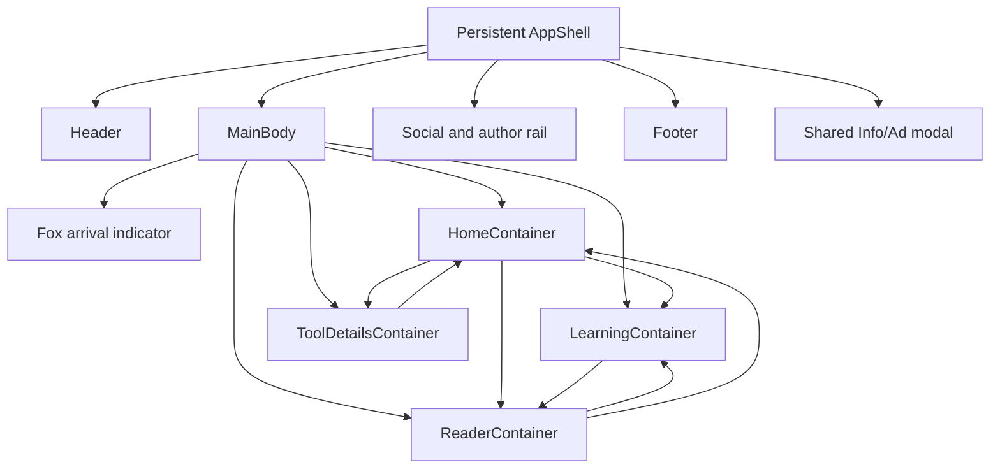

# The Builder's Fieldnotes

Design blueprint for a reading-first, one-page knowledge site. One persistent application shell contains a header, changing body container, slim social/author rail, footer, and shared modal.

## Design Direction

The site should feel like a useful technical journal, not a product dashboard or marketing site.

- Reading is the primary action.
- Article titles and excerpts carry more visual weight than metrics.
- The default Home body behaves like an editorial front page and is intentionally different from the reading and tool-detail bodies.
- A restrained 3D card rail is used for curated or sequential content, not for every section.
- The single application shell has a full-width translucent sticky header with a fox logo, floating Back/Home navigation icons, a replaceable body, a slim social/author rail, and a slim footer.
- Long-form text stays between 65 and 75 characters per line.
- Metadata is quiet, compact, and written in `IBM Plex Mono`.

## Visual System

### Typography

Use three font families only. Self-host WOFF2 files, use `font-display: swap`, and load only the weights listed below.

Interactive visual specimen: [Typography and color reference](./typography-reference.html). The standalone specimen loads the same faces from Google Fonts for preview convenience; the production site must self-host them.

```css
:root {
  --font-editorial: "Source Serif 4", Georgia, serif;
  --font-interface: "Space Grotesk", "Segoe UI", sans-serif;
  --font-mono: "IBM Plex Mono", Consolas, monospace;
}
```

Sizes are shown as `font-size / line-height`. Use the mobile value by default, the tablet value from `48rem`, and the wide value from `75rem`.

| Role | Typeface / weight | Mobile | Tablet | Wide |
| --- | --- | --- | --- | --- |
| Home lead title | Source Serif 4 / 600 | 40 / 44 px | 52 / 58 px | 64 / 68 px |
| Article title | Source Serif 4 / 600 | 38 / 42 px | 48 / 52 px | 56 / 60 px |
| Article introduction | Source Serif 4 / 400 | 20 / 30 px | 22 / 34 px | 22 / 34 px |
| Article body | Source Serif 4 / 400 | 18 / 30 px | 19 / 32 px | 19 / 32 px |
| Article `h2` | Source Serif 4 / 600 | 28 / 34 px | 34 / 40 px | 34 / 40 px |
| Article `h3` | Space Grotesk / 600 | 22 / 28 px | 24 / 30 px | 24 / 30 px |
| Interface heading | Space Grotesk / 600 | 24 / 30 px | 28 / 34 px | 28 / 34 px |
| Reading-card title | Source Serif 4 / 600 | 28 / 34 px | 32 / 38 px | 32 / 38 px |
| Navigation and controls | Space Grotesk / 500 | 14 / 20 px | 14 / 20 px | 14 / 20 px |
| Compact label | Space Grotesk / 600 | 12 / 16 px | 12 / 16 px | 12 / 16 px |
| Metadata | IBM Plex Mono / 400 | 10 / 16 px | 10 / 16 px | 10 / 16 px |
| Code | IBM Plex Mono / 400 | 14 / 22 px | 14 / 22 px | 14 / 22 px |

- Use Source Serif 4 only for editorial titles, article prose, quotations, and reading-card titles.
- Use Space Grotesk for all navigation, buttons, form controls, interface headings, and labels.
- Use IBM Plex Mono only for metadata, dates, version numbers, counters, and code.
- Use weight `600`, not `700`, for editorial emphasis. Body bold text may use Source Serif 4 at `600`.
- Keep letter spacing at `0`. Do not use viewport-based font scaling.
- Preserve a text measure of `65-75` characters for article prose.

### Color

| Token | Value | Use |
| --- | --- | --- |
| Mist | `#EEF1EF` | Neutral canvas |
| Glass white | `#FFFFFF` | Translucent UI surfaces and reading surface |
| Ink | `#17201B` | Primary text and icons |
| Muted ink | `#66706A` | Secondary text |
| Sky accent | `#1F7599` | The single readable accent for links, focus, and active states |
| Sky wash | `#DDF3FC` | Pale derived tint for subtle backgrounds and crystal highlights; never body text |
| Accent contrast | `#FFFFFF` | Text and icons on a solid field-accent control |

**Text color assignment**

| Content role | Color |
| --- | --- |
| Titles, headings, body text, control labels | Ink |
| Summaries, captions, supporting copy | Muted ink |
| Metadata, dates, counters, placeholders | Muted ink |
| Links and active controls | Sky accent |
| Text or icons on a solid accent background | Accent contrast |
| Disabled controls | Muted ink at `62%` opacity; never use this treatment for readable content |

- Body links use Sky accent and an underline; color is not their only affordance.
- Hover and focus may strengthen the underline or border but must not introduce another hue.
- Error and warning messages use Ink with a clear icon and label rather than adding semantic colors to the core palette.
- Ink on Mist or Glass white is the default readable combination. Muted ink is reserved for supporting text at `12 px` or larger, except `10 px` metadata.
- Sky wash is a non-text tint. It may appear behind controls, in the page canvas, or in the fox watermark, but never replaces Sky accent for readable links or labels.

Do not assign different colors to article topics, content formats, tool platforms, or card types. Distinguish them with labels, icons, typography, and position. Natural colors inside article imagery and the two emoji brand marks are content, not additions to the UI palette.

### Liquid Glass Surface Language

The visual direction is inspired by liquid glass: UI surfaces appear translucent, optically layered, and responsive to the content behind them. It should remain quiet and editorial rather than glossy or ornamental.

Apply liquid glass only to persistent or temporary interface chrome:

- Full-width sticky header.
- Floating Back and Home buttons.
- Social and author rail.
- Search/menu popovers and compact control groups.
- Information/advertisement modal.

Keep article pages, Markdown content, tables, pictures, and primary reading cards on opaque white or transparent neutral surfaces. Text must never depend on backdrop blur for contrast.

**Glass recipe**

- Neutral white fill at `52-76%` opacity over the mist canvas.
- `20-24 px` backdrop blur with restrained saturation at `115-125%`.
- A soft diagonal highlight from translucent white to clear; never introduce a colored gradient.
- `1 px` white optical edge plus a low-contrast ink boundary.
- One inset highlight and one diffuse outer shadow; avoid multiple dramatic shadows.
- Radius is `10 px` for compact controls and `6 px` for rails/modals. The full-width header remains square at its viewport edges.
- Never nest one glass panel inside another glass panel.
- Hover and active states change opacity, border weight, or the single Sky accent; they do not introduce another hue.
- Provide an opaque neutral fallback when backdrop filters are unsupported or reduced transparency is requested.

### Main Body Crystal Fox Field

Place a sparse field of 🦊 watermarks through `MainBody`. The marks give long containers a recurring site signature without forming a wallpaper pattern or competing with content.

```html
<div id="app-main-fox-field" aria-hidden="true">
  <span class="main-crystal-fox main-crystal-fox--top">🦊</span>
  <span class="main-crystal-fox main-crystal-fox--middle">🦊</span>
  <span class="main-crystal-fox main-crystal-fox--lower">🦊</span>
</div>
```

- Render three foxes on long Home, Library, Topic, Search, Saved, and About bodies. Use two on short Tool or error bodies. Reader surfaces remain opaque and may suppress any mark that would sit behind prose.
- The field is decorative, receives no focus or pointer events, and uses `aria-hidden="true"`. Its children do not need individual IDs.
- Keep every fox upright and strictly 2D. Do not rotate it, add perspective, animate it, or place it inside a disc, card, orb, or glass panel.
- Place the primary mark in the upper-right, a smaller supporting mark near the middle-left, and a final supporting mark near the lower-right. Partially crop the supporting marks at the container edges.
- Keep at least `32vh` or `520 px`, whichever is larger, between fox centers. Never align two marks on the same horizontal or vertical axis.
- Desktop sizes: primary `320-340 px`, middle `210-240 px`, and lower `240-270 px`. Narrow sizes: primary `208 px`, middle `148 px`, and lower `168 px`.
- Desktop opacity: primary `11.5%`, middle `10%`, and lower `10%`. Narrow opacity: primary `9.5%`, middle `8%`, and lower `8.5%`.
- Keep glyph edges crisp; do not blur them. Cool-tint each native emoji toward Sky wash and add one restrained white highlight plus one low-opacity Sky accent edge with `text-shadow`.
- Give every fox one duplicate glyph clipped to a narrow diagonal facet and offset by no more than `3 px`. Set the facet to `48%` of its parent fox opacity.
- Keep all body content above the field. Opaque white Reader surfaces cover it, so the foxes never appear directly behind long-form prose, code, tables, or pictures.
- Position marks in intentional negative space for each body state. If a mark intersects a title, summary, control, card, or picture, hide that individual mark rather than moving it into another content region.
- The field is separate from the persistent header fox and temporary loading indicator fox.
- Hide the entire field when reduced transparency or forced colors are requested and when printing.

### Shared Desktop Shell

```text
+--------------------------------------------------------------------------+
| 🦊 The Builder's Fieldnotes                                      Search  |
+------------------------------------------------------------------+-------+
| [←] [⌂]  floating controls                                      |       |
+------------------------------------------------------------------+-------+
|                                                                  |  in¹  |
| Dynamic body container                                          |  in²  |
| HomeContainer | ReaderContainer | ToolDetailsContainer           |       |
|                                                                  |  S    |
|                                                                  |  H    |
|                                                                  |  u    |
|                                                                  |  B    |
|                                                                  |  H    |
|                                                                  |  a    |
|                                                                  |  M    |
|                                                                  |  J    |
|                                                                  |  AI   |
|                                                                  |  D    |
|                                                                  |  E    |
|                                                                  |  V    |
|                                                                  |  🦅   |
+------------------------------------------------------------------+-------+
| Slim footer: page context                         | utility links       |
+--------------------------------------------------------------------------+
```

- Desktop reference viewport: `1440 x 1180`; the document height grows with the active body content.
- Application shell: `min-height: 100vh`.
- Outer page padding: `52 px`.
- Main content: up to `1196 px`; article text remains `680-720 px` and centered inside it.
- Right icon rail: `64 px`.
- Main/rail gap: `28 px`.
- Header height: `72 px`.
- Floating navigation icons sit below the header and stop before the right rail.
- Footer height: `46 px`.
- Card radius: `4-6 px`.

### Brand Marks

**Header logo: 🦊**

- Place the fox at the far left of every header, immediately before `The Builder's Fieldnotes`.
- Desktop size: `28 x 28 px`; mobile size: `26 x 26 px`.
- Keep `10 px` between the mark and the brand name.
- Use the native color emoji where supported. Do not place it inside a decorative rounded square.
- The combined logo link returns to Home and uses the accessible label `The Builder's Fieldnotes home`.
- If color emoji is unavailable, fall back to the text mark `FOX`, set in `IBM Plex Mono`.
- The Shared Fox Arrival Indicator may temporarily show a second fox inside `MainBody`. That fox is decorative, non-interactive, and removed with the loading state; the header fox remains the only brand link.

**Sidebar mark: 🦅**

- Center the eagle at the absolute bottom of the rail, after the author and role stack.
- Desktop size: `26 x 26 px`; mobile size: `22 x 22 px`.
- The eagle closes the author signature and is decorative, so hide it from assistive technology.
- Use one eagle per page. Do not repeat it on cards, links, or inline content.

The fox is the persistent site identity; the eagle closes the author signature. Neither mark appears inside article body text, article metadata, or card category labels.

### Floating Navigation Icons

Navigation below the header is a compact floating icon cluster, not a bar. The header remains full viewport width; the floating controls occupy only the main-content column and never extend into the `64 px` social/author rail.

```text
full-width header
+------------------------------------------------------------------------+
| 🦊 The Builder's Fieldnotes                                    Search  |
+------------------------------------------------------------------------+

main-content width                                         sidebar width
+----------------------------------------------------------+-------------+
|  [←]  [⌂]                                                |             |
|   floating icon controls                                 | social rail |
+----------------------------------------------------------+-------------+
```

**Controls**

- Back uses the `ArrowLeft` icon and accessible label `Go back`.
- Home uses the `Home` icon and accessible label `Go to home`.
- Use icon-only `44 x 44 px` buttons with tooltips; do not put text inside rounded rectangles.
- Each button has its own quiet liquid-glass surface, optical edge, and restrained shadow. There is no shared full-width background.
- Keep `8 px` between buttons and `12 px` clear space below the header.
- Back calls browser history when an in-site history entry exists. Disable it on the initial Home state rather than sending the visitor away from the site.
- Home routes to `#/home`. Mark it with `aria-current="page"` while Home is active.
- The cluster stays sticky while reading and must not cover headings when anchor links receive focus.

### Slim Social and Author Rail

The right rail places social navigation at the top and a compact author signature at the bottom. It does not contain page filters or article metadata.

```text
+--------+
|  in¹   |  LinkedIn profile
|  in²   |  LinkedIn group
|        |
|   S    |
|   H    |
|   u    |
|   B    |
|   H    |
|   a    |
|   M    |
|        |
|   J    |
|        |
|   AI   |
|        |
|   D    |
|   E    |
|   V    |
|   🦅   |
+--------+
```

**Layout**

- Width: `64 px` on desktop and tablet.
- Position: sticky, `88 px` from the viewport top, so it clears the header.
- Height: `calc(100vh - 112px)` with a minimum height of `520 px`.
- Use the neutral liquid-glass recipe, `1 px` optical edge, and `6 px` radius.
- LinkedIn buttons sit at the top: `44 x 44 px`, vertically stacked with `8 px` gaps.
- The author and role stack occupies the lower rail, with the eagle anchored last at the absolute bottom.
- Do not add visible labels beside the LinkedIn icons.

**Actions**

1. **LinkedIn profile:** LinkedIn `in` mark with a small person badge. Tooltip and accessible name: `Open LinkedIn profile`.
2. **LinkedIn group:** LinkedIn `in` mark with a small group badge. Tooltip and accessible name: `Open LinkedIn group`.

Use the official LinkedIn brand mark. Build the distinction with a small `UserRound` or `UsersRound` badge from the existing icon library; do not create two indistinguishable LinkedIn buttons.

**Bottom author signature**

- Use individually stacked text rows in this exact visible order: `S`, `H`, `u`, `B`, `H`, `a`, `M`, space, `J`, space, `AI`, space, `D`, `E`, `V`, then 🦅.
- Do not rotate a horizontal name and do not use CSS `writing-mode`; each visible row is a separate centered item.
- Use `11 px` `Space Grotesk Medium` with letter spacing `0`.
- Use `2 px` between name characters and `8 px` at each indicated space.
- Keep `10 px` between `V` and the eagle.
- The signature is not a link or button.
- Accessible label: `Shubham Jadhav, AI Dev`.
- Compact page wireframes abbreviate this exact stack as `S↓🦅`.

```yaml
socialNavigation:
  linkedInProfileUrl: "{{ linkedin-profile-url }}"
  linkedInGroupUrl: "{{ linkedin-group-url }}"
```

**Behavior**

- Tooltips open to the left after hover or keyboard focus and contain the full destination name.
- Both links open in a new tab with `rel="noopener noreferrer"`.
- Use a visible focus ring with at least `3:1` contrast.
- The entire `44 x 44 px` button is interactive, not only the glyph.
- Do not display notification dots, follower counts, or active states.
- Page-specific filters, article outlines, metadata, and reading progress move into the main content as inline strips, disclosures, or end matter.

### Scroll-Driven 3D Reading Cards

Use a scroll-triggered 3D card showcase inspired by the [WDesignKit Scrolling 3D Cards reference](https://wdesignkit.com/widgets/scrolling-3d-cards/11813). This is not a manually dragged carousel. Normal vertical page scrolling advances a horizontal sequence while its stage remains temporarily pinned.

```text
page scroll down
      |
      v

  ENTER                    ACTIVE                    EXIT
       /-----------+      +------------------+      +-----------\
      / topic      /|     | topic / guide    |     |\ article   \
     / article    / | --> |                  | --> | \           \
    +------------+  |     | Article title    |     |  +-----------+
    | tilted     | /      | Summary and time |     \ | receding   |
    +------------+/       +------------------+      \+------------+

 rotateY 14 deg           rotateY 0 deg             rotateY -14 deg
 translateZ -120 px       translateZ 0               translateZ -120 px
 opacity .55              opacity 1                  opacity .55
```

**Section structure**

- The outer section creates vertical scroll distance: approximately `90vh` per card after the first.
- The inner stage uses `position: sticky` below the `72 px` site header.
- Stage height: `calc(100vh - 72px)`, capped at `820 px` on large displays.
- The card track moves horizontally as the section's vertical scroll progress changes from 0 to 1.
- Keep the section title and `01 / 05` counter fixed within the stage.
- The page resumes ordinary vertical flow after the final card settles and the stage unpins.

**Geometry**

- Desktop card: `520 x 360 px`.
- Desktop gap: `64 px` between card centers.
- Show the incoming card edge on the right to communicate horizontal progression.
- Perspective: `1400 px` on the sticky stage.
- Entry state: `translateX(35vw) translateZ(-120px) rotateY(14deg) rotateZ(1.5deg)`.
- Active state: `translateX(0) translateZ(0) rotateY(0) rotateZ(0)`.
- Exit state: `translateX(-35vw) translateZ(-120px) rotateY(-14deg) rotateZ(-1.5deg)`.
- Maximum scale range: `0.88-1.00`.
- Use one restrained card shadow rather than blurred decorative backgrounds; reading cards remain opaque and are not liquid-glass panels.
- Keep card radius at `6 px`; depth should come from perspective, not exaggerated rounding.
- Maintain at least `48 px` between transformed cards to prevent text overlap.

**Card anatomy**

```text
+------------------------------------------+
| TOPIC / FORMAT                 02 OF 06  |
|                                          |
| Article title in Source Serif 4          |
|                                          |
| A two-line summary that explains why     |
| this reading is useful.                  |
|                                          |
| 12 MIN READ                         ->   |
+------------------------------------------+
```

**Interaction**

- Mouse wheel, trackpad, touch scroll, Page Down, and keyboard scrolling all advance the same vertical document.
- Do not hijack the wheel event or create a nested horizontal scroll region.
- The centered card is the active link; clicking it opens the article.
- Receding cards are not interactive until they reach the active zone, preventing accidental clicks during movement.
- Show `02 OF 05` and a thin progress track so position is never communicated by perspective alone.
- Update the URL only when a reader opens a card, never while scrolling through the sequence.
- Respect `prefers-reduced-motion`: disable pinning, rotation, depth, and scroll-linked animation; render the cards as a normal vertical reading list.

**Motion**

- Map animation directly to scroll progress; do not add delayed inertia after scrolling stops.
- Each card gets an enter, active, and exit interval with a short overlap between neighboring cards.
- Use smooth interpolation with no bounce.
- Titles and summaries do not animate independently from their card.
- Keep the active card front-facing for at least 30% of its interval so the title and summary can be read.
- Target smooth transforms using only `transform` and `opacity`; avoid animating layout properties.

**Body placement**

| Body container | Scroll-driven card content |
| --- | --- |
| HomeContainer | Primary signature section: this week's five featured readings |
| HomeContainer topic state | Three foundational readings, using a shorter scroll distance |
| ToolDetailsContainer category state | Published tools in the selected category |

Library, Series, Saved Reading, ReaderContainer, Search Results, and About remain stable and linear. Use the effect once per eligible body state and never inside readable article content.

## Markdown Content Architecture

Content is file-based. Version 1 uses no database, CMS, or browser-side Markdown parser. A build step reads local Markdown and YAML, validates it, derives indexes, renders safe HTML, and emits the records consumed by the body containers.

### Source Folder Contract

```text
content/
├── home.md
├── about.md
├── articles/
│   └── {article-slug}/
│       ├── index.md
│       └── images/
├── learning/
│   └── {guide-slug}/
│       ├── guide.yml
│       ├── index.md
│       ├── chapters/
│       │   └── {order}-{chapter-slug}.md
│       └── images/
├── tools/
│   ├── index.md
│   └── {category-slug}/
│       ├── category.yml
│       └── {tool-slug}/
│           ├── index.md
│           └── images/
├── topics/
│   └── {topic-slug}/
│       └── index.md
├── series/
│   └── {series-slug}/
│       └── index.md
└── config/
  ├── site.yml
  └── announcement.yml
```

- A content folder name is its canonical slug. Do not repeat `slug` in front matter.
- Every content folder contains one `index.md`; its front matter supplies structured fields and its body supplies readable Markdown.
- A learning collection owns one `guide.yml`, one editorial `index.md`, and any number of ordered chapter Markdown files. Adding another folder under `learning/` creates another guide without a new component or route implementation.
- A chapter filename supplies its order and slug. For example, `03-variables-and-data-types.md` becomes order `3` and slug `variables-and-data-types`; do not repeat either field in front matter.
- `tools/index.md` owns the Tools library introduction. Each tool category owns one `category.yml`, and each child tool owns one `index.md` plus optional pictures. Adding another category folder does not require a new component.
- A category slug comes from its folder, and a tool slug comes from its child folder. The canonical tool key is `{category-slug}/{tool-slug}`; use that qualified key in featured and related-tool references.
- Item-specific pictures live beside the item under `images/` and use paths relative to `index.md`. Shared brand assets may live in the application's public asset folder.
- `home.md` owns issue information and curated article/tool references. It does not duplicate article titles, summaries, dates, or reading times.
- Topic counts, current topic articles, Library groups, latest articles, reading paths, and search records are generated from source entries.
- `about.md` owns the About introduction and colophon. `site.yml` owns shell-level identity, navigation labels, and external URLs.
- `announcement.yml` is optional. When it is absent or `enabled: false`, the shared modal root remains closed and contains no campaign content.
- Components contain presentation and interaction only. Do not hard-code published content inside a container.

### Concrete Learning Example

```text
content/learning/copilot-studio/
├── guide.yml
├── index.md
├── chapters/
│   ├── 00-what-is-copilot.md
│   ├── 01-create-an-agent.md
│   ├── 02-core-concepts.md
│   ├── ...
│   └── 18-skills-and-instruction-sets.md
└── images/
```

- `guide.yml` defines the six parts and lists chapter slugs in reading order.
- `index.md` is the optional guide introduction shown above the parts.
- Each chapter file contains its own title, summary, level, type, and Markdown body.

### Concrete Tools Example

```text
content/tools/
├── index.md
├── vs-code/
│   ├── category.yml
│   ├── dataverse-devtools/
│   │   ├── index.md
│   │   └── images/
│   └── another-extension/
│       ├── index.md
│       └── images/
├── dynamics-365/
│   ├── category.yml
│   └── sample-dynamics-tool/
│       ├── index.md
│       └── images/
└── others/
  ├── category.yml
  └── sample-utility/
    ├── index.md
    └── images/
```

- Initial category titles are `VS Code Tools`, `Dynamics 365 Tools`, and `Others`.
- A tool belongs to exactly one primary category. Its `platforms` metadata may still name several environments.
- Moving a tool between categories changes its canonical route and requires the build to validate or redirect incoming references.

### Build and Update Flow

```text
Markdown/YAML source
  -> parse front matter
  -> validate schemas and slug references
  -> derive reading time, headings, indexes, and routes
  -> render and sanitize Markdown
  -> emit route records and a lightweight content index
  -> deploy the application to GitHub Pages
```

- The browser never fetches or parses raw `.md` files.
- The generated content index contains only fields needed by Home, Library, Learning, Topic, Series, Search, tool-category cards, and tool cards.
- Full rendered article, learning chapter, and tool records are split by route so opening Home or Learning does not download every readable body.
- The build rewrites relative chapter links such as `04-nodes.md#question-node` to `#/learn/{guide-slug}/nodes#question-node` and rejects links that do not resolve.
- Markdown tables receive labeled horizontal wrappers, code fences receive language metadata, and Mermaid fences remain isolated diagram sources for the chapter renderer.
- A source edit reaches the public site only after the validation, build, and GitHub Pages deployment complete.
- Production builds fail on invalid front matter, duplicate slugs, broken content references, unsafe URLs, missing local images, missing meaningful image alt text, or unresolved `{{ placeholder }}` text.
- Draft records are available in preview builds and excluded from production indexes and routes.

### Field Ownership

| Field group | Source |
| --- | --- |
| Titles, summaries, dates, topics, tags, body content | Item `index.md` |
| Learning title, description, parts, and ordered chapter membership | `learning/{guide-slug}/guide.yml` |
| Chapter title, summary, type, level, and body | Chapter Markdown front matter and body |
| Tools library introduction | `tools/index.md` |
| Tool category title, summary, and order | `tools/{category-slug}/category.yml` |
| Tool title, summary, platforms, links, and body | `tools/{category-slug}/{tool-slug}/index.md` |
| Lead article, featured order, archive highlight, featured tools | `home.md` |
| Brand name, author identity, social and utility URLs, arrival messages | `config/site.yml` |
| Slug and route | Derived from the content type and folder name |
| Reading time, table of contents, archive year | Derived from Markdown and dates |
| Latest lists, topic counts, Library groups, previous/next | Derived from all validated records |
| Saved reading and completion state | Browser local storage; never written into source content |

### Delivery Scope

Version 1 includes the shared shell, Home, Library, Learning Library, learning-guide index, learning-chapter Reader, Topic, standard Reader, technical-guide Reader, tool index/details, About, and the desktop Home 3D reading section. Series, full-text Search, Saved Reading, automatic announcements, reordering, and export remain documented planned states and can be enabled without changing the source-folder contract.

## One-Page Application Architecture

Only one HTML document is loaded. Header, rail, footer, and modal remain mounted while the main body container changes.

```text
AppShell
├── Header                      persistent
│   └── 🦊 brand + search/menu actions
├── FloatingNavigation          persistent
│   └── Back icon + Home icon
├── ContentLayout
│   ├── MainBody                changes by route/state
│   │   ├── HomeContainer
│   │   ├── LearningContainer
│   │   ├── ReaderContainer
│   │   └── ToolDetailsContainer
│   └── SocialAuthorRail        persistent
│       ├── LinkedIn profile
│       ├── LinkedIn group
│       └── vertical author stack + 🦅
├── Footer                      persistent
└── InfoAdModal                 shared optional overlay
```

### Body Switching

- Render exactly one primary body container inside `MainBody` at a time.
- Floating navigation and header menu actions change body state without replacing the application shell.
- For GitHub Pages, use the following hash routes so deep links work without server rewrites:

| Route | Container and state |
| --- | --- |
| `#/home` | HomeContainer / editorial home |
| `#/library` | HomeContainer / Library |
| `#/library?topic={slug}&format={type}&length={range}&year={year}` | HomeContainer / filtered Library; omit unused parameters |
| `#/topic/{topic-slug}` | HomeContainer / Topic Hub |
| `#/search?q={query}` | HomeContainer / Search |
| `#/saved` | HomeContainer / Saved Reading |
| `#/about` | HomeContainer / About |
| `#/learn` | LearningContainer / all learning guides |
| `#/learn/{guide-slug}` | LearningContainer / one guide index |
| `#/learn/{guide-slug}/{chapter-slug}` | ReaderContainer / one learning chapter |
| `#/read/{article-slug}` | ReaderContainer / essay, note, build, reference, or guide |
| `#/series/{series-slug}` | ReaderContainer / Series |
| `#/tools` | ToolDetailsContainer / all tool categories |
| `#/tools/{category-slug}` | ToolDetailsContainer / one category index |
| `#/tools/{category-slug}/{tool-slug}` | ToolDetailsContainer / one tool detail |

- Normalize route slugs to lowercase kebab-case and percent-encode query values.
- Unknown routes and missing production records render a not-found state inside `MainBody` with links to Home and Library.
- Version 1 navigation must recognize planned routes even when a planned feature is disabled; show a clear unavailable state instead of a blank body.
- On a body change, update the document title, move focus to the new `h1`, and scroll the document to the top.
- Browser Back and Forward restore the previous body and its URL.
- Use a restrained `180 ms` opacity transition; no horizontal page-slide animation.
- Loading and errors render inside `MainBody`. They never replace the header, rail, footer, or modal root.

### Body Container Contract

Every populated primary body receives structured data and exposes a single visible `h1`. The temporary route-loading state uses the shared status component defined below and does not introduce another heading.

```yaml
activeView:
  container: "home | learning | reader | tool"
  state: "home | library | topic | search | saved | about | learning-library | learning-guide | learning-chapter | article | guide | series | tool-library | tool-category | tool-detail"
  category: "{{ optional-category-slug }}"
  slug: "{{ optional-content-slug }}"
  title: "{{ document-title }}"
  loading: false
  error: null
```

### Stable DOM IDs and Rendering

Every ID that is rendered must be non-empty and unique across the current document. IDs are required for persistent shell regions, link targets, accessibility relationships, and stable test targets. Pure layout or decorative `<div>` elements do not need IDs.

Prefer semantic elements such as `<header>`, `<main>`, `<article>`, `<aside>`, `<footer>`, and `<dialog>` where they fit. Containers receive schema-validated records directly; DOM IDs and `data-*` attributes are not a content lookup system.

**Static ID registry**

| Region | Required ID |
| --- | --- |
| Application shell | `app-shell` |
| Header | `app-header` |
| Header brand | `app-header-brand` |
| Floating navigation | `app-floating-navigation` |
| Floating icon controls | `app-floating-navigation-controls` |
| Back action | `navigation-back` |
| Home action | `navigation-home` |
| Content layout | `app-content-layout` |
| Changing body root | `app-main` |
| Social and author rail | `app-social-author-rail` |
| LinkedIn profile action | `social-linkedin-profile` |
| LinkedIn group action | `social-linkedin-group` |
| Footer | `app-footer` |
| Shared modal | `app-info-ad-dialog` |
| Shared modal title | `app-info-ad-title` |

**Dynamic ID convention**

Use lowercase kebab-case and stable source slugs:

```text
{view}-{entity}-{slug}-{part}
```

The active body root must use one of these IDs:

```text
view-loading
view-home
view-learning
view-learning-{guide-slug}
view-reader-{article-slug}
view-reader-{guide-slug}-{chapter-slug}
view-tool
view-tool-{category-slug}
view-tool-{category-slug}-{tool-slug}
```

Examples:

```text
home-section-featured-reading
learning-copilot-studio-guide-card
learning-copilot-studio-part-fundamentals
learning-copilot-studio-chapter-what-is-copilot
home-article-grounded-copilot-card
reader-grounded-copilot-title
reader-copilot-studio-what-is-copilot-title
reader-grounded-copilot-section-actions
reader-grounded-copilot-image-architecture-map
tool-vs-code-dataverse-devtools-description
tool-vs-code-dataverse-devtools-link-marketplace
tool-vs-code-dataverse-devtools-instruction-install
tool-vs-code-dataverse-devtools-faq-telemetry
```

**Rules**

- Every routable article, learning guide, chapter, tool category, tool, topic, and series receives stable slugs from its folder or filename contract. Tool identity includes both category and tool slugs.
- Generate heading anchors deterministically from heading text and reject duplicate anchors within one record.
- Give an FAQ item, release, picture, or link its own key only when it is separately linkable, persisted, or targeted by a test.
- Never generate persistent anchors or storage keys from array positions such as `card-1` or `faq-3`.
- Convert source keys to lowercase ASCII kebab-case and allow only `a-z`, `0-9`, and `-`.
- Prefix IDs with the active view and entity type to avoid collisions.
- Render only the active primary body. Remove the previous body before mounting the next one; do not keep duplicate hidden views in the document.
- Never reuse an ID inside the shared modal or repeated card content.
- CSS classes control styling. IDs are reserved for identity, data targeting, labels, anchors, and tests.
- Use `document.getElementById()` for an exact generated ID or wrap it with `CSS.escape()` before using it in a CSS selector.
- Validate `home`, `learning`, `reader`, and `tool` records against their view-specific schemas before mounting the active body.

**Rendering and safety**

- Pass a validated record into its container and render fields directly. Do not query a client-side content store from individual DOM nodes.
- Use `data-*` only for analytics or tests that cannot use a semantic role, accessible name, or stable ID.
- Write plain values with `textContent`; sanitize rendered Markdown before inserting HTML.
- Validate URLs before assigning `href` or image `src`.
- Reject missing required fields and unresolved `{{ placeholder }}` values in preview and production builds.

**Required automated DOM check**

```js
const allIds = [...document.querySelectorAll('[id]')].map((node) => node.id);
const duplicateIds = allIds.filter((id, index) => allIds.indexOf(id) !== index);
const emptyIds = allIds.filter((id) => id.length === 0);
const requiredShellIds = [
  'app-shell',
  'app-header',
  'app-main',
  'app-social-author-rail',
  'app-footer',
];
const missingShellIds = requiredShellIds.filter((id) => !document.getElementById(id));

if (duplicateIds.length || emptyIds.length || missingShellIds.length) {
  throw new Error('DOM identity validation failed');
}
```

## View State Map



## Shared Fox Arrival Indicator

Use one reusable route-loading state when an asynchronously fetched content record takes longer than `180 ms` to arrive. It replaces only the changing body inside `MainBody`; the header, floating navigation, rail, footer, and modal root remain mounted.

The component does not display the word `Loading`. Its visible copy uses short AI and evidence-themed arrival lines that make it clear that content is coming.

```text
                 accent ring rotates
                         ↓
                      (  🦊  )

       "Good AI starts with context.
            The context is on its way."
```

### Visual Specification

- Root ID: `view-loading`.
- Spinner ID: `view-loading-spinner`; visible message ID: `view-loading-message`.
- Center the indicator in an unframed region with `min-height: clamp(18rem, 42vh, 28rem)` so route changes do not collapse the body.
- Spinner diameter: `56 px` below `48rem` and `64 px` from `48rem`.
- Draw a `2 px` circular track using the neutral rule color. Use Sky accent for one approximately `110deg` arc.
- Place one native-color 🦊 at the exact center: `26 px` on mobile and `28 px` from `48rem`.
- Rotate only the accent ring. Keep the fox upright and still; do not pulse, bounce, tilt, or rotate the emoji.
- Use a `900 ms` linear rotation based only on `transform`.
- Do not put the spinner or message inside a card, glass panel, colored disc, or decorative rounded square.
- Set the visible message in Source Serif 4 at `18 px / 28 px`, Muted ink, centered, with a maximum width of `34ch` and a stable two-line minimum height.

### Arrival Messages

Store the ordered message list in `config/site.yml` so the copy can change without editing the component. Use these defaults:

```yaml
arrivalMessages:
  - "Good AI starts with context. The context is on its way."
  - "Grounding first. The next field note is coming into focus."
  - "Useful answers begin with evidence. The evidence is arriving."
  - "The data is arriving. The useful part comes next."
  - "Following the thread from data to detail."
```

- Show the first line when the indicator appears, then advance in order every `3.2 s`.
- Cross-fade the complete message over `180 ms`; do not animate individual words or resize the message region.
- Reset to the first message for each new route request. Do not choose a random starting message.
- When a request exceeds `10 s`, stop cycling and show `The data is taking longer than expected.` until the request succeeds or fails.
- Remove the indicator as soon as content is ready. Never delay content merely to complete a rotation or message interval.

### Accessibility and Failure Behavior

- Set `aria-busy="true"` on `app-main` while the indicator is present and restore it to `false` before mounting the resolved body.
- Give `view-loading` `role="status"`, `aria-live="polite"`, `aria-atomic="true"`, and `aria-label="Content is on the way."`.
- Hide the rotating ring, fox emoji, and changing visible messages from assistive technology so every quote is not re-announced.
- Do not move keyboard focus to the indicator. Move focus to the resolved body's `h1` only after it mounts.
- On request failure, replace the indicator with the normal error state and expose Retry, Home, and Library actions.
- Under `prefers-reduced-motion: reduce`, show a static three-quarter accent ring and only the first arrival message; disable rotation and message cross-fades.

## Shared Information / Advertisement Modal

Use one reusable modal for a site announcement, useful information, or a clearly disclosed advertisement. Its content changes; its interaction model does not.

```text
                 +------------------------------------------+
                 | INFO or SPONSORED                    [x] |
                 |                                          |
                 | {{ modal.title }}                        |
                 | {{ modal.description }}                  |
                 |                                          |
                 | [Primary action]       [Not now]         |
                 +------------------------------------------+
```

**Placeholder data**

```yaml
sharedModal:
  enabled: true
  variant: "info | advertisement"
  eyebrow: "{{ INFO or SPONSORED }}"
  title: "{{ modal-title }}"
  description: "{{ modal-description }}"
  image: "{{ optional-image-path }}"
  primaryAction:
    label: "{{ action-label }}"
    url: "{{ action-url }}"
  dismissLabel: "Not now"
  startDate: "YYYY-MM-DD"
  endDate: "YYYY-MM-DD"
  frequency: "once-per-session"
```

**Behavior**

- Desktop width: `560 px`; mobile: bottom sheet with `20 px` page margins.
- Always provide a visible close icon and `Not now` action.
- Close on Escape, trap focus while open, and restore focus to the trigger when closed.
- Do not open immediately on load. Wait until the visitor has interacted or completed the first content section.
- Show automatically at most once per session; a user-triggered Info button may reopen it.
- Advertisement content must display `SPONSORED`, identify the sponsor, and never imitate site navigation.
- No autoplay media, forced countdown, or disabled close action.

## Primary Body Containers

### HomeContainer

The default body is a visually distinct editorial front page. It combines discovery sections without becoming a marketing landing page.

```text
HomeContainer
├── Issue masthead and lead reading
├── Scroll-driven 3D featured cards
├── Latest readable content
├── Topic collections
├── Featured learning
├── Featured tools
└── Archive and About summary
```

```yaml
home:
  issue:
    number: "{{ issue-number }}"
    date: "{{ issue-date }}"
  leadArticle: "{{ article-slug }}"
  featuredArticles:
    - "{{ article-slug }}"
  archiveHighlight: "{{ article-slug }}"
  featuredTopics:
    - "{{ topic-slug }}"
  featuredLearning:
    - "{{ guide-slug }}"
  featuredTools:
    - "{{ category-slug }}/{{ tool-slug }}"
  now:
    reading: "{{ short-reading-note }}"
    testing: "{{ short-testing-note }}"
    building: "{{ short-building-note }}"
```

- Home uses a fixed section order in version 1. Source data changes the referenced content, not the page structure.
- Latest articles and topic article counts are generated during the build.
- Selecting an article changes `MainBody` to `ReaderContainer`.
- Selecting a learning card changes `MainBody` to `LearningContainer`.
- Selecting a tool changes `MainBody` to `ToolDetailsContainer`.
- Library, Topic, Search, Saved, and About are alternate HomeContainer states, not new documents.

### LearningContainer

The Learning body displays a library of reusable Markdown learning collections or the chapter index for one collection. It remains editorial and reading-oriented rather than resembling a course dashboard.

```text
LearningContainer / library
├── Compact introduction and guide count
├── Guide cards
│   ├── title and summary
│   ├── chapter and part counts
│   ├── level and calculated total time
│   └── open-guide action
└── Optional recently read guide

LearningContainer / guide
├── Breadcrumb
├── Guide title and editorial introduction
├── Start or continue action
├── Guide metadata and local completion summary
├── Unframed part sections
│   └── Chapter cards
└── Related guides
```

- `#/learn` lists every production-visible guide. It must demonstrate that the design supports more than one collection.
- `#/learn/{guide-slug}` renders guide data only; it does not download chapter bodies.
- Parts are full-width unframed sections. Chapter cards are the repeated items; do not place chapter cards inside a larger part card.
- Chapter cards show order, title, summary, type, level, and calculated reading time. Do not show scores, streaks, points, or competitive metrics.
- `Start guide` opens the first chapter. `Continue guide` opens the earliest locally incomplete chapter when local completion data exists.
- Completion is optional local browser state keyed by guide and chapter slug. Reading remains fully available when storage is blocked.
- The library uses one column below `48rem` and two columns from `48rem`. A guide index uses one chapter column below `48rem`, two from `48rem`, and up to three from `60rem`.
- Selecting a chapter changes `MainBody` to `ReaderContainer` with the learning-chapter state.

### ReaderContainer

The Reader body displays articles and guides as one continuous vertical document. Do not introduce nested scrolling around the article.

```text
ReaderContainer
├── Breadcrumb and topic
├── Title
├── Summary and metadata
├── Optional hero picture + caption
├── On-this-page disclosure
├── Vertically scrolling Markdown content
│   ├── headings and paragraphs
│   ├── inline pictures + captions
│   ├── lists, quotes, tables, and callouts
│   └── optional code samples
├── References
├── FAQ when supplied by the article
└── Previous, next, and related reading
```

```yaml
reader:
  title: "{{ article-title }}"
  summary: "{{ article-summary }}"
  topic: "{{ topic }}"
  published: "YYYY-MM-DD"
  updated: "YYYY-MM-DD"
  readingTime: 0
  hero:
    src: "{{ image-path }}"
    alt: "{{ meaningful-image-description }}"
    caption: "{{ optional-caption }}"
  content: "{{ rendered-markdown }}"
  pictures:
    - src: "{{ image-path }}"
      alt: "{{ meaningful-image-description }}"
      caption: "{{ optional-caption }}"
  relatedArticles:
    - "{{ article-slug }}"
```

- Reading width stays `680-720 px` even though the body container is wider.
- Pictures may expand to `960 px`, centered around the reading column.
- The document itself scrolls vertically; header, rail, and footer remain part of the same page.
- When the article changes, replace ReaderContainer data, update the hash route, focus the `h1`, and return to the top.
- A learning chapter adds Guide and Part breadcrumbs, chapter position, Mark complete, and previous/next chapter actions. Its Markdown measure and scrolling behavior remain identical to a normal article.

### ToolDetailsContainer

The Tool body lists tool categories, lists tools within one category, or documents one tool. It supports extensions, web utilities, scripts, command-line tools, templates, and platform-specific helpers without becoming a marketplace storefront.

```text
ToolDetailsContainer / library
├── Compact Tools introduction
├── Category cards
│   ├── title and summary
│   ├── published tool count
│   └── recently updated tools
└── Featured tools across categories

ToolDetailsContainer / category
├── Tools breadcrumb
├── Category title and summary
├── Optional featured tool
└── Tool cards generated from child folders

ToolDetailsContainer / detail
├── Category, kind, platforms, title, version, and status
├── Short description and primary links
├── Pictures or screenshots
├── Why it exists and useful scenarios
├── Optional installation and configuration
├── Usage instructions and limitations
├── Optional FAQ and release notes
└── Related tools and reading
```

```yaml
tool:
  key: "{{ category-slug }}/{{ tool-slug }}"
  category: "{{ category-slug }}"
  slug: "{{ tool-slug }}"
  title: "{{ tool-title }}"
  kind: "extension | web-app | desktop-app | cli | script | library | template | utility"
  platforms:
    - "{{ platform-key }}"
  version: "{{ optional-version }}"
  status: "stable | preview | archived"
  description: "{{ tool-description }}"
  links:
    primary:
      label: "{{ primary-action-label }}"
      url: "{{ primary-action-url }}"
    marketplace: "{{ optional-marketplace-url }}"
    documentation: "{{ optional-documentation-url }}"
    repository: "{{ optional-repository-url }}"
    issues: "{{ optional-issues-url }}"
  pictures:
    - src: "{{ image-path }}"
      alt: "{{ screenshot-description }}"
      caption: "{{ optional-caption }}"
  uses:
    - title: "{{ use-title }}"
      description: "{{ use-description }}"
  installation:
    - "{{ installation-step }}"
  instructions:
    - title: "{{ instruction-title }}"
      content: "{{ instruction-content }}"
  faq:
    - question: "{{ question }}"
      answer: "{{ answer }}"
  releases:
    - version: "0.0.0"
      date: "YYYY-MM-DD"
      notes: "{{ release-notes }}"
```

- `#/tools` orders category cards by `category.yml` order, then title. Category counts and recently updated tools are generated from validated child records.
- `#/tools/{category-slug}` lists only that folder's production-visible tools. Tool cards show title, summary, kind, platforms, status, optional version, and updated date.
- The initial categories are content, not code: `VS Code Tools`, `Dynamics 365 Tools`, and `Others` use the same category and tool-card components.
- Use familiar external-link icons for primary, Marketplace, documentation, source, and issue links. Render only links supplied by the record.
- FAQ items are collapsed by default and keyboard-operable.
- Keep installation and usage steps linkable through heading anchors.
- Tool screenshots use stable aspect ratios so loading does not shift the layout.
- A category page uses one tool-card column below `48rem`, two from `48rem`, and up to three from `60rem`.

## Canonical Content Records

The following front matter is source data, not visible template syntax. Omit unused optional fields instead of leaving empty placeholders.

### Article or Standalone Guide Source

```yaml
---
title: "The work begins after the answer"
summary: "A concise explanation of what the reader will learn."
type: "essay"
topic: "ai-copilot"
published: "2026-08-24"
updated: "2026-08-26"
draft: false
tags:
  - "grounding"
  - "actions"
hero:
  src: "./images/answer-to-action.webp"
  alt: "A diagram connecting an answer to an action and its evidence"
  caption: "Optional visible caption."
relatedArticles:
  - "grounding-a-useful-answer"
---
```

- Required article fields are `title`, `summary`, `type`, `topic`, `published`, and `draft`.
- `updated`, `tags`, `hero`, `relatedArticles`, `series`, and `seriesOrder` are optional.
- `type` is one of `essay`, `guide`, `note`, `build`, or `reference`.
- Guides may additionally provide `level`, `prerequisites`, and `downloads` in front matter. Guide steps remain Markdown headings and body content.
- `readingTime`, headings, route, archive year, previous, and next are generated and must not be authored.

This source type is for one-document technical guides at `#/read/{article-slug}`. Multi-chapter learning collections use the two schemas below.

### Learning Collection Source

`learning/{guide-slug}/guide.yml` owns collection-level organization:

```yaml
title: "Copilot Studio Guide"
summary: "Build useful and secure agents from fundamentals to advanced patterns."
level: "beginner-to-advanced"
featured: true
draft: false
parts:
  - key: "fundamentals"
    title: "Fundamentals"
    summary: "Understand the platform and create a first agent."
    chapters:
      - "what-is-copilot"
      - "create-an-agent"
      - "core-concepts"
```

- Required guide fields are `title`, `summary`, `level`, `featured`, `draft`, and at least one part.
- Every part requires a stable lowercase kebab-case `key`, title, summary, and non-empty ordered chapter list.
- Every production chapter must appear exactly once across the guide's parts. Duplicate, missing, or unresolved chapter membership fails the build.
- Guide slug, chapter count, part count, total reading time, updated date, route, and completion count are generated.
- `index.md` contains the guide's optional long editorial introduction. Do not duplicate its prose in `guide.yml`.

### Learning Chapter Source

Each file under `learning/{guide-slug}/chapters/` uses concise front matter:

```yaml
---
title: "What is Copilot?"
summary: "Understand Copilot and the role of Copilot Studio."
type: "chapter"
level: "beginner"
draft: false
tags:
  - "fundamentals"
---
```

- Required fields are `title`, `summary`, `type`, `level`, and `draft`; `tags` and `updated` are optional.
- `type` is one of `chapter`, `lab`, or `reference`.
- Guide slug comes from the parent folder; order and chapter slug come from the filename; part comes from `guide.yml`.
- Reading time, headings, previous, next, route, Mermaid presence, and table/code counts are generated.
- Chapter bodies may contain Markdown tables, fenced code, Mermaid, blockquotes, and relative chapter links. The build validates and transforms each form before deployment.

### Initial Copilot Studio Collection Mapping

The current 19-file guide is the first instance of the generic model, not a special component:

| Part | Purpose | Chapter numbers |
| --- | --- | --- |
| Fundamentals | Platform orientation and first agent | `00-02` |
| Building Blocks | Variables, nodes, entities, and slot filling | `03-05` |
| Hands-On Labs | Guided practice and progressive scenarios | `06-08` |
| Deep Dive | Models, limitations, grounding, and knowledge | `09-12` |
| Advanced Features | Adaptive cards, AI prompts, and MCP | `13-15` |
| Security and Patterns | Security, grounded queries, skills, and instruction sets | `16-18` |

Future guides supply their own parts and chapter membership in `guide.yml`; none of these labels or ranges belong in application code.

### Tool Category Source

Each `tools/{category-slug}/category.yml` defines category-level display data:

```yaml
title: "VS Code Tools"
summary: "Extensions and utilities used directly inside Visual Studio Code."
order: 1
featured: true
draft: false
featuredTools:
  - "dataverse-devtools"
```

- Required fields are `title`, `summary`, `order`, `featured`, and `draft`; `featuredTools` is optional.
- Category slug comes from the folder and must not be repeated in `category.yml`.
- Category membership comes from validated child tool folders. Do not maintain a second complete tool list in the manifest.
- `featuredTools` contains child tool slugs from the same category only.
- Published tool count, status counts, latest update, and route are generated.

### Tool Source

For example, `tools/vs-code/dataverse-devtools/index.md` contains:

```yaml
---
title: "Dataverse DevTools"
summary: "Why the extension exists and how to use it."
kind: "extension"
platforms:
  - "vscode"
  - "windows"
version: "2.4.0"
status: "stable"
updated: "2026-08-26"
draft: false
links:
  primary:
    label: "Open in Marketplace"
    url: "https://example.com/marketplace"
  marketplace: "https://example.com/marketplace"
  documentation: "https://example.com/docs"
  repository: "https://example.com/repository"
  issues: "https://example.com/issues"
relatedTools:
  - "dynamics-365/solution-inspector"
relatedArticles:
  - "grounding-a-useful-answer"
---
```

- Required tool fields are `title`, `summary`, `kind`, a non-empty `platforms` list, `status`, `updated`, and `draft`; `version`, `links`, `relatedTools`, and `relatedArticles` are optional.
- `kind` is one of `extension`, `web-app`, `desktop-app`, `cli`, `script`, `library`, `template`, or `utility`.
- Initial platform keys are `vscode`, `edge`, `web`, `windows`, `macos`, `linux`, `power-platform`, `dynamics-365`, and `cli`. Additional validated keys may be added without changing a view component.
- Category, tool slug, canonical key, and route are derived from the two parent folders and must not appear in front matter.
- Required tool body headings are `Why it exists`, `Useful for`, `Usage`, and `Limitations`. `Installation`, `Configuration`, `FAQ`, and `Release notes` are optional so web utilities and scripts do not need empty sections.
- Questions under `FAQ` and versions under `Release notes` use `h3` headings when those sections exist, allowing the build to create the accordion and release index without duplicated front matter.
- Tool URLs remain nested under `links`; do not also define flattened `marketplaceUrl` or `repositoryUrl` fields.
- Every `relatedTools` value uses the qualified `{category-slug}/{tool-slug}` key and must resolve to a production-visible tool.

### Home, Topic, and Series Sources

- `home.md` uses the HomeContainer record shown above. Article and guide references use canonical slugs; tool references use qualified `{category-slug}/{tool-slug}` keys.
- A topic source requires `title` and `summary`; it may provide ordered `foundations`, `relatedTopics`, and `relatedSeries` slug lists. Its Markdown body is the editorial introduction.
- A series source requires `title`, `summary`, `level`, and an ordered `parts` list of article slugs. Total time, completion count, and updated date are derived.
- All referenced slugs must resolve to a production-visible record of the expected type.

Visible `{{ placeholder }}` values are allowed only in blueprint examples and intentionally incomplete preview fixtures. Published records must contain final values.

---

## Body State References

The following designs are states rendered inside `MainBody`. They are not separate HTML pages and do not replace the persistent header, rail, footer, or modal root.

Interactive companion: [Reusable Learning Reference](./learning-reference.html). It includes Home placement, the multi-guide library, both generic guide fixtures, and the chapter Reader at desktop and mobile sizes.

### HomeContainer: Home / Reading Journal

**Existing Figma reference frame:** `10 - Home / Reading Journal`

The home page is an editorial front page, not a generic landing page. It opens with one dominant current essay and a visual field-note panel.

```text
+--------------------------------------------------------------------------+
| Issue 08 / August 2026                     A reading journal for builders |
+----------------------------------------------+---------------------------+
| AI + COPILOT                                 | Field note / 024          |
|                                              |                           |
| The work begins after the answer.            | ANSWER                    |
|                                              |   down                    |
| {{ lead.summary }}                           | ACTION                    |
| 14 min read                                  |   down                    |
|                                              | EVIDENCE                  |
+----------------------------------------------+---------------------------+
| This week's reading: scroll-driven 3D editorial cards                    |
+--------------------------------------------------------------------------+
| From the archive / desk notes inline                    | in¹ in² · S↓🦅 |
+--------------------------------------------------------------------------+
```

**Placeholders**

- `{{ issue.number }}` and `{{ issue.date }}`
- `{{ lead.title }}`, `{{ lead.summary }}`, `{{ lead.readingTime }}`
- Three `{{ weeklyReading[] }}` items
- One `{{ archiveHighlight }}`
- `{{ now.reading }}`, `{{ now.testing }}`, `{{ now.building }}`

**Inline context:** current reading, testing, building, and one new extension note appear below the archive highlight.

### HomeContainer: Library / All Reading

**Existing Figma reference frame:** `11 - Library / All Reading`

The library is a quiet index for scanning titles and narrowing the catalog.

```text
+------------------------------------------------------------------+-------+
| LIBRARY / {{ total }} ENTRIES                                    |  in¹  |
| All reading                                                      |  in²  |
| [ Search the library...                                        ] |       |
| Filters: Topic · Format · Reading time · Archive year            |       |
| Featured reading                                                 |       |
| 2026                                                             |       |
| [type] Article title                              date  time      | S↓🦅  |
| [type] Article title                              date  time      |       |
| [type] Article title                              date  time      |       |
+------------------------------------------------------------------+-------+
```

**Placeholders**

- `{{ library.total }}`
- `{{ library.featuredArticle }}`
- `{{ library.groups[].year }}`
- `{{ library.groups[].articles[] }}`
- `{{ filters.topics[] }}`, `{{ filters.formats[] }}`, `{{ filters.lengths[] }}`

**Interaction:** filters update the URL so a filtered library view can be bookmarked.

### HomeContainer: Topic Hub / AI + Copilot

**Existing Figma reference frame:** `12 - Topic Hub / AI Copilot`

Every topic uses the same Sky accent and receives an editorial introduction. Topic identity comes from its title, mark, and description rather than a different color. The hub explains where to begin before showing the newest material.

```text
+------------------------------------------------------------------+-------+
| TOPIC / {{ count }} ENTRIES                                      |  in¹  |
| AI + Copilot                                      [topic mark]   |  in²  |
| {{ topic.description }}                                         |       |
| Topic map: Foundations · Grounding · Agents · Governance         |       |
| Start here                                                       |       |
| [Foundation 01] [Foundation 02] [Foundation 03]                  |       |
| Current notes                                                    |       |
| Article row                                                      |       |
| Key terms · Related topics · Follow                              | S↓🦅  |
+------------------------------------------------------------------+-------+
```

**Placeholders**

- `{{ topic.name }}`, `{{ topic.description }}`, `{{ topic.count }}`
- Three `{{ topic.foundations[] }}` cards
- `{{ topic.currentArticles[] }}`
- `{{ topic.sections[] }}`, `{{ topic.keyTerms[] }}`
- `{{ topic.relatedTopics[] }}` and `{{ topic.relatedSeries }}`

**Inline context:** topic map, key terms, related topics, and follow action use a compact strip below the topic introduction.

### HomeContainer: Featured Learning

Place this linear section after the weekly reading cards and before Featured Tools. It may contain one or two curated guide cards and must not become another 3D stage.

```text
+------------------------------------------------------------------+-------+
| LEARNING                                                         |  in¹  |
|                                                                  |  in²  |
| GUIDE / 19 CHAPTERS / 6 PARTS                                    |       |
| Open the Copilot Studio Guide                                    |       |
| From a first agent to grounding, security, MCP, and advanced     |       |
| instruction patterns.                                           |       |
| Beginner to advanced · calculated time                      ->   | S↓🦅  |
+------------------------------------------------------------------+-------+
```

- The entire guide card opens `#/learn/{guide-slug}`.
- Display values come from the generated learning index; Home stores only the featured guide slug.
- Use Source Serif 4 for the title, Space Grotesk for the section heading, and IBM Plex Mono for guide metadata.
- When more than two guides are featured, show the first two and link to `View all learning`; do not add a carousel.

### LearningContainer: Learning Library

The library proves that learning content is a collection type rather than a Copilot-specific screen.

```text
+------------------------------------------------------------------+-------+
| LEARNING / {{ guideCount }} GUIDES                               |  in¹  |
| Learning library                                                 |  in²  |
| Focused paths for building, testing, and shipping useful work.   |       |
|                                                                  |       |
| [Copilot Studio Guide]       [Dataverse Extension Guide]         |       |
| 19 chapters · 6 parts         8 chapters · 3 parts               |       |
| Beginner to advanced          Intermediate                       |       |
|                                                                  | S↓🦅  |
+------------------------------------------------------------------+-------+
```

- Guide cards show title, summary, chapter count, part count, level, and calculated total time.
- The example Dataverse guide is a proof fixture using the same schema and component; it is not required production content.
- Sort featured guides first, then title. Do not sort by local completion.
- Use one column below `48rem` and two columns from `48rem`. Cards in a row share a stable minimum height, but their text must never be clamped below the full summary.
- Guide identity comes from its title and subject label, not a collection-specific color theme.
- Empty state: `No learning guides are published yet` with a link to Library.

### LearningContainer: Guide Index

The guide index is a reading path, not a course dashboard. Its introduction is compact enough that the first part remains visible in the initial viewport.

```text
+------------------------------------------------------------------+-------+
| LEARNING / 19 CHAPTERS / 6 PARTS                                |  in¹  |
| Copilot Studio Guide                                             |  in²  |
| Build useful and secure agents from fundamentals to patterns.    |       |
| Beginner to advanced · calculated time · Updated Aug 2026        |       |
| [Start guide]                                      0 of 19 read  |       |
|                                                                  |       |
| PART 1 / FUNDAMENTALS                                            |       |
| [00 What is Copilot?] [01 Create an agent] [02 Core concepts]    |       |
|                                                                  |       |
| PART 2 / BUILDING BLOCKS                                         |       |
| [03 Variables] [04 Nodes] [05 Entities]                          | S↓🦅  |
+------------------------------------------------------------------+-------+
```

- Render parts as unframed full-width sections and chapters as repeated cards. Never place chapter cards inside a part card.
- Each part heading includes sequence, title, summary, chapter count, and calculated time.
- Chapter cards show two-digit order, title, summary, type, level, and calculated reading time.
- `Start guide` opens the first chapter. When local completion exists, rename it `Continue guide` and open the earliest incomplete chapter.
- A completed chapter receives a check icon and `Completed` accessible text; completion is not communicated by color alone.
- The index uses one chapter column below `48rem`, two from `48rem`, and up to three from `60rem`.
- All part names and chapter membership come from `guide.yml`; the component contains no Copilot-specific conditions.

### ReaderContainer: Learning Chapter

Learning chapters reuse the standard vertical Reader and add only path context and progression controls.

```text
+------------------------------------------------------------------+-------+
| LEARNING / COPILOT STUDIO / PART 1                              |  in¹  |
| 00 / What is Copilot?                                            |  in²  |
| {{ chapter.summary }}                                            |       |
| 12 min · Beginner · Chapter 1 of 19 · [Mark complete]            |       |
| [On this page: Copilot · Studio · First agent]                   |       |
|                                                                  |       |
|            Vertically scrolling Markdown body...                 |       |
|            Mermaid · tables · code · callouts                    |       |
|                                                                  |       |
| Previous chapter                    Next: Create an agent         | S↓🦅  |
+------------------------------------------------------------------+-------+
```

- Guide and Part breadcrumbs return to `#/learn/{guide-slug}` and its anchored part respectively.
- Rewrite relative Markdown links to learning hash routes while preserving fragments and validating target headings.
- Render Mermaid only when the active chapter declares Mermaid fences; do not load it for ordinary articles.
- Wide tables scroll inside focusable, labeled wrappers. Preserve code-fence language metadata for highlighting and accessible labels.
- `Mark complete` writes optional local state and changes to `Mark incomplete`; the control never blocks previous/next navigation.
- Previous and next derive from guide part order, including transitions across part boundaries.

### ReaderContainer: Standard Essay

**Existing Figma reference frame:** `13 - Article / Standard Essay`

This is the default long-form reading view. It prioritizes a comfortable text measure and stable reading position.

```text
+------------------------------------------------------------------+-------+
| AI + COPILOT                                                    |  in¹  |
| The work begins after the answer.                               |  in²  |
| {{ article.summary }}                                           |       |
| 14 min read / Aug 24, 2026 / Share / Save                       |       |
| [On this page: Introduction · Grounding · Actions · Evidence]    |       |
|                                                                  |       |
|            The opening paragraph begins here...                  |       |
|            ## A section heading                                  |       |
|            Long-form article body...                             |       |
|            Related reading                                       | S↓🦅  |
+------------------------------------------------------------------+-------+
```

**Placeholders**

- Standard article front matter
- `{{ article.body }}` rendered from Markdown
- `{{ article.headings[] }}` for the table of contents
- `{{ article.related[] }}`
- `{{ article.previous }}` and `{{ article.next }}`

**Reading behavior**

- Body width: `680-720 px`.
- Body type: `19 px / 32 px`.
- A collapsed `On this page` disclosure below the article metadata expands into the table of contents and highlights the visible section.
- Share/save controls stay visually quiet.
- Footnotes open inline instead of navigating away.

### ReaderContainer: Technical Guide

**Existing Figma reference frame:** `14 - Article / Technical Guide`

Technical guides use the same reading measure but add prerequisites, code blocks, callouts, and an inline guide outline.

```text
+------------------------------------------------------------------+-------+
| GUIDE / INTERMEDIATE / 24 MIN                                   |  in¹  |
| Build a grounded action in Copilot Studio                       |  in²  |
| {{ guide.summary }}                                              |       |
| [Guide outline: Prepare · Create · Fallback · Test]               |       |
| Before you begin: [Prerequisite] [Download]                       |       |
| Step 1. Prepare the connection                                   |       |
| Explanation text                                                 |       |
| +--------------------------------------------------------------+ | S↓🦅  |
| | code sample                                                  | |       |
| +--------------------------------------------------------------+ |       |
+------------------------------------------------------------------+-------+
```

**Placeholders**

- `{{ guide.level }}`, `{{ guide.duration }}`
- `{{ guide.prerequisites[] }}`
- `{{ guide.steps[] }}` with Markdown and code blocks
- `{{ guide.downloads[] }}`
- `{{ guide.references[] }}`

**Code blocks**

- Filename and language appear in a slim header.
- Copy uses a familiar copy icon, not a text button.
- Lines can wrap only when the reader enables wrapping.
- Long code blocks collapse after 20 lines.

### ReaderContainer: Series / Reading Path

**Existing Figma reference frame:** `15 - Series / Reading Path`

The series page presents a deliberate reading sequence without making the site feel like a course platform.

```text
+------------------------------------------------------------------+-------+
| SERIES / 4 PARTS                                                 |  in¹  |
| Build a grounded Copilot Studio agent                            |  in²  |
| {{ series.description }}                                         |       |
| 62 min · Beginner · Updated Aug 2026 · 2 of 4 complete            |       |
| 01  Shape a useful topic                               12 min     |       |
| 02  Ground answers in data                              18 min     |       |
| 03  Add a useful action                                 20 min     |       |
| 04  Test and publish                                    12 min     |       |
| What you will build · Materials · Related series                  | S↓🦅  |
+------------------------------------------------------------------+-------+
```

**Placeholders**

- `{{ series.title }}`, `{{ series.description }}`
- `{{ series.level }}`, `{{ series.totalTime }}`, `{{ series.updated }}`
- Ordered `{{ series.parts[] }}`
- `{{ series.outcome }}`, `{{ series.materials[] }}`
- `{{ series.related[] }}`

**Inline context:** metadata and optional local reading progress sit below the series introduction; related series appears after the final part.

### HomeContainer: Search / Results

**Existing Figma reference frame:** `16 - Search / Results`

Search stays reading-oriented: title matches first, useful excerpts second, metadata last.

```text
+------------------------------------------------------------------+-------+
| Search                                                           |  in¹  |
| [ grounding Copilot                                            ] |  in²  |
| 12 results · Topic · Type · Date · Reading time                   |       |
| Article title                                                    |       |
| ...matched excerpt with highlighted phrase...                    |       |
| topic / format / time                                            |       |
| ---------------------------------------------------------------- |       |
| Article title                                                    |       |
| ...matched excerpt... · Suggested searches                       | S↓🦅  |
+------------------------------------------------------------------+-------+
```

**Placeholders**

- `{{ search.query }}`, `{{ search.total }}`
- `{{ search.results[] }}` with highlighted excerpt ranges
- `{{ search.filters }}`
- `{{ search.suggestions[] }}`

**States:** initial suggestions, loading skeleton, results, no results, and spelling correction.

### HomeContainer: Saved / Reading List

**Existing Figma reference frame:** `17 - Saved / Reading List`

Saved reading is stored locally unless authentication is introduced later. The page supports a simple personal queue without social features.

```text
+------------------------------------------------------------------+-------+
| Saved reading                                                    |  in¹  |
| 8 items / about 92 minutes                                       |  in²  |
| Collections: All saved · Read next · Reference                    |       |
| [drag] Article title                                  14 min      |       |
| [drag] Article title                                   8 min      |       |
| [drag] Article title                                  16 min      |       |
| Export list · Clear completed                                    |       |
| Recently completed                                               | S↓🦅  |
+------------------------------------------------------------------+-------+
```

**Placeholders**

- `{{ saved.items[] }}`
- `{{ saved.collections[] }}`
- `{{ saved.totalTime }}`
- `{{ saved.completed[] }}`

**Interaction:** reorder, mark complete, remove, export links, and clear completed. Do not require an account for the first version.

### ToolDetailsContainer: Tools Library

The Tools root is a compact directory of categories, followed by a small cross-category featured list.

```text
+------------------------------------------------------------------+-------+
| TOOLS / 3 CATEGORIES                                             |  in¹  |
| Tools                                                            |  in²  |
| Utilities, extensions, and references used while building.      |       |
|                                                                  |       |
| [VS Code Tools] [Dynamics 365 Tools] [Others]                    |       |
| 6 tools          4 tools              3 tools                    |       |
|                                                                  |       |
| Featured tools across categories                                 | S↓🦅  |
+------------------------------------------------------------------+-------+
```

- Category cards show title, summary, published tool count, and latest update from generated category records.
- Render one category column below `48rem` and up to three from `60rem`.
- Category cards link to `#/tools/{category-slug}`. Do not nest individual tool cards inside a category card.
- Category order comes from `category.yml`; the component contains no special conditions for VS Code or Dynamics 365.

### ToolDetailsContainer: Tool Category

```text
+------------------------------------------------------------------+-------+
| TOOLS / VS CODE TOOLS / {{ count }}                              |  in¹  |
| VS Code Tools                                                    |  in²  |
| Extensions and utilities used directly inside Visual Studio Code.|       |
|                                                                  |       |
| [Dataverse DevTools] [Tool title] [Tool title]                   |       |
| Extension · Stable   Script · Preview  Utility · Stable          |       |
|                                                                  | S↓🦅  |
+------------------------------------------------------------------+-------+
```

- Tool cards are generated from child folders and link to `#/tools/{category-slug}/{tool-slug}`.
- Cards show summary, kind, platforms, status, optional version, and updated date.
- Sort a configured featured tool first, then status (`stable`, `preview`, `archived`), then title.
- Empty state: `No tools are published in this category yet` with a link back to all Tools.

### ToolDetailsContainer: Tool Detail

**Existing Figma reference frame:** `18 - Extensions / Notes`

This is an instructional page about one published tool, not a storefront. The same detail structure works whether the tool is an extension, web utility, script, or command-line tool.

```text
+------------------------------------------------------------------+-------+
| TOOL / VS CODE TOOLS / EXTENSION                                |  in¹  |
| Dataverse DevTools                                               |  in²  |
| Why it exists, what changed, and what comes next.                |       |
| v2.4.0 · Stable · VS Code · Windows · Updated Aug 2026            |       |
| [Open in Marketplace] [Documentation] [View source]               |       |
| Why it exists                                                     |       |
| Long-form Markdown explanation...                                |       |
| Release notes: 2.4.0 / 2.3.0 / 2.2.0                             |       |
| Related tools · Related reading                                   | S↓🦅  |
+------------------------------------------------------------------+-------+
```

**Placeholders**

- Tool and category records
- `{{ tool.purpose }}` and `{{ tool.uses[] }}`
- Optional `{{ tool.installation }}`, `{{ tool.configuration }}`, `{{ tool.faq[] }}`, and `{{ tool.releases[] }}`
- Supplied `{{ tool.links }}` only
- Qualified `{{ tool.relatedTools[] }}` and `{{ tool.relatedArticles[] }}`

**Inline context:** kind, optional version, platforms, status, links, and compatibility form a metadata strip below the title; related tools and reading appear after the Markdown body.

### HomeContainer: About / Colophon

**Existing Figma reference frame:** `19 - About / Colophon`

The about page explains the editorial intent, author, update rhythm, and technical construction of the site.

```text
+------------------------------------------------------------------+-------+
| ABOUT                                                            |  in¹  |
| Notes from the space between learning and making.                |  in²  |
| {{ about.introduction }}                                         |       |
| Now: Reading · Testing · Building                                 |       |
| What belongs here                                                |       |
| Editorial principles                                             |       |
| Colophon                                                         |       |
| Built with GitHub Pages and Markdown                             |       |
| Elsewhere: GitHub · Marketplace · LinkedIn                        | S↓🦅  |
+------------------------------------------------------------------+-------+
```

**Placeholders**

- `{{ about.introduction }}`
- `{{ about.principles[] }}`
- `{{ about.author }}`
- `{{ about.now }}`
- `{{ about.stack[] }}`
- `{{ about.externalLinks[] }}`

**Inline context:** current reading/testing/building and external profiles appear in the page body. LinkedIn destinations remain in the icon rail.

---

## Responsive Behavior

Use mobile-first CSS. Breakpoints respond to content requirements rather than device names.

### CSS Foundation

```css
:root {
  --mist: #eef1ef;
  --glass-white-rgb: 255 255 255;
  --ink: #17201b;
  --muted-ink: #66706a;
  --accent: #1f7599;
  --accent-wash: #ddf3fc;
  --rule: rgb(23 32 27 / 14%);
  --glass-fill: rgb(var(--glass-white-rgb) / 58%);
  --glass-fill-strong: rgb(var(--glass-white-rgb) / 76%);
  --glass-edge: rgb(var(--glass-white-rgb) / 78%);
  --glass-border: color-mix(in srgb, var(--glass-edge) 72%, var(--rule));
  --glass-shadow: 0 0.5rem 1.75rem rgb(23 32 27 / 10%);
  --header-height: 4.5rem;
  --floating-nav-offset: 0.75rem;
  --rail-width: 4rem;
  --page-gutter: 1.25rem;
  --content-max: 74.75rem;
  --reading-max: 45rem;
  --wide-media-max: 60rem;
}

*,
*::before,
*::after {
  box-sizing: border-box;
}

html {
  color-scheme: light;
  overflow-x: clip;
  scroll-padding-top: calc(var(--header-height) + 4.25rem);
}

body {
  margin: 0;
  min-width: 20rem;
  color: var(--ink);
  background: linear-gradient(
    180deg,
    var(--mist),
    color-mix(in srgb, var(--mist) 58%, var(--accent-wash)) 48%,
    color-mix(in srgb, var(--mist) 96%, var(--ink))
  );
  background-attachment: fixed;
}

:focus-visible {
  outline: 0.1875rem solid currentColor;
  outline-offset: 0.1875rem;
}

.icon-button,
.menu-button,
.modal-close,
.social-link {
  min-width: 2.75rem;
  min-height: 2.75rem;
}

#app-shell {
  min-height: 100vh;
  display: grid;
  grid-template-rows: auto 1fr auto;
}

#app-header {
  position: sticky;
  top: 0;
  z-index: 30;
  width: 100%;
  min-height: var(--header-height);
  border: 0;
  border-bottom: 0.0625rem solid var(--glass-border);
  border-radius: 0;
  background: linear-gradient(
    145deg,
    var(--glass-fill-strong),
    var(--glass-fill)
  );
  box-shadow:
    inset 0 0.0625rem 0 var(--glass-edge),
    0 0.375rem 1.5rem rgb(23 32 27 / 7%);
  backdrop-filter: blur(1.5rem) saturate(120%);
  -webkit-backdrop-filter: blur(1.5rem) saturate(120%);
}

#app-floating-navigation {
  position: sticky;
  top: calc(var(--header-height) + var(--floating-nav-offset));
  z-index: 25;
  width: min(100%, calc(var(--content-max) + (2 * var(--page-gutter))));
  margin-inline: auto;
  padding-inline: var(--page-gutter);
  pointer-events: none;
}

#app-floating-navigation-controls {
  display: flex;
  width: max-content;
  gap: 0.5rem;
  pointer-events: auto;
}

#navigation-back,
#navigation-home {
  display: grid;
  width: 2.75rem;
  height: 2.75rem;
  place-items: center;
  border: 0.0625rem solid var(--glass-border);
  border-radius: 50%;
  color: var(--ink);
  background: linear-gradient(145deg, var(--glass-fill-strong), var(--glass-fill));
  box-shadow:
    inset 0 0.0625rem 0 var(--glass-edge),
    var(--glass-shadow);
  backdrop-filter: blur(1.25rem) saturate(120%);
  -webkit-backdrop-filter: blur(1.25rem) saturate(120%);
}

#navigation-back:hover,
#navigation-home:hover,
#navigation-home[aria-current="page"] {
  border-color: var(--accent);
  color: var(--accent);
  background: var(--glass-fill-strong);
}

#app-social-author-rail,
#app-info-ad-dialog,
.liquid-glass {
  border: 0.0625rem solid var(--glass-border);
  background: linear-gradient(145deg, var(--glass-fill-strong), var(--glass-fill));
  box-shadow:
    inset 0 0.0625rem 0 var(--glass-edge),
    var(--glass-shadow);
  backdrop-filter: blur(1.5rem) saturate(120%);
  -webkit-backdrop-filter: blur(1.5rem) saturate(120%);
}

#app-content-layout {
  width: min(100%, calc(var(--content-max) + (2 * var(--page-gutter))));
  margin-inline: auto;
  padding-inline: var(--page-gutter);
}

#app-main {
  position: relative;
  isolation: isolate;
  min-width: 0;
  overflow: clip;
  container-type: inline-size;
}

#app-main-fox-field {
  position: absolute;
  inset: 0;
  z-index: 0;
  overflow: hidden;
  pointer-events: none;
  user-select: none;
}

.main-crystal-fox {
  position: absolute;
  display: block;
  font-size: var(--fox-size);
  line-height: 1;
  opacity: var(--fox-opacity);
  filter: grayscale(1) sepia(0.25) hue-rotate(145deg) saturate(2.2) brightness(1.12);
  text-shadow:
    -0.0625rem -0.0625rem 0 rgb(var(--glass-white-rgb) / 92%),
    0.0625rem 0.0625rem 0 rgb(31 117 153 / 20%);
}

.main-crystal-fox::after {
  content: "🦊";
  position: absolute;
  inset: 0;
  opacity: 0.48;
  clip-path: polygon(43% 0, 57% 0, 49% 100%, 36% 100%);
  transform: translate(0.1875rem, -0.125rem);
}

.main-crystal-fox--top {
  --fox-size: 13rem;
  --fox-opacity: 0.095;
  top: 2rem;
  right: -3.5rem;
}

.main-crystal-fox--middle {
  --fox-size: 9.25rem;
  --fox-opacity: 0.08;
  top: 66%;
  left: -3.5rem;
}

.main-crystal-fox--lower {
  --fox-size: 10.5rem;
  --fox-opacity: 0.085;
  top: 88%;
  right: -4rem;
}

#app-main > :not(#app-main-fox-field) {
  position: relative;
  z-index: 1;
}

.reading-column {
  width: min(100%, var(--reading-max));
  margin-inline: auto;
}

.reading-media-wide {
  width: min(100%, var(--wide-media-max));
  margin-inline: auto;
}

img,
picture,
video,
svg {
  display: block;
  max-width: 100%;
}

.content-picture {
  width: 100%;
  aspect-ratio: 16 / 9;
  object-fit: cover;
}

.table-scroll,
pre {
  max-width: 100%;
  overflow-x: auto;
  overscroll-behavior-inline: contain;
}

#app-social-author-rail {
  display: none;
}

#app-info-ad-dialog {
  width: min(35rem, calc(100% - 2.5rem));
  max-height: calc(100dvh - 2.5rem);
  margin: auto 0 0;
  border-radius: 0.5rem 0.5rem 0 0;
  overflow: auto;
}

@supports not ((backdrop-filter: blur(1rem)) or (-webkit-backdrop-filter: blur(1rem))) {
  #app-header,
  #navigation-back,
  #navigation-home,
  #app-social-author-rail,
  #app-info-ad-dialog,
  .liquid-glass {
    background: rgb(var(--glass-white-rgb) / 96%);
  }
}

@media (prefers-reduced-transparency: reduce) {
  #app-header,
  #navigation-back,
  #navigation-home,
  #app-social-author-rail,
  #app-info-ad-dialog,
  .liquid-glass {
    background: rgb(var(--glass-white-rgb) / 96%);
    backdrop-filter: none;
    -webkit-backdrop-filter: none;
  }

  #app-main-fox-field {
    display: none;
  }
}

@media (forced-colors: active), print {
  #app-main-fox-field {
    display: none;
  }
}

@container (min-width: 42rem) {
  .reader-navigation,
  .tool-action-grid {
    display: grid;
    grid-template-columns: repeat(2, minmax(0, 1fr));
    gap: 1rem;
  }
}
```

### Breakpoints

```css
/* Reading tablet */
@media (min-width: 48rem) {
  :root {
    --page-gutter: 2rem;
  }

  .main-crystal-fox--top {
    --fox-size: clamp(20rem, 24vw, 21.25rem);
    --fox-opacity: 0.115;
    top: 4rem;
    right: 1rem;
  }

  .main-crystal-fox--middle {
    --fox-size: clamp(13.125rem, 17vw, 15rem);
    --fox-opacity: 0.1;
    left: -2rem;
  }

  .main-crystal-fox--lower {
    --fox-size: clamp(15rem, 19vw, 16.875rem);
    --fox-opacity: 0.1;
    right: -2rem;
  }

  #app-info-ad-dialog {
    margin: auto;
    border-radius: 0.5rem;
  }

  .home-card-grid,
  .tool-use-grid {
    display: grid;
    grid-template-columns: repeat(2, minmax(0, 1fr));
    gap: 1.25rem;
  }
}

/* Full shell with slim social/author rail */
@media (min-width: 60rem) {
  #app-floating-navigation {
    display: grid;
    grid-template-columns: minmax(0, 1fr) var(--rail-width);
    gap: 1.75rem;
  }

  #app-floating-navigation-controls {
    grid-column: 1;
  }

  #app-content-layout {
    display: grid;
    grid-template-columns: minmax(0, 1fr) var(--rail-width);
    gap: 1.75rem;
    align-items: start;
  }

  #app-social-author-rail {
    display: flex;
    position: sticky;
    top: 5.5rem;
    height: calc(100dvh - 7rem);
  }

  .home-card-grid,
  .tool-use-grid {
    grid-template-columns: repeat(3, minmax(0, 1fr));
  }
}

/* Wide editorial viewport */
@media (min-width: 75rem) {
  :root {
    --page-gutter: 3.25rem;
  }
}

@media (prefers-reduced-motion: reduce) {
  *,
  *::before,
  *::after {
    scroll-behavior: auto !important;
    animation-duration: 0.01ms !important;
    animation-iteration-count: 1 !important;
    transition-duration: 0.01ms !important;
  }
}
```

### Component Adaptation

- Below `48rem`, cards use one column and pictures keep their declared aspect ratio.
- From `48rem`, Home and Tool use two-column supporting grids.
- From `60rem`, the `64 px` rail appears and supporting grids may use three columns.
- On narrow screens, LinkedIn links move into the header menu and the author signature moves into the footer.
- Header actions collapse to search and menu icon buttons before labels overlap; Back and Home remain in the separate floating cluster.
- Article titles use fixed breakpoint sizes: `38 px` below `48rem`, `48 px` from `48rem`, and `56 px` from `75rem`; do not scale type with viewport units.
- Article body remains at least `18 px / 30 px`, increasing to `19 px / 32 px` from `48rem`.
- Tables scroll inside a labeled wrapper only when they cannot reflow into key/value rows.
- The 3D reading-card section becomes a normal vertical card list below `60rem` and whenever reduced motion is requested.
- Footer content wraps into two rows before text or icons can overlap.

## Content States

Implement only states that can occur for a given data source:

1. Populated records render their normal container.
2. Collection views may render an empty state with one clear next action.
3. Missing routes or failed route-record requests render an error with retry, Home, and Library actions.
4. Show the Shared Fox Arrival Indicator only when an asynchronously fetched route record exceeds the `180 ms` delay; do not simulate loading for records already bundled in memory.
5. Draft content is visible only in preview builds and never appears in production indexes.

## Figma Status

The Figma file is available at:

<https://www.figma.com/design/S6HlDudSva3y3Fn374IAVN>

- The ten existing `1440 x 1180` frames are body-state references created before the one-page decision. They are not separate final pages.
- Home and Library contain populated reference designs; Topic Hub through About remain named reference placeholders.
- The Starter-plan Figma MCP limit currently prevents canvas updates.
- When Figma writes are available, consolidate the references into one `Master AppShell` frame with Home, Reader, and Tool Details body states plus one shared modal overlay.
- This blueprint is the controlling source for that consolidation.