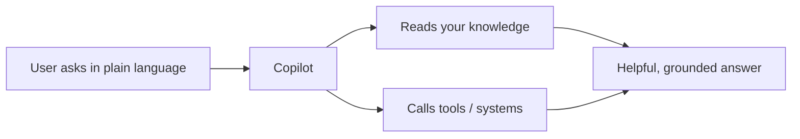
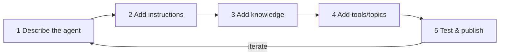

Before the deeper concepts, here's the big picture in plain language: **what Copilot is, why people
use it, how it's used, how you build one, what Copilot Studio is, and why you need it.**

> New to everything? Read this first, then [01-create-an-agent.md](01-create-an-agent.md) to build one,
> then [02-core-concepts.md](02-core-concepts.md) for the deeper *why*.

---

## What is Copilot?

A **Copilot** is an **AI-powered assistant** that understands natural language and helps people get
things done — answering questions, finding information, and taking actions on their behalf.

- It's built on **large language models (LLMs)** so it can understand and generate human-like text.
- A Copilot can **chat** (web, Teams, phone) and **act** (look up an order, file a ticket, send an email).
- In Microsoft's world, the assistants you build are called **agents** (formerly *bots* / *chatbots* /
  *Power Virtual Agents*).

> **One line:** A Copilot is a conversational assistant that *talks* like a person and *works* like an app.



---

## Why is Copilot used?

Because it removes friction between people and information/systems.

| Problem | How a Copilot helps |
| --- | --- |
| Employees can't find policies fast | Answers instantly from your HR/IT docs |
| Support teams are overloaded | Deflects common questions 24/7, escalates the rest |
| Apps are complex to navigate | Users just *ask* instead of clicking through menus |
| Repetitive tasks waste time | Automates lookups, status checks, form-filling |
| Knowledge is scattered | One assistant, grounded across many sources |

**Business value:** faster answers, lower support cost, consistent service, 24/7 availability, and
happier users — without writing a traditional app for every task.

---

## How is Copilot used?

People interact with a Copilot through **channels**, and the Copilot responds using **knowledge** and
**tools**.

1. **The user asks** in natural language (types or speaks) — in a website widget, **Microsoft Teams**,
   **Microsoft 365 Copilot**, or over the **phone**.
2. **The Copilot understands** the intent using AI.
3. **It grounds** the answer in your data (documents, records, live systems).
4. **It acts** if needed (runs a flow, calls an API, books something).
5. **It replies** — often with **citations** — and can escalate to a human when appropriate.

> Example: *"What's the status of order 12345?"* → the agent calls your order system → replies
> *"Shipped, arriving Tuesday."*

---

## How do you build a Copilot?

At a high level, building an agent is five repeatable steps:



1. **Describe** what the agent does and for whom (the **Description**).
2. **Instruct** how it should behave (tone, rules, guardrails — the **Instructions**).
3. **Ground** it on your **Knowledge** (websites, SharePoint, files, data).
4. **Empower** it with **Tools** and **Topics** (connectors, Power Automate flows, scripted flows).
5. **Test** in the test pane, then **Publish** to channels — and **iterate**.

> The full hands-on walkthrough is in [01-create-an-agent.md](01-create-an-agent.md).

---

## What is Copilot Studio?

**Microsoft Copilot Studio** is the **low-code / no-code tool for building, managing, and publishing
Copilot agents.** You design conversations on a visual canvas — no deep coding required.

It gives you everything in one place:

| Capability | What it means |
| --- | --- |
| **Visual authoring** | Drag-and-drop **topics** and **nodes** to design conversations |
| **Generative AI** | Pick a **model** and ground answers on your **knowledge** |
| **Tools & actions** | Connect **Power Automate**, **connectors**, **HTTP**, and **MCP servers** |
| **Orchestration** | **Classic** (trigger phrases) or **generative** (AI plans the steps) |
| **Multi-channel publishing** | Website, **Teams**, **Microsoft 365 Copilot**, phone, and more |
| **Governance** | Environments, security, **DLP**, and lifecycle management (ALM) |

> Copilot Studio was previously called **Power Virtual Agents**. It's part of the **Power Platform**.

---

## Copilot Studio for non-coders (no programming needed)

If you've never written code, relax — Copilot Studio is built for you. You **describe** what you want
in plain English and **drag boxes** on a canvas. Think of it like building with LEGO blocks instead
of pouring the plastic yourself.

### Everyday analogies

| Copilot Studio term | Think of it as… |
| --- | --- |
| **Agent** | Your assistant / helpful employee |
| **Topic** | One thing the assistant knows how to handle ("take an order") |
| **Trigger phrase** | The words a customer might say to start that task |
| **Node** | One step in a recipe (say this, then ask that) |
| **Variable** | A sticky note that remembers an answer ("name = Sam") |
| **Knowledge** | The binder of documents the assistant can read from |
| **Tool** | A button that does a job (look up an order, send an email) |
| **Publish** | Opening the shop so real people can talk to it |

### What you actually do (no code)

1. **Type a sentence** describing your assistant — Copilot Studio drafts it for you.
2. **Drag and drop** steps (message, question) on a visual canvas.
3. **Click** to add your documents as knowledge.
4. **Type** the rules in plain English (the instructions).
5. **Test** by chatting with it, then **Publish**.

> You only ever **type plain language** and **arrange boxes**. No syntax, no installs, no servers.

### Real-world work that can become an agent

The easiest way to spot an agent opportunity: look for **questions people keep asking** or **repetitive
steps people keep doing**. If a task is *"someone asks → you look something up → you reply,"* it can
usually become an agent.

| Real-world situation (today) | As an agent |
| --- | --- |
| Staff keep emailing HR *"how many leave days do I have left?"* | **HR leave assistant** answers from the policy + leave system, 24/7 |
| Customers call to ask *"where's my order?"* | **Order-status agent** looks up the order number and replies instantly |
| IT gets the same *"how do I reset my VPN/password?"* tickets | **IT helpdesk agent** walks users through the fix, creates a ticket only if needed |
| Front desk repeats opening hours, address, parking | **FAQ agent** answers from a simple knowledge page |
| Sales reps re-explain pricing tiers and product specs | **Product info agent** answers from the product catalog |
| Employees ask *"how do I claim expenses?"* | **Policy agent** explains the steps and links the form |
| Clinic staff field *"how do I book/cancel an appointment?"* | **Booking agent** collects details and schedules via a tool |
| New hires ask the same onboarding questions | **Onboarding buddy** answers from the employee handbook |

> **Rule of thumb:** *High volume + repetitive + answer lives in a document or system* = a great first agent.

### How a real task maps to agent pieces

Take *"Where's my order?"* and see how it becomes an agent — no code, just arranging steps:

| The real task | Agent piece |
| --- | --- |
| Customer says "track my order" | **Trigger phrase** |
| You ask "what's your order number?" | **Question** node → saved in a variable |
| You look it up in the system | **Tool** (connector / Power Automate) |
| You tell them the status | **Message** node with the result |
| It's a complex complaint | **Escalate** to a human |

### Tiny example — turning an FAQ into an agent (start to finish)

The simplest real use case: a shop answering opening hours.

1. **Create the agent** — type: *"Answer questions about Copilot Coffee's opening hours and location."*
2. **Add a topic** called *Store Hours*.
3. **Trigger phrases** (what customers actually type):
   ```
   what time do you open
   are you open on sunday
   store hours
   when do you close
   ```
4. **Message node** (what the assistant replies):
   ```
   ☕ We're open Mon–Fri 7am–6pm, Sat 8am–4pm, and closed Sundays.
   ```
5. **Test** — type *"are you open sunday?"* → it replies with the hours. **Publish.**

That's a working assistant — built with **zero code**, just typing and clicking.

### A slightly bigger example — collecting info

Want the assistant to take a customer's name and coffee order? You add **Question** nodes that
*remember* answers in variables, then a message that repeats them back:

```
Question: "What's your name?"            → remembers it as  CustomerName
Question: "Which coffee would you like?" → remembers it as  Coffee
Message:  "Thanks {CustomerName}! One {Coffee} coming up. ☕"
```

The `{CustomerName}` and `{Coffee}` are just sticky notes the assistant fills in automatically. This
exact build is the hands-on [Lab 1](06-lab1.md).

### When would a non-coder use each piece?

| You want the assistant to… | Use this (no code) |
| --- | --- |
| Say something fixed | **Message** node |
| Ask and remember an answer | **Question** node (+ a variable) |
| Answer from your documents | **Knowledge** (upload files / add a website) |
| Do different things based on the answer | **Condition** (pick from a list) |
| Take a real action (email, lookup) | **Tool** (a ready-made connector or flow) |
| Hand off to a human | **Escalate** / Redirect |

> **Beginner tip:** Start with **Message** and **Question** nodes only. That alone builds genuinely
> useful assistants. Add knowledge and tools once you're comfortable.

### Common beginner worries — answered

- *"Do I need to install anything?"* — No. It runs in your web browser.
- *"Will I break something?"* — No. Changes aren't live until you **Publish**, and you can always test first.
- *"Do I need to know AI?"* — No. Pick the default model and write rules in plain English.
- *"What if it doesn't understand?"* — Add more trigger phrases or clearer instructions, then re-test.

---

## Why do we need Copilot Studio?

Because building a reliable conversational AI from scratch is hard — and Copilot Studio handles the
heavy lifting.

| Without Copilot Studio | With Copilot Studio |
| --- | --- |
| Write and host LLM/RAG plumbing yourself | Add **knowledge**, it grounds automatically |
| Hand-build NLU and intent routing | **Classic / generative orchestration** built in |
| Custom-code every integration | **Connectors + Power Automate + MCP** out of the box |
| Build channel integrations one by one | **Publish once**, reach many channels |
| Manage security & compliance manually | **Environments, DLP, ALM** included |
| Needs developers for everything | **Low-code** — makers and citizen developers can build |

**In short:** Copilot Studio lets you go from idea to a published, governed, multi-channel agent
**quickly** — without reinventing AI infrastructure.

---

### Key takeaways

- A **Copilot** = an AI assistant that *talks* like a person and *works* like an app (Microsoft calls
  them **agents**).
- It's **used** to answer questions, automate tasks, and deflect support — across web, Teams, M365, and phone.
- You **build** one in five steps: Describe → Instruct → Ground → Empower → Test/Publish.
- **Copilot Studio** is the **low-code** platform that makes all of this fast, governed, and multi-channel.

---

## Official Microsoft documentation (references)

- [What is Copilot Studio?](https://learn.microsoft.com/microsoft-copilot-studio/fundamentals-what-is-copilot-studio)
- [Copilot Studio overview](https://learn.microsoft.com/microsoft-copilot-studio/)
- [Quickstart: Create and deploy an agent](https://learn.microsoft.com/microsoft-copilot-studio/authoring-first-bot)
- [Key concepts — agents](https://learn.microsoft.com/microsoft-copilot-studio/fundamentals-get-started)

Next: [02-core-concepts.md](02-core-concepts.md)
