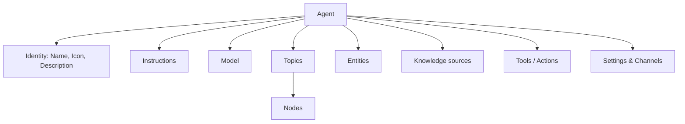
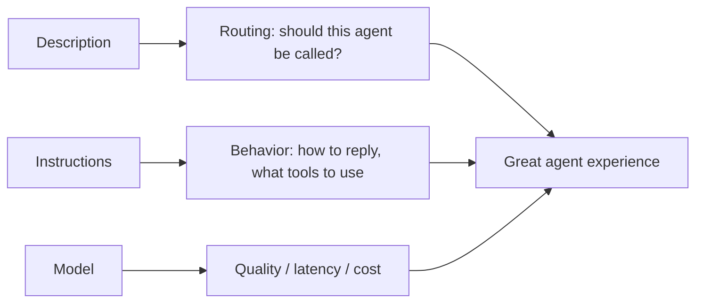
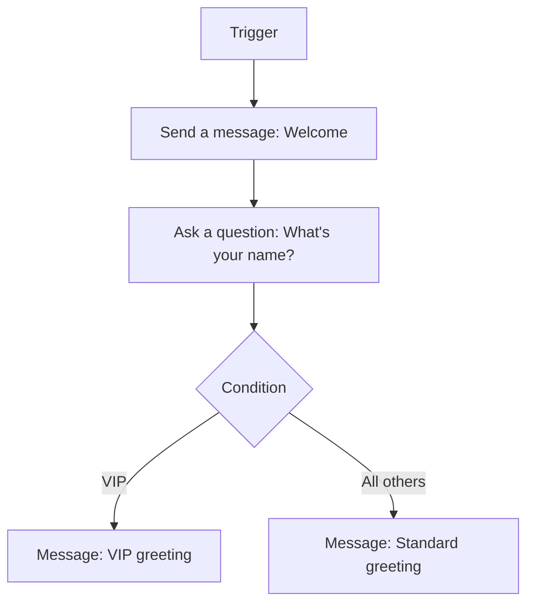
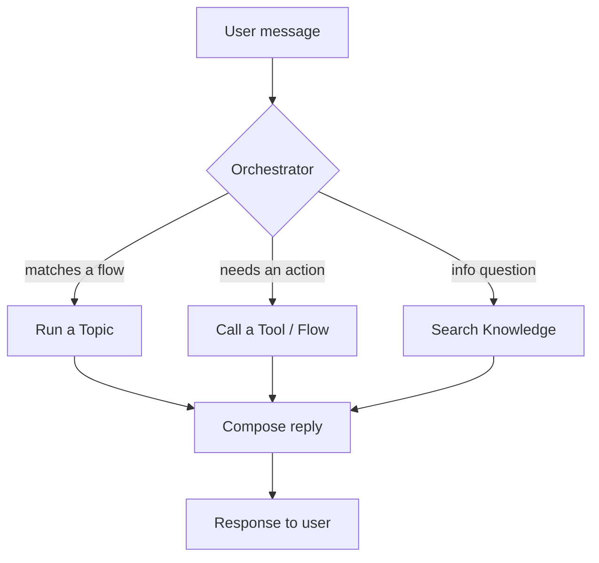
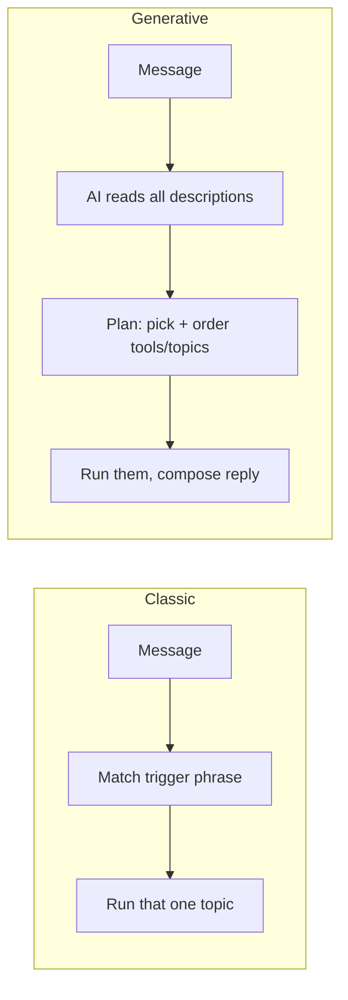

This is the mental model you need before building anything.

> New to creating agents? Walk through [01-create-an-agent.md](01-create-an-agent.md) first; come back here for the *why*.

---

## 1. The agent

An **agent** is the complete conversational assistant you build and publish. One agent contains:

- **Identity** – its **Name**, **Icon**, and **Description**.
- **Instructions** – the system prompt that controls how it behaves.
- **Model** – the LLM that powers it.
- **Topics** – the conversation flows.
- **Entities** – the information types it can recognize.
- **Knowledge sources** – websites, files, or data it can answer from with generative AI.
- **Tools / Actions** – connectors, Power Automate flows, and MCP servers it can call.
- **Settings** – language, authentication, channels, security.



---

## 1a. Description, Instructions, and Model — why they matter

These three live on the agent's **Overview** page and shape **every** response your agent gives. Get them right and the rest of your authoring becomes much easier.

### Description (≤ 1,024 characters) — the "what"
The **Description** is a one-paragraph summary of *what your agent does and for whom*. You edit it in **Overview → Details**.

**Why it matters**
- **Discovery** – users see it in the app catalog (Teams, Microsoft 365 Copilot).
- **Routing** – when your agent is invoked from Microsoft 365 Copilot or as a **child agent**, the orchestrator reads the **name + description** to decide whether to call it. Vague description → your agent never gets picked.

**Good vs bad**

| ❌ Weak | ✅ Strong |
| --- | --- |
| "HR chatbot." | "HR Assistant helps Contoso employees with HR questions about time-off, benefits, payroll, and onboarding. It answers from the Contoso HR policy library and escalates complex cases to a human HR business partner." |

> Rule: if printing only the Description would tell a stranger *what your agent is for*, it's good.

### Instructions (≤ 8,000 characters) — the "how"
The **Instructions** are the agent's **system prompt** — the standing rules the model follows on every turn. You edit them in **Overview → Instructions**.

**Why they matter**
- They set **role, tone, format, what to do, what to avoid, when to call which tool/topic, and how to handle "I don't know."**
- In **generative orchestration**, they directly shape the plan the model builds for each user message.
- Type **`/`** to reference real **tools / topics / agents / knowledge sources / variables / Power Fx** by name. **Names carry more weight than descriptions** when the orchestrator chooses what to call.

**Mini-template (full one in [09-models-and-instructions.md](09-models-and-instructions.md))**

```
Role         – who you are and who you serve
Tone & style – friendly, concise, bullets, next step
You can     – tasks + which /tools or /topics to use
You must NOT – guardrails (no inventing, no advice, etc.)
If unsure   – say so and offer /Escalate
```

### Model — the engine
The **Model** is the LLM that powers orchestration and responses. You pick it in **Overview → Model**. Each model has a **category tag** that tells you what it's optimized for:

| Tag | Best for | Latency | Cost | Examples (today) |
| --- | --- | --- | --- | --- |
| **General** | Everyday chat, FAQs, drafting, summarizing | Lowest | Lowest | **GPT-4.1** (default), GPT-5 Chat, Claude Sonnet |
| **Auto** | Mixed workloads — chat + actions | Variable | Variable | GPT-5 Auto |
| **Deep** | Multistep reasoning, policy/contract analysis | Highest | Highest | GPT-5 Reasoning, Claude Opus |

Each model also has a **release tag**: **Default**, **GA**, **Preview**, **Experimental**, **Retired**, **Cross-geo**.
**Use GA/Default for production.** Preview and Experimental are for testing only.

**Quick rule:**
1. **First agent / chat / FAQ?** → keep the **Default General** model.
2. **Multi-step reasoning, long docs, complex tools?** → use a **Deep** model.
3. **Mixed traffic?** → try **Auto**.
4. **Voice/IVR?** → prefer **General** for low latency.

> Full model list, regional availability, governance, and decision tree: [09-models-and-instructions.md](09-models-and-instructions.md).

### How they work together



| Get this wrong | And you'll see this |
| --- | --- |
| Vague **Description** | Orchestrators (M365 Copilot, parent agents) don't pick your agent. |
| Vague **Instructions** | Inconsistent tone, wrong tools called, hallucinations, no guardrails. |
| Wrong **Model** | Too slow, too expensive, or not smart enough for the task. |

> After changing any of these three, click **Start new test session** ⟳ in the test pane — the next message will use the latest configuration. **Publish** to release changes to users.

---

## 2. Topics

A **topic** represents a portion of a conversation — usually one user goal, like *"Track my order"*
or *"Reset my password."* You design each topic on the **authoring canvas** as a sequence of nodes.

There are two kinds:

| Type | Description |
| --- | --- |
| **System topics** | Built-in behaviors (Greeting, Start Over, Escalate, End of Conversation, errors…). You can edit or turn them off but can't create or delete them. |
| **Custom topics** | Everything you create. Some starter custom topics (Greeting, Goodbye, etc.) come predefined and can be edited or removed. |

**Best practice:** keep topics **small and focused** ("bite-size"). Many small topics are easier to
maintain and trigger more reliably than a few giant ones. Reusable logic can live in its own topic
that others **redirect** to.

---

## 3. Triggers — how a topic starts

Every topic begins with a **Trigger** node. A topic can be triggered in several ways:

| Trigger type | Starts when… |
| --- | --- |
| **User says a phrase** (classic) | The user's message matches the topic's **trigger phrases**. |
| **The agent chooses** (generative) | The AI decides the topic's **name + description** matches the user's intent. |
| **Redirect** from another topic | Another topic explicitly sends the conversation here. |
| **An event** | E.g., conversation start, inactivity, message received, on error, escalate. |

### Trigger phrases

For classic triggering, give each topic **5–10 short example phrases** a user might type. The AI
generalizes from them — it does **not** require an exact match. Example for a "Store Hours" topic:

```
what time do you open
are you open on sunday
store hours
when do you close
opening times
```

> Keep phrases short and varied. Avoid overlapping phrases across topics, or the agent will
> ask the user to disambiguate (the **Multiple Topics Matched** system topic).

---

## 4. Nodes — the steps inside a topic

A **node** is one action. You add nodes by selecting the **+** (Add node) icon between steps.
The most common node types:

| Node | Purpose |
| --- | --- |
| **Send a message** | The agent says something (text, image, quick replies, Adaptive Card). |
| **Ask a question** | The agent asks for input and stores the answer in a **variable**. |
| **Add a condition** | Branch the flow based on a value (uses Power Fx). |
| **Variable management** | Set, clear, or parse variable values. |
| **Topic management** | Redirect to another topic, or end the topic/conversation. |
| **Call an action** | Run a Power Automate flow, a connector, a prompt, or a tool. |
| **Advanced** | HTTP request, generative answers, send/receive events, etc. |

We cover **Send a message** and **Ask a question** in depth in
[04-nodes-message-and-question.md](04-nodes-message-and-question.md).



---

## 5. Orchestration — classic vs generative

**Orchestration** is the agent's "brain" — the part that decides, for **every user message**, *what
to do next*: which **topic** to run, which **tool** or **knowledge source** to use, in what **order**,
and how to **combine** the results into a single reply. Think of it as a **dispatcher** standing
between the user and everything you built.



Copilot Studio offers **two orchestration modes**, set in **Settings → Generative AI**.

| | **Classic orchestration** | **Generative orchestration** |
| --- | --- | --- |
| Routing | Matches **trigger phrases** to topics | AI reads topic/tool **descriptions** and chooses |
| Best for | Predictable, scripted flows | Flexible, natural, multi-step requests |
| You author | Trigger phrases per topic | Clear names + descriptions; the AI plans |
| Default trigger | "User says a phrase" | "The agent chooses" |
| Multi-step | One topic at a time | Can chain several topics/tools in one turn |
| Control | High (you decide the path) | High-level (you guide; AI decides the path) |

### Classic orchestration (rule-based routing)

The agent compares the user's message to the **trigger phrases** you wrote for each topic and runs the
**best match**. It's deterministic and easy to follow — what you script is exactly what happens.

- **You control the path.** Great for compliance-heavy or strictly scripted flows.
- **One topic at a time.** If a request needs two things, the user usually goes through two topics.
- **Limitation:** it only knows what you anticipated. Unusual phrasings may match nothing (or the
  wrong topic), triggering the **Multiple Topics Matched** or **Fallback** system topics.

> Example: User types *"opening times"* → matches the **Store Hours** trigger phrases → that topic runs.

### Generative orchestration (AI-planned routing)

Instead of matching phrases, the AI reads the **names and descriptions** of your topics, tools,
knowledge sources, and child agents, then **builds a plan** for each message — possibly using
**several** of them in one turn, and asking follow-up questions if information is missing.

What the orchestrator does each turn:

1. **Understands** the user's intent (even from messy, multi-part requests).
2. **Selects** the relevant topics / tools / knowledge by their **descriptions**.
3. **Sequences** them (e.g., look up the order *then* draft an email).
4. **Fills inputs** automatically from the conversation (proactive slot filling).
5. **Composes** one coherent answer, with citations when grounded.

> Example: User says *"My order 123 is late and I want a refund."* The orchestrator can call
> **/LookupOrder**, then run the **Refund** topic, then **escalate** — all from one sentence.

**What makes generative orchestration work well**

- **Great descriptions everywhere.** Names + descriptions are how the AI "sees" each topic/tool.
  Vague descriptions → the right tool never gets picked. (Names carry more weight than descriptions.)
- **Clear Instructions.** The agent's **Instructions** steer the plan: *"For policy questions, cite the
  source; for account changes, call /AccountTool; if unsure, escalate."*
- **Bounded tasks.** Very long multi-step plans can time out or drift — keep tools/topics focused.

### How the two compare at runtime



### Which should you use?

| Choose **classic** when… | Choose **generative** when… |
| --- | --- |
| Flows must be exact and predictable | Users phrase things many different ways |
| Compliance/audit needs a fixed path | You want natural, multi-step conversations |
| You're a beginner learning cause→effect | You have well-described topics, tools, knowledge |
| Few, simple topics | Many capabilities the AI should combine |

You switch modes in **Settings → Generative AI**. As a beginner, **classic** makes the cause-and-effect
of triggers and nodes easiest to see, so the labs use trigger phrases. Once comfortable — and once your
topics/tools have clear descriptions — switch to **generative** for more natural, AI-driven conversations.

> **Note on "agent" orchestration too:** the same description-driven logic decides whether *your whole
> agent* is invoked as a **child agent** or from **Microsoft 365 Copilot**. Good names + descriptions
> matter at every level.

---

## 6. The conversation lifecycle (what happens at runtime)

1. **User sends a message** (types or speaks).
2. The agent's **NLU** (natural language understanding) figures out the **intent**.
3. The matching **topic is triggered**.
4. Nodes run **top to bottom**; **conditions** branch left to right.
5. **Question** nodes pause and wait for the user; answers are saved to **variables**.
6. **Entities** extract structured info (a date, an email, a choice) from free text.
7. The topic ends, redirects, or escalates. Variables persist for the **session**.

---

## 7. Knowledge & generative answers (quick intro)

Beyond scripted topics, an agent can answer from **knowledge sources** (public websites, SharePoint,
uploaded files, Dataverse, etc.) using **generative AI**. When no topic matches, the agent can fall
back to generative answers. You'll mostly use scripted topics in these labs, but know that knowledge
is what makes an agent feel "smart" beyond your hand-built flows.

---

## 8. Publishing & channels

- **Save** keeps your edits in the authoring environment.
- **Publish** pushes the latest version live.
- **Channels** are where users reach the agent: a **demo website**, your own website, **Microsoft
  Teams**, **Microsoft 365 Copilot**, telephony/voice, Facebook, and more.

---

### Key takeaways

- An **agent** is made of **topics**; topics are made of **nodes**.
- **Triggers** start topics; **trigger phrases** (classic) or **descriptions** (generative) decide routing.
- **Variables** remember values; **entities** recognize information types.
- Nodes run **top→bottom, left→right**.

---

## Official Microsoft documentation (references)

The content in this section is based on the following Microsoft Learn pages:

- [Create and edit topics](https://learn.microsoft.com/microsoft-copilot-studio/authoring-create-edit-topics)
- [Use system topics](https://learn.microsoft.com/microsoft-copilot-studio/authoring-system-topics)
- [Set topic triggers](https://learn.microsoft.com/microsoft-copilot-studio/authoring-triggers)
- [Triggering topics (guidance)](https://learn.microsoft.com/microsoft-copilot-studio/guidance/triggering-topics)
- [Design effective trigger phrases](https://learn.microsoft.com/microsoft-copilot-studio/guidance/trigger-phrases-best-practices)
- [Follow topic authoring best practices](https://learn.microsoft.com/microsoft-copilot-studio/guidance/topic-authoring-best-practices)
- [Orchestrate agent behavior with generative AI](https://learn.microsoft.com/microsoft-copilot-studio/advanced-generative-actions)
- [Choose how to control the conversation](https://learn.microsoft.com/microsoft-copilot-studio/guidance/voice-agents-control-conversation)
- [Write agent instructions](https://learn.microsoft.com/microsoft-copilot-studio/authoring-instructions)
- [Select a primary AI model for your agent](https://learn.microsoft.com/microsoft-copilot-studio/authoring-select-agent-model)
- [Quickstart: Create and deploy an agent](https://learn.microsoft.com/microsoft-copilot-studio/fundamentals-get-started)

Next: [03-variables-and-data-types.md](03-variables-and-data-types.md)
