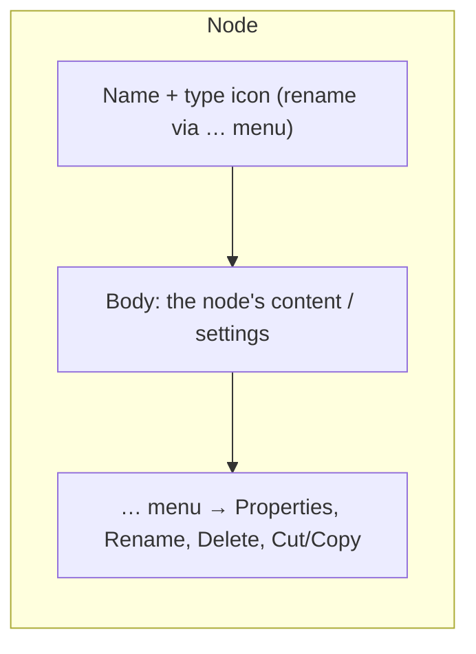
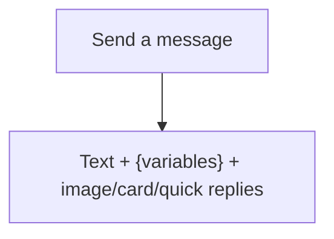
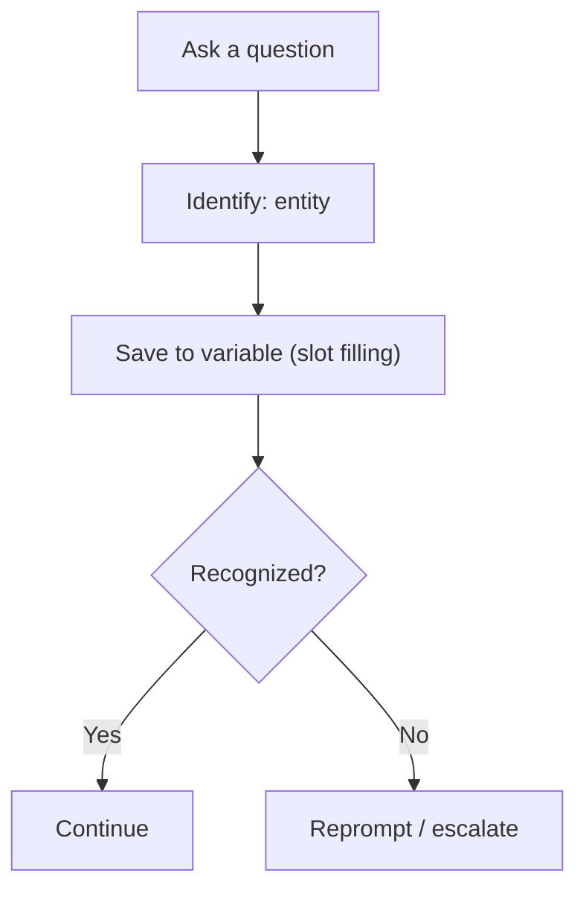
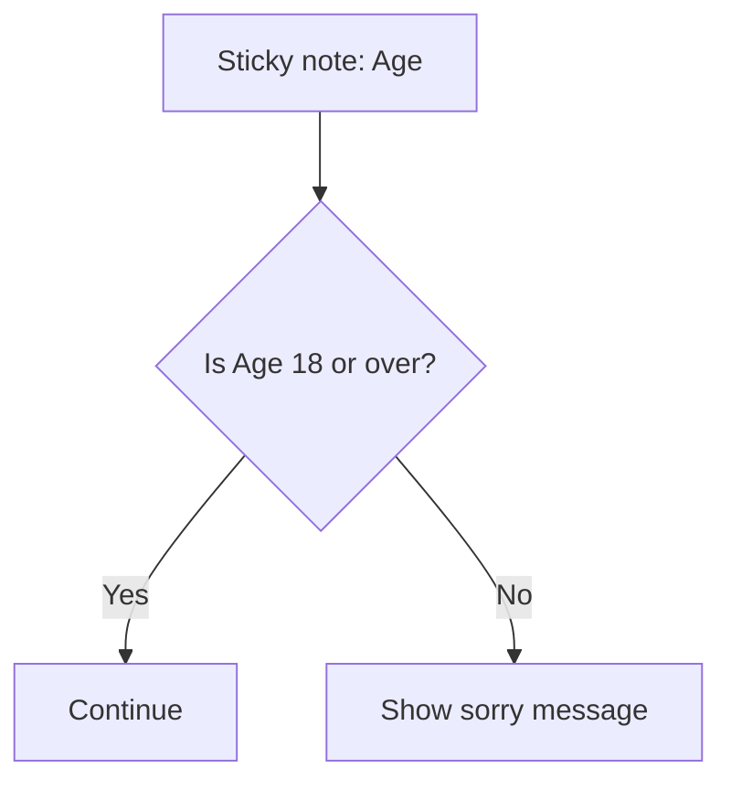
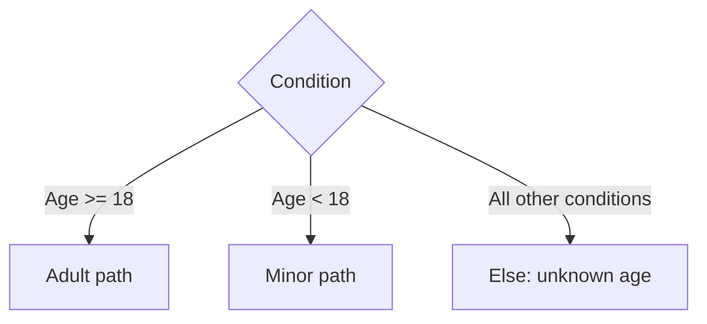
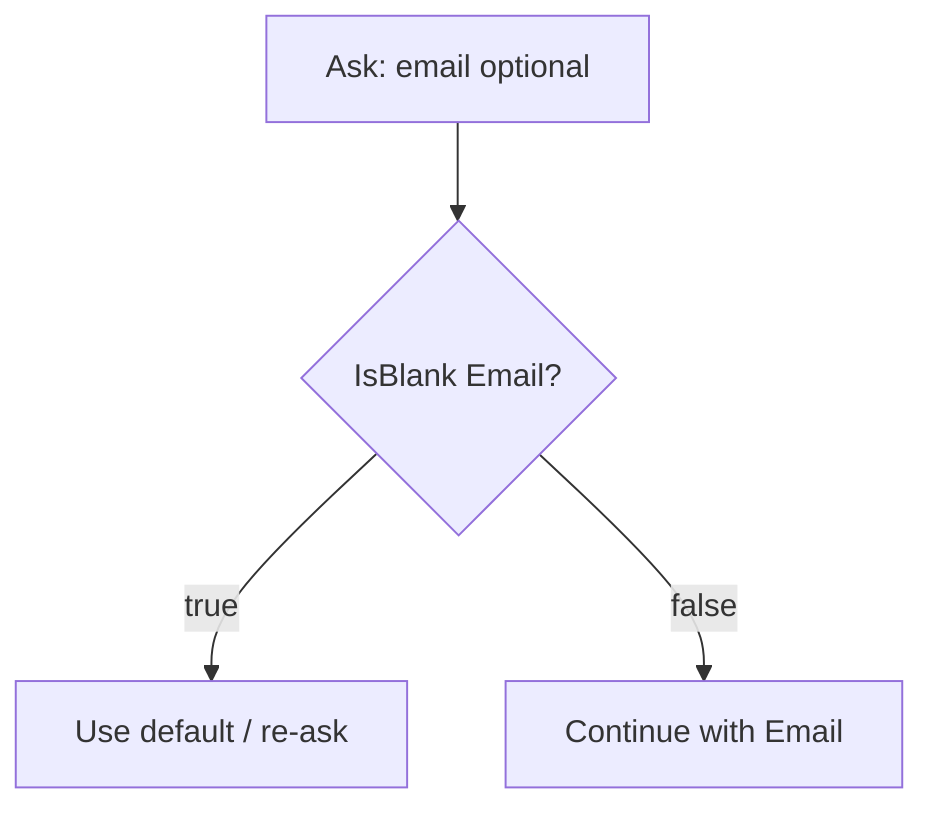

Nodes are the steps in a topic. This file goes deep on the two you'll use most —
**Send a message** and **Ask a question** — then summarizes every other node type.

---

## Node anatomy (every node shares this)

No matter the type, each node on the authoring canvas has the same three parts:



- **Name + icon** — identifies the node; rename it (up to **500 characters**) so topics stay readable.
  You can't rename **Trigger** or **Go to step** nodes.
- **Body** — the editable content (message text, question, condition, etc.).
- **… (More) menu** — opens **Properties**, plus Rename, Delete, Cut/Copy/Paste.

Nodes run **top → bottom**; **Condition** branches run **left → right**.

---

## Part A — The Message node ("Send a message")

The Message node makes the agent **say something**. No input is collected.

### Add one
1. Select **+** under a node → **Send a message**.
2. Type your message text.

### Insert a variable into a message
Select the **`{x}`** icon in the message box to pick a variable. At runtime the value is substituted.

```
Welcome back, {Global.UserName}! Your last order was #{Topic.OrderId}.
```

- The **Custom** tab lists topic and global variables (alphabetical).
- The **System** tab lists context variables like `Activity.Channel`.

### Rich content the Message node supports
Use the node's menu bar (**Add**) to insert any of these. All of them are **also available on the
Question node**.

| Content type | What it adds | Key properties |
| --- | --- | --- |
| **Text formatting** | Bold, italic, bulleted & numbered lists | Inline toolbar |
| **Variables** `{x}` | Insert a variable value into the text | Custom / System / etc. tabs |
| **Message variation** | Extra wordings; the agent randomly picks one each time | One text box per variation |
| **Speech override (SSML)** | A separate spoken version for voice agents | Plays instead of the text when spoken |
| **Image** | An image from a hosted **URL** | `Image URL`, optional `Title` |
| **Video** | A direct **MP4 URL** or a **YouTube URL** | `Media URL`, `Title`, `Subtitle`, `Image URL`, `Text`, buttons |
| **Basic card** | Text + image + interactive buttons | Title, subtitle, text, image, buttons |
| **Adaptive Card** | Rich structured card authored as **JSON** (schema 1.6 and earlier) | Built-in designer or JSON payload editor |
| **Quick replies** | Tappable suggestion buttons that don't block the flow | See action types below |

#### Message node properties in detail

- **Message variations** — When you add variations, the agent **randomly** picks one each time the
  node runs, so it doesn't sound repetitive. Add or remove them from the node's menu bar.
- **Speech (SSML) override** — A voice-only alternative to the text. Voice agents speak this instead
  of reading the on-screen text.
- **Quick reply action types** — Select the **Quick replies** box to open its properties and set the
  **Type**:
  - **Send a message** (default) — sends the text to the agent and shows it in chat history.
  - **Open URL** — opens a link (must start with `https://`).
  - **Make a call** — dials a number; enter `PhoneNumber:1234567890`.
  - **Send a hidden message to the agent** — sends text to the agent but hides it from chat history.
  > Quick replies let users *type instead* of choosing. To **force** a choice from a list, use a
  > **multiple-choice Question node** instead. Some channels don't support quick replies or limit how
  > many show at once.
- **Multiple cards layout** — If a node has two or more media cards, choose how they display:
  - **Carousel** (default) — one card at a time.
  - **List** — all cards stacked vertically.
- **Rename the node** — Select the node name, or **… → Rename**. Names can be up to **500 characters**
  (you can't rename **Trigger** or **Go to step** nodes).

> **Adaptive Card schema note:** Copilot Studio supports Adaptive Cards **1.6 and earlier**, but the
> target channel matters — Web Chat supports 1.6 (no `Action.Execute`), while **Teams** and the live
> chat widget are limited to **1.5**. For *interactive* cards that collect input, use the dedicated
> **Ask with Adaptive Card** node instead of the Message node.

### Good message-writing habits
- Keep it short and conversational.
- Confirm what you captured: *"Got it — pickup at {Topic.PickupTime}."*
- Use variations for greetings to feel natural.
- Don't put a question here — use a **Question** node so the answer is captured.



---

## Part B — The Question node ("Ask a question")

The Question node **asks for input, waits**, recognizes it with an **entity**, and **saves it to a
variable**. This is the heart of data collection.

A Question node has three parts:

1. **Message** – the question text (supports variables and `{x}`).
2. **Identify** – *what kind of information* to extract (an entity).
3. **Save user response as** – the **variable** that stores the answer (this is **slot filling**).

### In plain English (for non-coders)

Think of a Question node like a **friendly form field that talks**:

- **It asks** — "What's your name?" (the *Message*).
- **It listens** — and figures out the useful part of the reply (the *Identify* step). If you say
  *"my email is sam@contoso.com, thanks!"* it grabs just `sam@contoso.com`.
- **It remembers** — by writing the answer on a **sticky note** (the *variable*) so you can use it
  later, e.g., *"Thanks, {CustomerName}!"*

> Analogy: **Message node = the agent talking.** **Question node = the agent asking and writing down
> your answer.** The sticky note (variable) keeps that answer for the rest of the chat.

**A tiny mental model**

```
You ask:      "What's your name?"
User types:   "Sam"
Agent saves:  CustomerName = Sam     ← the sticky note
Agent reuses: "Nice to meet you, Sam!"
```

What each part means without jargon:

| Builder word | What it really means |
| --- | --- |
| **Identify / Entity** | "What *kind* of answer am I expecting?" (a name, a date, a yes/no, a choice) |
| **Variable** | The sticky note that stores the answer |
| **Slot filling** | The act of writing the answer onto the sticky note |
| **Prebuilt entity** | A ready-made detector (email, date, number) — no setup |
| **Multiple choice** | Show **buttons** so the user taps instead of typing |

### Add one
1. Select **+** → **Ask a question**.
2. Type the question, e.g., *"What's your email address?"*
3. Under **Identify**, choose what to recognize (see options below).
4. Under **Save response as**, rename the variable to something meaningful (e.g., `customerEmail`).
5. (Optional) Open **Properties** to fine-tune behavior.

### "Identify" options

| Identify option | Use it when… | Stores |
| --- | --- | --- |
| **Multiple choice options** | You want fixed, tappable buttons | Choice |
| **User's entire response** | You want the raw text exactly as typed | String |
| A **prebuilt entity** (Email, Date and time, Number, Age…) | You want a known information type extracted | type of that entity |
| A **custom entity** (your own list) | You want to recognize *your* domain values | Choice |
| **One of multiple entities** | The answer could be one of several types (up to 5) | Record |

#### Multiple choice options
You define the choices; each appears as a **button**. Users can tap **or** type. Stores a **Choice**.

#### User's entire response
No extraction — you get the literal text. Good for free-text like feedback, names, or passing raw
context.

#### Prebuilt / custom entity
The AI extracts just the relevant piece. *"It's sam@contoso.com, thanks!"* with the **Email** entity
stores `sam@contoso.com`. (Entities are covered fully in
[05-entities-and-slot-filling.md](05-entities-and-slot-filling.md).)

#### One of multiple entities
Accept any one of several entities at the same turn — e.g., *account number* **or** *phone number*.
The result is a **Record** with one field per entity (e.g., `Identifier.account`, `Identifier.phone`),
and you branch with conditions using **is not Blank**. Note: if the user provides two, only the
**first** configured entity is captured.

### Show options as buttons
When using **Multiple choice** or a **closed-list custom entity**, enable **"Select options for user"**
to render the list as buttons — convenient and reduces typos. Users can still type a synonym.

### Question node properties (behavior tuning)
Open **… → Properties** on the Question node. The **Question properties** panel is organized into
**categories** (some only appear for voice-enabled agents):

| Category | What it controls |
| --- | --- |
| **Question behavior** | Skip behavior + reprompt (retry) behavior |
| **Entity recognition** | Extra validation + what happens when no valid entity is found |
| **Interruptions** | Whether the user can switch to another topic mid-question |
| **Voice** | Speech-specific settings (voice agents only) |
| **Hold and resume** | Pause/resume the conversation (voice agents) |

#### 1. Question behavior

**Skip behavior** — what to do if the node's variable *already has a value* from earlier:
- **Allow question to be skipped** — skip the question when the variable is already filled.
  This is what lets the agent **not re-ask** something it already knows (great with global variables).
- **Ask every time** — always ask, even if the variable has a value.

**Reprompt** — what to do when the user's answer can't be recognized:
- **How many reprompts** — **Repeat up to 2 times** (default), **Repeat once**, or **Don't repeat**.
- **Retry prompt** — select **Customize** to set the message used on a retry. Supports multiple
  variants plus **Randomize variant selection** (on = random; off = play variants in order, so you
  can escalate guidance: gentle on retry 1, explicit on retry 2).

#### 2. Entity recognition
Expand validation beyond the entity's default rules and decide what happens when the agent gives up
after the reprompts (**No valid entity found**):
- **Set variable to empty (no value)** — clear the variable and move on; check it later with a
  **Condition** node (`IsBlank`).
- **No entity found message** — select **Customize** to set the message shown when it moves on.
- **Condition not met prompt** — shown when your extra validation rule fails (also supports variants
  and **Randomize variant selection**).

#### 3. Interruptions
Controls whether a user can jump to a different topic while this question is waiting:
- **Allow switching to another topic** — the user can switch when their reply matches another topic's
  trigger with high confidence.
- **Only selected topics** — restrict which topics they can switch to.
> **Troubleshooting tip:** If answers to your question keep triggering *other* topics instead of
> filling the variable, turn **Allow switching to another topic** **off** on that node.

#### 4. Voice / Hold & resume (voice agents only)
Speech timing, DTMF, and the ability to place the caller on hold (**Do Not Hold**, **Hold
Automatically**, **Hold if user requests**) with hold/resume words, hold message, and hold music URL.

#### Sensitive data
Separately, on the topic's **Details → Input/Output** tabs you can mark a variable as **Sensitive
data** so its value is kept out of transcripts and platform logs (use for card numbers, secrets).

> **Note:** The Adaptive Card question node has its own similar properties (reprompt count, retry
> prompt, allow switching topics) — a text reply while it waits for a card submission counts as an
> invalid response unless it triggers an interruption.

### What it looks like under the hood (YAML)
You normally never see this, but it helps to know a Question is just structured data:

```yaml
- kind: Question
  id: question_1
  alwaysPrompt: true                 # "Ask every time" (skip behavior)
  variable: init:Topic.Continue      # where the answer is saved (slot filling)
  prompt: Can I help with anything else?
  entity: BooleanPrebuiltEntity      # what to identify
```



---

## Part B.5 — The Adaptive Card question node ("Ask with Adaptive Card")

When you need a **rich form** (multiple fields in one card — text boxes, dropdowns, date pickers,
toggles, and a Submit button), use the dedicated **Ask with Adaptive Card** node instead of a plain
Question node.

### How it differs from a normal Question node

| | Question node | Adaptive Card question node |
| --- | --- | --- |
| Input style | One value per turn | **Several fields at once** in a card |
| Authoring | Pick an entity | **Adaptive Card designer** or raw **JSON** payload |
| Stores | One variable | **One variable per input field** |
| Dynamic data | Variables in text | **Power Fx** can inject data into the card |

### Add one
1. Select **+** → **Ask with adaptive card**.
2. Select **Edit adaptive card** to open the designer, or paste a **JSON** payload (schema **1.6 and
   earlier**).
3. Map each input field to a variable; the user's submission fills those variables.

### Properties (similar to a Question node)
- **How many reprompts** — Repeat up to 2 (default), once, or don't. The card is **resent** on each retry.
- **Retry prompt** — customize the message shown with the resent card.
- **Allow switching to another topic** — if the user types text instead of submitting the card, that
  counts as **invalid** *unless* it triggers an interruption. With this on (default), it switches
  topics and the card is re-sent after the interruption ends.

> **Channel limits:** Web Chat supports schema 1.6 (no `Action.Execute`); **Teams** and the live chat
> widget are limited to **1.5**. Use the **Message** node's Adaptive Card option for *display-only*
> cards, and this node when you need the user to **submit** input.

---

## Part B.6 — The Condition node ("Add a condition")

The **Condition** node **branches** the flow: it checks a value and sends the conversation down the
matching path. Add it with **+ → Add a condition** (under **Logic**).

### In plain English (for non-coders)

A Condition node is just a **fork in the road** with a yes/no (or which-one) question on the signpost.
The agent looks at a **sticky note** (a variable) and **picks the path** that matches.

> Analogy: *"**If** it's raining, take an umbrella; **otherwise**, don't."* The Condition node is the
> word **"if"** — it decides what happens next based on what it already knows.

Everyday examples (no formulas needed — the builder gives you dropdowns):

- *If the user said they're a **VIP** → show the VIP greeting; otherwise → show the normal greeting.*
- *If **age is 18 or over** → continue; otherwise → show a "sorry" message.*
- *If the **email box is empty** → ask again; otherwise → move on.*

How you build it (point-and-click):

1. Pick the **sticky note** to check (a variable, e.g., *Age*).
2. Pick **how** to check it from a dropdown (*is equal to*, *is greater than*, *is not blank*…).
3. Type the **value** to compare against (e.g., *18*).
4. Add more branches if you have more than two outcomes; the agent always has an **"everything else"**
   path for safety.



### How a condition is built

Each condition has:
1. A **variable** to check (e.g., `Topic.Age`).
2. An **operator** (is equal to, is greater than, is not blank, …).
3. A **value** to compare against (a literal, another variable, or a Power Fx formula).

A Condition node can have **multiple branches** (like a switch): the first branch whose check is
**true** runs; if none match, the **All other conditions** (else) branch runs.



### Types of checks you can add

| Check type | Builder operator | Power Fx equivalent |
| --- | --- | --- |
| **Equality** | is / is equal to | `Topic.Status = "Open"` |
| **Inequality** | is not | `Topic.Status <> "Open"` |
| **Comparison** | greater / less than (or equal) | `Topic.Age >= 18` |
| **Boolean true** | is true | `Topic.Agreed` or `Topic.Agreed = true` |
| **Boolean false** | is false | `Not(Topic.Agreed)` |
| **Has a value** | is not blank | `!IsBlank(Topic.Email)` |
| **No value** | is blank | `IsBlank(Topic.Email)` |
| **Text contains** | contains | `"hello" in Lower(Topic.Text)` |
| **In a set** | — (use formula) | `Topic.Size in ["Small","Medium","Large"]` |
| **Multiple conditions** | And / Or rows | `Topic.Age >= 18 And Topic.Country = "US"` |

> Switch to the **Formula** option in the condition to write any Power Fx expression that returns
> `true`/`false`.

### Null / "no value" checks (important)

Copilot Studio doesn't have a separate `null` keyword — the concept of "no value / not set / empty"
is represented by **Blank**. So a **null check is a Blank check**.

- **Is it empty / not answered / not set?** → `IsBlank(Topic.X)`
- **Does it have a value?** → `!IsBlank(Topic.X)`

```
// User skipped an optional email question?
If  IsBlank(Topic.Email)   → ask again / use a default
Else                       → continue
```

Why use `IsBlank` instead of comparing to `""` or `0`:

| Value of `Topic.X` | `IsBlank(Topic.X)` | `Topic.X = ""` | `Topic.X = 0` |
| --- | --- | --- | --- |
| Never set (Blank) | **true** | false | false |
| Empty text `""` | false* | true | false |
| Zero `0` | false | false | true |

> *Tip:* To treat **both** "never set" **and** "empty text" as empty, use
> `IsBlank(Topic.X) Or Topic.X = ""` — or normalize first with `Trim(...)`.

### Blank check — common patterns

```
// 1. Default a value when blank
Set Topic.Size = If(IsBlank(Topic.Size), "Medium", Topic.Size)

// 2. Require a value before continuing
If IsBlank(Topic.OrderId)  → Message "I still need your order number"  → loop back
Else                       → continue

// 3. Guard a calculation (avoid errors on blank numbers)
If !IsBlank(Topic.Qty) And Topic.Qty > 0  → proceed
Else                                      → "Please enter a quantity"

// 4. Coalesce: first non-blank wins
Coalesce(Topic.PreferredName, Topic.FullName, "there")
```

### Useful Power Fx for conditions

| Goal | Formula |
| --- | --- |
| Not blank | `!IsBlank(Topic.Email)` |
| Blank **or** empty text | `IsBlank(Topic.Email) Or Topic.Email = ""` |
| Numeric range | `Topic.Age >= 18 And Topic.Age <= 65` |
| Case-insensitive match | `Lower(Topic.City) = "seattle"` |
| Contains a word | `"refund" in Lower(Topic.Text)` |
| One of several values | `Topic.Coffee in ["Latte","Espresso"]` |
| Boolean is false/blank-safe | `Topic.Agreed <> true` |
| First non-blank value | `Coalesce(Topic.A, Topic.B, "fallback")` |

### Condition node gotchas

- **Blank ≠ empty string ≠ 0** — pick the right check (table above).
- A **Blank Boolean is not `false`** — `If(Topic.Agreed = false, …)` misses the "never answered"
  case; use `IsBlank` or `Topic.Agreed <> true`.
- **Order matters** — the **first** true branch wins; put the most specific checks first.
- Always provide an **All other conditions** path so nothing falls through silently.
- **Type mismatches** error out — compare a Number to a Number, not to `"18"` (convert with
  `Value(...)` / `Text(...)`).
- String compares are **case-sensitive** unless you normalize with `Lower(...)`/`Trim(...)`.



---

## Part C — Every other node type (quick reference)

| Category | Node | What it does |
| --- | --- | --- |
| **Send a message** | Send a message | Agent speaks; rich content supported |
| **Ask a question** | Ask a question | Collect + recognize + store input |
| **Ask with adaptive card** | Adaptive Card question | Collect input via a rich card form |
| **Logic** | Add a condition | Branch on a value (Power Fx) |
| **Logic** | Conditions (switch-like) | Multiple branches from one value |
| **Variable management** | Set a variable value | Assign a value or Power Fx formula |
| **Variable management** | Clear variable values | Reset variables (e.g., on start over) |
| **Variable management** | Parse value | Convert/parse text into a typed value |
| **Topic management** | Redirect | Jump to another topic (optionally pass variables) |
| **Topic management** | End current topic | Finish this topic |
| **Topic management** | End conversation / Transfer / Escalate | Hand off to a person or close the chat |
| **Call an action** | Power Automate flow | Run a flow (lookup, write to a system, send email) |
| **Call an action** | Connector / Prompt / Tool | Call a connector, an AI prompt, or an agent tool |
| **Advanced** | HTTP request | Call a REST API directly |
| **Advanced** | Generative answers | Answer from knowledge sources with AI |
| **Advanced** | Send/Receive event, Go to step | Eventing and flow control |

> Different categories appear under the **+** menu grouped exactly like the table above.

---

### Key takeaways

- **Message node** = output (supports variables, variations, images, quick replies, Adaptive Cards).
- **Question node** = input → **Identify** (entity) → **Save to variable** (slot filling).
- Use **Multiple choice** for buttons, **prebuilt/custom entities** to extract specific info,
  **One of multiple entities** when the answer could be several types.
- **Condition node** = branch on a value; "null" means **Blank**, so use `IsBlank(...)` /
  `!IsBlank(...)` — not `= ""` or `= 0`.
- **Properties** control reprompts, skip-if-known, validation, interruptions, and sensitive data.

---

## Official Microsoft documentation (references)

The content in this section is based on the following Microsoft Learn pages:

- [Send a message (Message node)](https://learn.microsoft.com/microsoft-copilot-studio/authoring-send-message)
- [Ask a question (Question node)](https://learn.microsoft.com/microsoft-copilot-studio/authoring-ask-a-question)
- [Reprompt messages in a Question node](https://learn.microsoft.com/microsoft-copilot-studio/voice-random-message-selection)
- [Ask with Adaptive Cards](https://learn.microsoft.com/microsoft-copilot-studio/authoring-ask-with-adaptive-card)
- [Adaptive Cards overview](https://learn.microsoft.com/microsoft-copilot-studio/adaptive-cards-overview)
- [Use conditions](https://learn.microsoft.com/microsoft-copilot-studio/authoring-using-conditions)
- [Send an event or activity](https://learn.microsoft.com/microsoft-copilot-studio/authoring-send-event-activities)
- [Use Hold and resume](https://learn.microsoft.com/microsoft-copilot-studio/voice-hold-resume)
- [Additional settings for inputs of topics and actions](https://learn.microsoft.com/microsoft-copilot-studio/advanced-additional-settings-topic-action-inputs)
- [Create and edit topics](https://learn.microsoft.com/microsoft-copilot-studio/authoring-create-edit-topics)

Next: [05-entities-and-slot-filling.md](05-entities-and-slot-filling.md)
