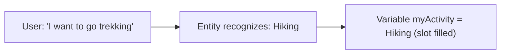

Entities are how the agent **understands the *information* inside what a user says** — not just
which topic to trigger, but the actual values (a date, an email, a product, a yes/no).

---

## 1. What is an entity?

An **entity** is a unit of information that represents a real-world type of subject — a phone number,
a city, a person's name, a color, a date. With entities, the agent can pull the relevant value out of
free-form text and **save it for later use**.

Example: a user says *"I tried to use my gift card but it doesn't work."* The agent can both route to
the right topic **and** recognize *gift card* as a value — even if those exact words weren't a trigger
phrase.

There are two families: **prebuilt** (ready-made) and **custom** (you create).

---

## 2. Prebuilt entities

Copilot Studio ships with entities for the most common information types. You just pick one in a
**Question** node's **Identify** box. Full list and the type each one stores:

| Prebuilt entity | Stored as | Recognizes things like |
| --- | --- | --- |
| Age | Number | "I'm 30 years old" → `30` |
| Boolean | Boolean | "yes / no / sure / nope" → `true`/`false` |
| City | String | "Seattle" |
| Color | String | "dark blue" |
| Continent | String | "Asia" |
| Country or region | String | "Canada" |
| Date and time | DateTime | "next Friday at 3pm" |
| Email | String | "sam@contoso.com" |
| Event | String | "Thanksgiving" |
| Integer | Number | "42" |
| Language | String | "Spanish" |
| Money | Number | "It costs 1000 dollars" → `1000` |
| Number | Number | "3.14" |
| Ordinal | Number | "the second one" |
| Organization | String | "Microsoft" |
| Percentage | Number | "20%" |
| Person name | String | "Maria Garcia" |
| Phone number | String | "+1 425-555-0100" |
| Point of interest | String | "Eiffel Tower" |
| Speed | Number | "60 mph" |
| State | String | "Texas" |
| Street address | String | "1 Microsoft Way" |
| Temperature | Number | "75 degrees" |
| URL | String | "https://contoso.com" |
| Weight | Number | "5 kg" |
| Zip code | String | "98052" |

> Notice extraction is **smart**: from *"It costs 1000 dollars"* the **Money** entity stores the
> number `1000`, dropping the surrounding words. That's the power of entities vs. raw text.

To browse them: **Settings → Entities** (you'll see prebuilt + any custom ones).

---

## 3. Custom entities

When prebuilt types don't cover your domain (pizza sizes, coffee types, ticket categories), create a
**custom entity**. Two kinds:

### a) Closed list entity
A fixed list of allowed values, each with optional **synonyms**. Best when answers come from a known
set.

Example — **Coffee Type**:

| Value | Synonyms |
| --- | --- |
| Espresso | short black, shot |
| Latte | caffè latte, milky coffee |
| Cappuccino | cap, cappa |
| Americano | long black |

Now if a user types *"I'll have a long black"*, the agent recognizes **Americano**. Closed-list
entities store a **Choice**, and can be shown as **buttons** in a Question node.

**Create one:**
1. **Settings → Entities → New entity → Closed list**.
2. Name it (e.g., `Coffee Type`).
3. Add each **item** and its **synonyms** (one synonym per line or comma-separated).
4. Save.

### b) Regular expression (regex) entity
Matches a **pattern** — perfect for structured IDs like order numbers, case numbers, or SKUs.

Example — an order ID that is `ORD-` followed by 6 digits:

```
ORD-\d{6}
```

A user message *"my order ORD-123456 is late"* yields the match `ORD-123456`.

**Create one:**
1. **Settings → Entities → New entity → Regular expression (regex)**.
2. Name it (e.g., `Order ID`).
3. Enter the pattern.
4. Save.

> There's also **CLU** (Azure Conversational Language Understanding) integration for advanced NLU —
> imported CLU entities appear on the Entities page and are used just like custom/prebuilt ones.
> That's an advanced topic; closed-list and regex cover most beginner needs.

---

## 4. Slot filling

**Slot filling** = taking the entity value the AI extracted and **putting it into a variable** (the
"slot"). Every time a Question node recognizes an entity and saves it to a variable, that's slot filling.



If you defined *trekking* as a synonym of *Hiking*, the user can type either and the slot fills with
the canonical value **Hiking**. Watch this happen live in the **Test** pane's **Variables** tab.

### Proactive slot filling (the "smart skip")
The agent listens for **multiple pieces of information at once** and **fills several slots up front** —
then **skips** the questions it already has answers for.

Example: user says *"I want to buy a pair of hiking boots under $100."*
- Trigger: shopping for outdoor activities.
- Slot 1 (activity entity): **Hiking**.
- Slot 2 (Money entity): **100**.

The agent skips the "what activity?" and "what budget?" questions because both slots are already
filled. This makes conversations feel natural instead of like a rigid form.

### Multiple entities at one turn
With **Identify → One of multiple entities**, a single question can accept any one of up to 5 entities
(e.g., account number *or* phone number). The answer is stored as a **Record** with one field per
entity; branch using **is not Blank**. (See [04-nodes-message-and-question.md](04-nodes-message-and-question.md).)

---

## 5. When to use what

| You need to capture… | Use |
| --- | --- |
| An email, date, number, phone, address | **Prebuilt entity** |
| A yes/no answer | **Boolean** prebuilt entity |
| A pick from *your* fixed list (sizes, types) | **Closed list** custom entity (+ synonyms, buttons) |
| A structured ID/code (ORD-123456) | **Regex** custom entity |
| Exact raw text (feedback, free notes) | **User's entire response** (no entity) |
| One of several possible identifiers | **One of multiple entities** |

---

### Key takeaways

- **Entities** extract *values* from text; **prebuilt** for common types, **custom** for your domain.
- **Closed list** = fixed values + synonyms (+ buttons). **Regex** = pattern matching for IDs.
- **Slot filling** = saving an extracted entity into a variable.
- **Proactive slot filling** lets the agent capture several values at once and **skip** questions.

---

## Official Microsoft documentation (references)

The content in this section is based on the following Microsoft Learn pages:

- [Use entities and slot filling in agents](https://learn.microsoft.com/microsoft-copilot-studio/advanced-entities-slot-filling)
- [Variables overview — entities and their base types](https://learn.microsoft.com/microsoft-copilot-studio/authoring-variables-about#entities)
- [Ask a question (Question node)](https://learn.microsoft.com/microsoft-copilot-studio/authoring-ask-a-question)
- [Conversational language understanding (CLU) integration](https://learn.microsoft.com/microsoft-copilot-studio/advanced-clu-integration)
- [CLU entity registration](https://learn.microsoft.com/microsoft-copilot-studio/advanced-clu-entity-registration)
- [Use Hold and resume (custom entities for hold/resume words)](https://learn.microsoft.com/microsoft-copilot-studio/voice-hold-resume)

Next: [06-lab1.md](06-lab1.md)
