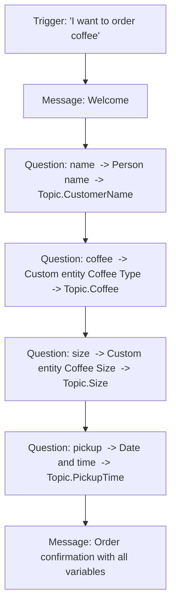

## Core concepts covered
- **Variables**
- **Message Nodes**
- **Prebuilt & Custom Entities**
- **Suggested Flow**

> **Goal:** Build a single topic that greets the customer, collects their **name**, **coffee type**,
> **size**, and **pickup time**, then **confirms the order** back to them. By the end you'll have
> used message nodes, several variables, a prebuilt entity, and two custom entities.

**Time:** ~30–45 minutes · **Level:** Beginner · **Prereq:** You can open an agent in Copilot Studio.

---

## What you'll build (the finished conversation)

```
Agent:  ☕ Welcome to Copilot Coffee! Let's get your order started.
Agent:  First, what's your name?
User:   Sam
Agent:  Thanks, Sam! Which coffee would you like?  [Espresso] [Latte] [Cappuccino] [Americano]
User:   long black
Agent:  Great choice. What size?  [Small] [Medium] [Large]
User:   Medium
Agent:  When would you like to pick it up?
User:   today at 4pm
Agent:  ✅ All set, Sam! One Medium Americano, ready at 6/14/2026 4:00 PM. See you soon!
```

---

## Suggested Flow (build this node tree)



| Step | Node type | Identify (entity) | Saves to variable |
| --- | --- | --- | --- |
| 1 | Trigger | — | — |
| 2 | Send a message | — | — |
| 3 | Ask a question | **Person name** (prebuilt) | `Topic.CustomerName` |
| 4 | Ask a question | **Coffee Type** (custom, closed list) | `Topic.Coffee` |
| 5 | Ask a question | **Coffee Size** (custom, closed list) | `Topic.Size` |
| 6 | Ask a question | **Date and time** (prebuilt) | `Topic.PickupTime` |
| 7 | Send a message | — | — |

---

## Step 0 — Create the custom entities first

It's easiest to define entities before you reference them in the topic.

### Entity A — "Coffee Type" (closed list)
1. In your agent, open **Settings** (top bar) → **Entities**.
2. Select **+ New entity** → **Closed list**.
3. **Name:** `Coffee Type`.
4. Add these **items** and **synonyms**:

   | Item | Synonyms |
   | --- | --- |
   | Espresso | shot, short black |
   | Latte | caffe latte, milky coffee |
   | Cappuccino | cap, cappa |
   | Americano | long black |

5. **Save**.

### Entity B — "Coffee Size" (closed list)
1. **+ New entity** → **Closed list**. **Name:** `Coffee Size`.
2. Items / synonyms:

   | Item | Synonyms |
   | --- | --- |
   | Small | tall, regular |
   | Medium | grande |
   | Large | venti, big |

3. **Save**.

> ✅ **Checkpoint:** Under **Settings → Entities** you should now see `Coffee Type` and `Coffee Size`
> listed alongside the prebuilt entities.

---

## Step 1 — Create the topic

1. Go to **Topics** → **+ Add a topic** → **From blank**.
2. Select the **Trigger** node → **Properties** → add trigger phrases:
   ```
   I want to order coffee
   order a coffee
   buy coffee
   get me a drink
   can I order
   coffee please
   ```
3. Open **Details** (top bar) and name the topic **Order Coffee**. **Save**.

---

## Step 2 — Welcome message (Message node)

1. Under the Trigger, select **+** → **Send a message**.
2. Enter:
   ```
   ☕ Welcome to Copilot Coffee! Let's get your order started.
   ```
3. *(Optional, learn variations):* on a new line add a second greeting so the agent varies it:
   ```
   Hi there! Ready to build your perfect cup?
   ```

---

## Step 3 — Ask for the name (prebuilt entity → variable)

1. Select **+** → **Ask a question**.
2. **Message:** `First, what's your name?`
3. **Identify:** choose **Person name**.
4. **Save response as:** click the variable name, rename it to `CustomerName`.

> 🧠 This is **slot filling**: the recognized name lands in `Topic.CustomerName`.

---

## Step 4 — Ask for the coffee (custom entity + buttons)

1. **+** → **Ask a question**.
2. **Message:** `Thanks, {CustomerName}! Which coffee would you like?`
   - Use the **`{x}`** icon to insert `CustomerName` instead of typing it.
3. **Identify:** select your custom entity **Coffee Type**.
4. Turn on **Select options for user** so the four coffees appear as **buttons**.
5. **Save response as:** rename to `Coffee`.

> Test idea: typing **"long black"** should still resolve to **Americano** thanks to the synonym.

---

## Step 5 — Ask for the size (custom entity + buttons)

1. **+** → **Ask a question**.
2. **Message:** `Great choice. What size?`
3. **Identify:** select **Coffee Size**.
4. Enable **Select options for user** (Small / Medium / Large buttons).
5. **Save response as:** rename to `Size`.

---

## Step 6 — Ask for pickup time (prebuilt DateTime entity)

1. **+** → **Ask a question**.
2. **Message:** `When would you like to pick it up?`
3. **Identify:** choose **Date and time**.
4. **Save response as:** rename to `PickupTime`.

> The agent understands natural phrases like *"today at 4pm"* or *"tomorrow morning"* and stores a
> **DateTime** value.

---

## Step 7 — Confirmation message (variables in a Message node)

1. **+** → **Send a message**.
2. Enter (insert each variable with the **`{x}`** icon):
   ```
   ✅ All set, {CustomerName}! One {Size} {Coffee}, ready at {PickupTime}. See you soon!
   ```
3. **Save** the topic.

---

## Step 8 — Test it

1. Open the **Test** pane (top-right).
2. Turn on **Track between topics** and open the **Variables** tab so you can watch values fill in.
3. Type a trigger phrase: `I want to order coffee`.
4. Walk through the prompts. Try:
   - Typing **"long black"** for the coffee (expect **Americano**).
   - Typing **"grande"** for the size (expect **Medium**).
   - Typing **"today at 4pm"** for pickup.
5. Confirm the final message shows all four values correctly.

> ✅ **Checkpoint:** In the **Variables** tab you should see `CustomerName`, `Coffee`, `Size`, and
> `PickupTime` populated as you answer each question.

---

## Stretch goals (optional)

1. **Confirm & loop:** Add a **Boolean** question *"Is that correct?"* After it, add a **Condition** —
   if `false`, **Redirect** back to the start of the topic to re-order.
2. **Buttons everywhere:** Make the name optional by adding a "Skip" quick reply.
3. **Personality:** Add message **variations** to every message node so the agent feels less robotic.
4. **Default size:** Use a **Set a variable value** node to default `Size` to `Medium` if left blank
   (`If(IsBlank(Topic.Size), "Medium", Topic.Size)`).

---

## What you learned

- Created and used **variables** (`CustomerName`, `Coffee`, `Size`, `PickupTime`).
- Used **Message nodes** for output, including **inserting variables** and **variations**.
- Used a **prebuilt entity** (Person name, Date and time) to extract information.
- Built and used **custom closed-list entities** with **synonyms** and **buttons**.
- Followed a **suggested flow** of Trigger → Message → Questions → Confirmation.

---

## Troubleshooting

| Problem | Fix |
| --- | --- |
| The topic doesn't trigger | Add more/varied **trigger phrases**; make sure you **Saved**. |
| "long black" isn't recognized | Check the **synonym** spelling under the `Coffee Type` entity. |
| Variable shows blank in the message | Re-insert it with **`{x}`**; confirm the names match exactly. |
| Buttons don't appear | Ensure **Select options for user** is enabled in the Question node. |
| Date stored oddly | Use the **Date and time** entity, not *User's entire response*. |

---

## Official Microsoft documentation (references)

This lab applies concepts from the following Microsoft Learn pages:

- [Create and edit topics](https://learn.microsoft.com/microsoft-copilot-studio/authoring-create-edit-topics)
- [Send a message (Message node)](https://learn.microsoft.com/microsoft-copilot-studio/authoring-send-message)
- [Ask a question (Question node)](https://learn.microsoft.com/microsoft-copilot-studio/authoring-ask-a-question)
- [Use entities and slot filling in agents](https://learn.microsoft.com/microsoft-copilot-studio/advanced-entities-slot-filling)
- [Work with variables](https://learn.microsoft.com/microsoft-copilot-studio/authoring-variables)
- [Test your agent](https://learn.microsoft.com/microsoft-copilot-studio/authoring-test-bot)

Next: [07-lab2.md](07-lab2.md)
