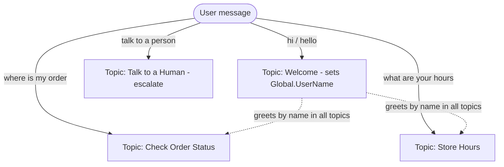
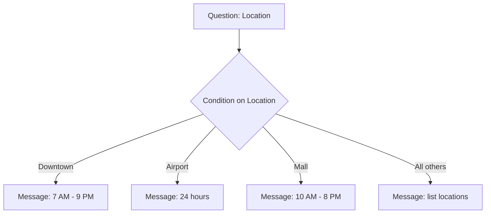

## Core concepts covered
- **Topics**
- **Variables** (with a focus on **global** variables shared across topics)
- **Message Nodes**
- **Prebuilt & Custom Entities**

> **Goal:** Build an agent with **multiple topics** that route by **trigger phrases**, remember the
> customer's name in a **global variable** (so no topic asks twice), look up an **order status** using
> entities, share **store hours** for a chosen location, and **escalate** to a human. This is where you
> graduate from one flow (Lab 1) to designing a real multi-flow agent.

**Time:** ~45–60 minutes · **Level:** Beginner→Intermediate · **Prereq:** Finish [Lab 1](06-lab1.md).

---

## The topics you'll create



| Topic | Triggers on | Key concept demonstrated |
| --- | --- | --- |
| **Welcome** | "hi", "hello", "hey" | Sets a **global** variable `UserName` |
| **Check Order Status** | "where is my order", "track order" | **Regex** custom entity + **Number** prebuilt; reuse global name |
| **Store Hours** | "store hours", "when are you open" | **Closed-list** custom entity (Location) |
| **Talk to a Human** | "talk to an agent", "speak to a person" | **Escalate** system behavior |

---

## Step 0 — Create the entities

### Entity A — "Order ID" (regex)
1. **Settings → Entities → + New entity → Regular expression (regex)**.
2. **Name:** `Order ID`.
3. **Pattern** (the letters `ORD-` followed by 6 digits):
   ```
   ORD-\d{6}
   ```
4. **Save**.

### Entity B — "Store Location" (closed list)
1. **+ New entity → Closed list**. **Name:** `Store Location`.
2. Items / synonyms:

   | Item | Synonyms |
   | --- | --- |
   | Downtown | city, central |
   | Airport | terminal |
   | Mall | shopping center, plaza |

3. **Save**.

---

## Step 1 — The Welcome topic (create a GLOBAL variable)

This topic captures the name **once** and shares it everywhere.

1. **Topics → + Add a topic → From blank**. Name it **Welcome**.
2. **Trigger** phrases:
   ```
   hi
   hello
   hey
   good morning
   start
   ```
3. **+ → Send a message:** `Hi! I'm the Contoso support assistant. 👋`
4. **+ → Ask a question:**
   - **Message:** `Before we start, what's your name?`
   - **Identify:** **Person name**.
   - **Save response as:** rename to `UserName`.
5. **Make it global:** select the `UserName` variable → in **Variable properties**, choose
   **Global (any topic can access)**. The name becomes **`Global.UserName`**.
6. **+ → Send a message:** `Thanks, {Global.UserName}! Ask me about your order, our hours, or say "talk to a person".`
7. **Save**.

> 🧠 Because `UserName` is **global**, it lives for the whole **session**. If another topic uses
> `Global.UserName` before Welcome ran, the agent will automatically jump to Welcome, ask the name,
> then return — so it's always filled in.

---

## Step 2 — The Check Order Status topic (entities + reuse global)

1. **+ Add a topic → From blank**. Name it **Check Order Status**.
2. **Trigger** phrases:
   ```
   where is my order
   track my order
   order status
   check my order
   has my order shipped
   ```
3. **+ → Ask a question:**
   - **Message:** `Sure, {Global.UserName}. What's your order ID? (looks like ORD-123456)`
   - **Identify:** select the **Order ID** regex entity.
   - **Save response as:** `OrderId`.
4. **+ → Send a message** (simulated lookup result):
   ```
   📦 Order {OrderId} for {Global.UserName} is out for delivery and arrives today.
   ```

> Notice the topic **reuses `Global.UserName`** from the Welcome topic — it never asks the name again.

### (Optional) Add a quantity question using a prebuilt Number entity
1. **+ → Ask a question:** `How many items were in this order?`
2. **Identify:** **Number** → save as `ItemCount`.
3. **+ → Send a message:** `Got it — {ItemCount} item(s) on order {OrderId}.`
4. **Save**.

---

## Step 3 — The Store Hours topic (closed-list entity + condition)

1. **+ Add a topic → From blank**. Name it **Store Hours**.
2. **Trigger** phrases:
   ```
   store hours
   when are you open
   what time do you open
   opening hours
   are you open
   ```
3. **+ → Ask a question:**
   - **Message:** `Which location, {Global.UserName}?`
   - **Identify:** the **Store Location** closed-list entity.
   - Enable **Select options for user** (Downtown / Airport / Mall buttons).
   - **Save response as:** `Location`.
4. **+ → Add a condition** to branch on `Location`:
   - **Branch 1 — `Location` is `Downtown`:** Message → `🏙️ Downtown is open 7 AM–9 PM daily.`
   - **Branch 2 — `Location` is `Airport`:** Message → `✈️ Airport is open 24 hours.`
   - **Branch 3 — `Location` is `Mall`:** Message → `🛍️ Mall is open 10 AM–8 PM.`
   - **All other conditions (else):** Message → `We have Downtown, Airport, and Mall locations.`
5. **Save**.



---

## Step 4 — The Talk to a Human topic (escalate)

1. **+ Add a topic → From blank**. Name it **Talk to a Human**.
2. **Trigger** phrases:
   ```
   talk to a person
   speak to an agent
   human please
   live agent
   I need help from a person
   ```
3. **+ → Send a message:** `No problem, {Global.UserName} — connecting you with a team member now.`
4. **+ → Topic management → Transfer conversation** (or **Escalate**) to hand off.
   - *(If you don't have live agent routing configured, just end with a message — the point is to
     practice creating the routing topic.)*
5. **Save**.

> 💡 There's also a built-in **Escalate** *system* topic. Editing topics like this is how you customize
> system behaviors once you're comfortable.

---

## Step 5 — Test the whole agent

1. Open the **Test** pane; enable **Track between topics** and the **Variables** tab.
2. Run this script and watch routing + the **global** name persist:

   | You type | Expected |
   | --- | --- |
   | `hello` | Welcome runs, asks your name, greets you |
   | `where is my order` | Order topic runs, greets you **by name without re-asking** |
   | `ORD-123456` | Confirms order out for delivery |
   | `store hours` | Asks location with buttons |
   | `airport` | "✈️ Airport is open 24 hours." |
   | `talk to a person` | Escalation message |

3. **Start Over** test: type `start over` — confirm globals reset (the agent asks your name again).

> ✅ **Checkpoint:** `Global.UserName` is captured once in **Welcome** and correctly reused by the
> Order, Hours, and Human topics.

---

## Step 6 — Publish (optional)

1. Select **Publish** (top bar) → **Publish**.
2. Open the **Channels** / **demo website** to chat with the live agent.

---

## Stretch goals (optional)

1. **Pass a topic variable instead of global:** Make `OrderId` an **output** in *Check Order Status* and
   an **input** in a new *Order Details* topic; **Redirect** and pass it — practicing topic
   input/output instead of globals.
2. **One of multiple entities:** In *Check Order Status*, let users give an **Order ID (regex)** *or* a
   **phone number (prebuilt)** in one question using **Identify → One of multiple entities**, then branch
   with **is not Blank**.
3. **Disambiguation:** Add overlapping trigger phrases to two topics and watch the **Multiple Topics
   Matched** system topic ask the user to choose.
4. **Reusable topic:** Move the greeting into its own small topic that others **Redirect** to.

---

## What you learned

- Designed an agent from **multiple topics**, each with its own **trigger phrases**.
- Created a **global variable** (`Global.UserName`) and **reused it across topics** (no double-asking).
- Combined **Message nodes** with **prebuilt** (Person name, Number) and **custom** (regex Order ID,
  closed-list Location) **entities**.
- Branched with a **Condition** node and built an **escalation** topic.

---

## Lab 1 vs Lab 2 — how they differ

| | **Lab 1** | **Lab 2** |
| --- | --- | --- |
| Scope | One topic | Several topics |
| Variables | Topic-scoped | **Global**, reused across topics |
| Routing | Single trigger | **Multiple trigger-phrase** topics + conditions |
| Entities | Prebuilt + closed list | Adds **regex** + **conditional branching** |
| New skills | Build a flow | **Design an agent** & route between flows |

---

## Official Microsoft documentation (references)

This lab applies concepts from the following Microsoft Learn pages:

- [Create and edit topics](https://learn.microsoft.com/microsoft-copilot-studio/authoring-create-edit-topics)
- [Work with global variables](https://learn.microsoft.com/microsoft-copilot-studio/authoring-variables-bot)
- [Work with variables (pass between topics)](https://learn.microsoft.com/microsoft-copilot-studio/authoring-variables)
- [Use entities and slot filling in agents](https://learn.microsoft.com/microsoft-copilot-studio/advanced-entities-slot-filling)
- [Use conditions](https://learn.microsoft.com/microsoft-copilot-studio/authoring-using-conditions)
- [Use system topics (Multiple Topics Matched, Escalate)](https://learn.microsoft.com/microsoft-copilot-studio/authoring-system-topics)
- [Redirect to another topic (topic management)](https://learn.microsoft.com/microsoft-copilot-studio/authoring-topic-management)
- [Key concepts – Publish and channels](https://learn.microsoft.com/microsoft-copilot-studio/publication-fundamentals-publish-channels)

Next: [08-scenarios-basic-to-advanced.md](08-scenarios-basic-to-advanced.md)
