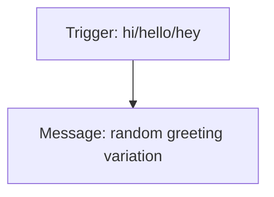
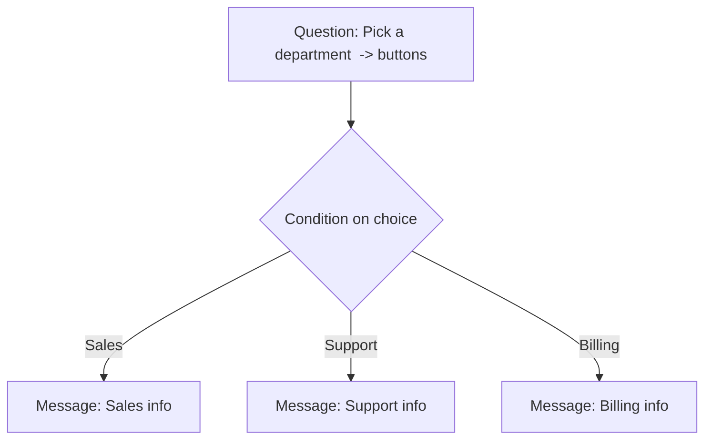
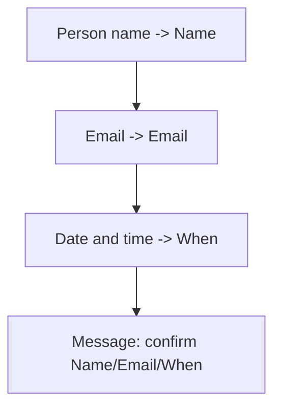
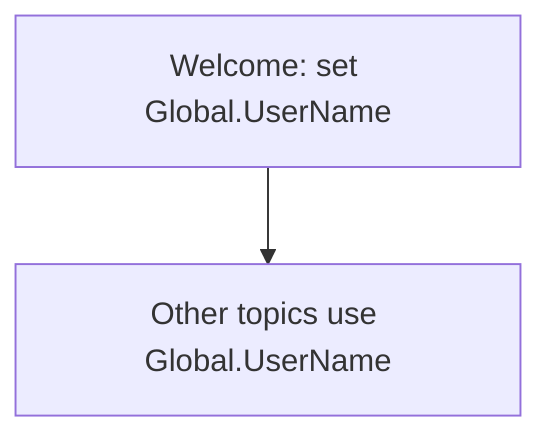
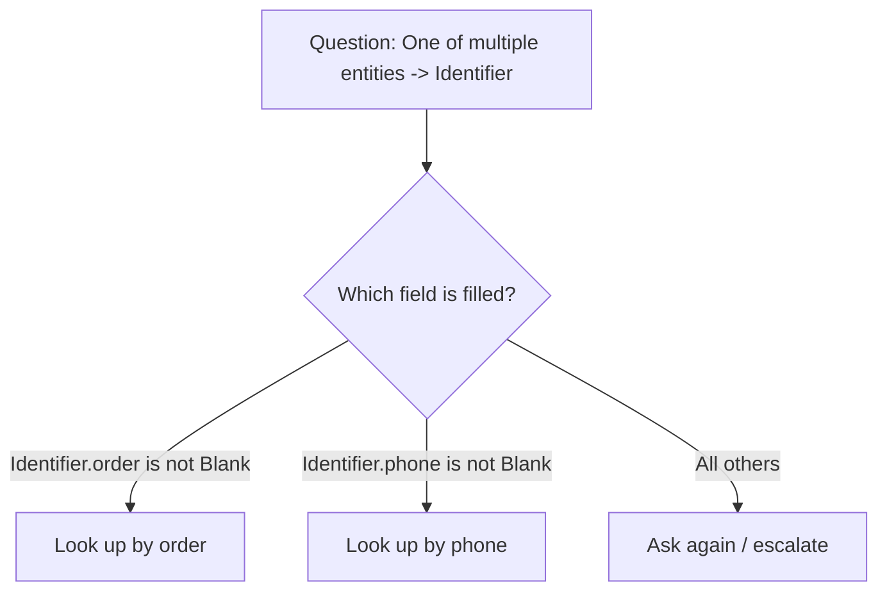
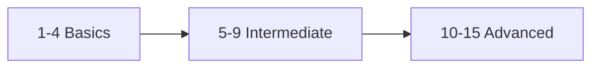

A ladder of practice scenarios. Each lists the **concepts**, a **suggested flow**, and **tips**.
Work down the list — difficulty and realism increase as you go.

Legend: 🟢 Basic · 🟡 Intermediate · 🔴 Advanced

---

## 🟢 Scenario 1 — "Hello" greeting
**Goal:** Agent greets the user warmly with a little variety.
**Concepts:** Topic, Trigger phrases, **Message node**, message variations.



**Tips:** Add 3–4 greeting variations in one Message node so it feels human. Keep trigger phrases short.

---

## 🟢 Scenario 2 — Single FAQ answer
**Goal:** Answer "What's your return policy?" with a fixed message.
**Concepts:** Topic, **Message node**.

**Flow:** Trigger (`return policy`, `can I return`, `refund`) → Message with the policy text + a link.

**Tips:** This is the simplest useful topic. Later, replace many FAQ topics with **knowledge sources**
+ generative answers.

---

## 🟢 Scenario 3 — Multiple-choice menu
**Goal:** Offer 3 options as buttons and respond to the choice.
**Concepts:** **Question node** (Multiple choice), **Choice** variable, **Condition**.



**Tips:** Multiple-choice renders buttons automatically; users can also type. Store as a **Choice**.

---

## 🟢 Scenario 4 — Collect a name and echo it
**Goal:** Ask the user's name, then greet them by it.
**Concepts:** **Question node**, **prebuilt entity** (Person name), **variable**, variable-in-message.

**Flow:** Question (Person name → `UserName`) → Message `Nice to meet you, {UserName}!`

**Tips:** Insert the variable with the **`{x}`** icon. Rename `Var1` → `UserName` immediately.

---

## 🟡 Scenario 5 — Appointment booking (mixed prebuilt entities)
**Goal:** Collect name, email, and a date/time for an appointment, then confirm.
**Concepts:** Multiple **prebuilt entities** (Person name, Email, Date and time), several variables.



**Tips:** The **Email** entity validates format; the **Date and time** entity understands
"next Tuesday at 2." Confirm everything back in one message.

---

## 🟡 Scenario 6 — Custom closed-list + synonyms
**Goal:** Recognize a product category from natural phrasing.
**Concepts:** **Custom entity** (closed list), synonyms, buttons, slot filling.

**Flow:** Question (custom `Product Category` entity, options-as-buttons → `Category`) → branch messages.

**Tips:** Add synonyms (e.g., *trekking* → **Hiking**) so typed answers still map to your canonical
values. This is the foundation of [Lab 1](06-lab1.md).

---

## 🟡 Scenario 7 — Remember the user across topics (global variable)
**Goal:** Ask the name once; reuse it in every topic.
**Concepts:** **Global variable**, multi-topic reuse, session lifecycle.



**Tips:** Convert the topic variable to **Global**. If a topic needs it before it's set, the agent
auto-jumps to where it's defined, asks, and returns. This is the core of [Lab 2](07-lab2.md).

---

## 🟡 Scenario 8 — Validate and reprompt
**Goal:** Keep asking until you get a valid value; escalate after N tries.
**Concepts:** **Question properties** (reprompt/retries), **Condition**, counter variable.

**Flow:** Question → on no-recognition, reprompt up to 2× → if still failing, **Redirect** to a
"Talk to a human" topic.

**Tips:** Use the node's **Properties → reprompt** settings. For custom counting, increment a
**Number** variable with **Set variable value** and branch on it.

---

## 🟡 Scenario 9 — Conditional branching with Power Fx
**Goal:** Different message based on a numeric threshold.
**Concepts:** **Number** variable, **Condition** node, **Power Fx**.

**Flow:** Question (Number → `Score`) → Condition `Topic.Score >= 50` → Pass/Fail messages.

**Tips:** Power Fx examples: `If(Topic.Score >= 50, "Pass", "Fail")`, `!IsBlank(Topic.Email)`,
`Upper(Topic.Name)`.

---

## 🔴 Scenario 10 — One of multiple entities (flexible identifier)
**Goal:** Accept an **order ID** *or* a **phone number** in a single question.
**Concepts:** **Identify → One of multiple entities**, **Record** variable, **is not Blank** branching.



**Tips:** The result is a **Record** with one field per entity. Only the **first** matched entity is
captured if the user provides several. Branch with **is not Blank**.

---

## 🔴 Scenario 11 — Proactive slot filling (skip known answers)
**Goal:** From *"I want hiking boots under $100"*, fill activity **and** budget at once and skip those
questions.
**Concepts:** **Proactive slot filling**, multiple entities, natural conversation.

**Tips:** Author the questions normally; the agent fills any slots it can detect up front and **skips**
the corresponding Question nodes. Verify with **Track between topics** — you'll see nodes get skipped.

---

## 🔴 Scenario 12 — Look up data with Power Automate
**Goal:** Take an order ID and return a real status from an external system.
**Concepts:** **Call an action** (Power Automate flow), input/output parameters, variables.

```mermaid
flowchart TD
    Q[Question: Order ID -> OrderId] --> A[Call an action: flow takes OrderId, returns Status]
    A --> M[Message: Your order is {Status}]
```

**Tips:** The flow's **inputs** map to your variables; its **outputs** become new variables you use in
later nodes. Keep secrets in **environment variables**, not hard-coded.

---

## 🔴 Scenario 13 — Generative answers from knowledge
**Goal:** Answer open questions from your website/docs without scripting every FAQ.
**Concepts:** **Knowledge sources**, **Generative answers** node, fallback behavior.

**Flow:** Add knowledge (URL/SharePoint/files) → in a topic (or the fallback **Conversational boosting**
system topic), use a **Generative answers** node over those sources.

**Tips:** Great for long-tail questions. Combine with scripted topics for transactions (booking,
lookups) where you need control.

---

## 🔴 Scenario 14 — Authenticated, personalized greeting
**Goal:** Greet a signed-in user by name from their profile — no question needed.
**Concepts:** **Authentication**, **system/user variables** (`User.DisplayName`, `User.IsLoggedIn`).

**Flow:** Condition `System.User.IsLoggedIn = true` → Message `Welcome back, {System.User.DisplayName}!`
else prompt to sign in.

**Tips:** Requires authentication configured in **Settings → Security**. Use **Sensitive data** flags
for anything confidential so it stays out of transcripts/logs.

---

## 🔴 Scenario 15 — Multi-environment with environment variables (ALM)
**Goal:** Use the right API endpoint/key per environment (dev/test/prod) without editing topics.
**Concepts:** **Environment variables** (read-only in Copilot Studio), solutions, publishing.

**Tips:** Reference environment variables for endpoints/keys. Admins set values per environment in
Power Apps. **Secret** environment variables are read at runtime (no republish needed); others require
**republish** after a value change.

---

## Suggested practice order



1. Do **1–4** to get comfortable with topics, messages, questions, and one variable.
2. Do **5–9** to combine entities, globals, validation, and Power Fx (this is [Lab 1](06-lab1.md) +
   [Lab 2](07-lab2.md) territory).
3. Tackle **10–15** to reach production-grade agents: flexible input, external data, knowledge, auth,
   and ALM.

---

### Where to go next
- Re-read [05-entities-and-slot-filling.md](05-entities-and-slot-filling.md) before Scenarios 10–11.
- Explore **knowledge sources** and **generative orchestration** for Scenario 13+.
- Learn **Power Automate** basics for Scenario 12.
- Read about **Application Lifecycle Management (ALM)** and **solutions** for Scenario 15.

---

## Official Microsoft documentation (references)

The scenarios above draw on the following Microsoft Learn pages:

- [Send a message (Message node)](https://learn.microsoft.com/microsoft-copilot-studio/authoring-send-message)
- [Ask a question (Question node)](https://learn.microsoft.com/microsoft-copilot-studio/authoring-ask-a-question)
- [Use entities and slot filling in agents](https://learn.microsoft.com/microsoft-copilot-studio/advanced-entities-slot-filling)
- [Work with variables](https://learn.microsoft.com/microsoft-copilot-studio/authoring-variables) · [Global variables](https://learn.microsoft.com/microsoft-copilot-studio/authoring-variables-bot)
- [Use conditions](https://learn.microsoft.com/microsoft-copilot-studio/authoring-using-conditions) · [Use Power Fx](https://learn.microsoft.com/microsoft-copilot-studio/advanced-power-fx)
- [Add actions / call Power Automate flows](https://learn.microsoft.com/microsoft-copilot-studio/advanced-flow) · [Add tools to custom agents](https://learn.microsoft.com/microsoft-copilot-studio/add-tools-custom-agent)
- [Boost conversations with generative answers (knowledge)](https://learn.microsoft.com/microsoft-copilot-studio/knowledge-copilot-studio)
- [Orchestrate agent behavior with generative AI](https://learn.microsoft.com/microsoft-copilot-studio/advanced-generative-actions)
- [Add user authentication to topics](https://learn.microsoft.com/microsoft-copilot-studio/advanced-end-user-authentication)
- [Environment variables](https://learn.microsoft.com/power-apps/maker/data-platform/environmentvariables) · [Application Lifecycle Management (ALM) basics](https://learn.microsoft.com/power-platform/alm/basics-alm)
