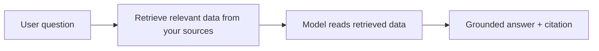
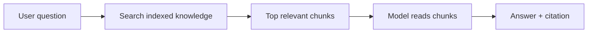
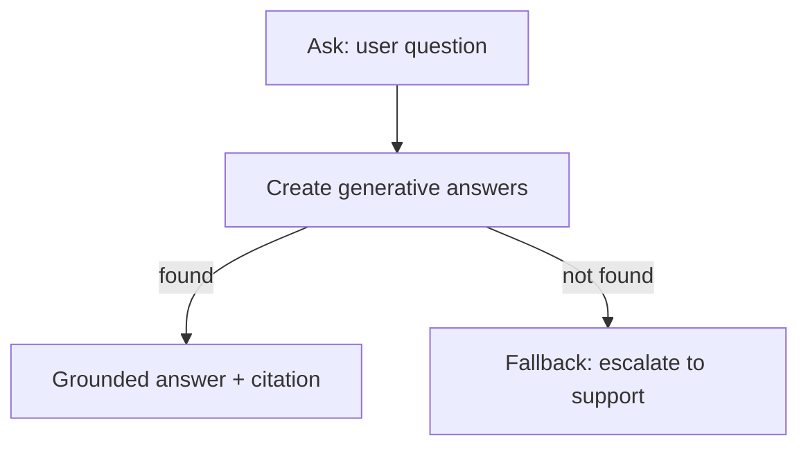

**Grounding** means tying the agent's generative answers to **your trusted data** — knowledge
sources, records, or live systems — instead of the model's general training knowledge. Grounding is
what turns a generic chatbot into a reliable assistant that answers *your* policies, *your* prices,
and *your* order statuses, with **citations** and far fewer hallucinations.

> Mental model: **Model = how it talks. Grounding = what it's allowed to talk about.**

---

## 1. Why grounding matters

| Without grounding | With grounding |
| --- | --- |
| Answers from generic training data | Answers from your documents/records/systems |
| Can confidently invent facts (hallucinate) | Stays within supplied sources; says "I don't know" when missing |
| No citations | Cites the source it used |
| Stale / generic | Reflects your latest curated content |



This retrieve-then-answer pattern is **RAG** (Retrieval-Augmented Generation).

---

## 2. The five ways to ground in Copilot Studio

| # | Mechanism | Best for |
| --- | --- | --- |
| 1 | **Knowledge sources** | Documents, FAQs, websites, SharePoint, Dataverse |
| 2 | **Generative Answers node** | Grounding at one point in a topic, with scoped sources |
| 3 | **Instructions** | Enforcing "answer only from sources + cite + escalate" |
| 4 | **Tools** (HTTP / Power Automate / connectors) | Live, transactional data |
| 5 | **Power Fx variables** | Injecting small known facts inline |

---

## 3. Knowledge sources (the main way)

Add sources under **Overview → Knowledge → Add knowledge**. The agent retrieves relevant chunks and
feeds them to the model before answering.

| Source type | Example use |
| --- | --- |
| **Public website** | Add `https://contoso.com/support` to answer FAQ questions from your site |
| **SharePoint** | Point to an HR site to answer from policy docs (respects user permissions) |
| **Uploaded files** | Upload `Employee-Handbook.pdf` for onboarding questions |
| **Dataverse** | Ground on the `Accounts` table to answer "What's the status of account Northwind?" |
| **Azure AI Search** | Connect a prebuilt vector index for large enterprise corpora |

**Example — HR vacation policy**

> **User:** "How many vacation days do I get in my first year?"
> **Agent (grounded):** Searches the HR SharePoint → finds the policy paragraph → answers
> *"New full-time employees accrue 15 days in year one"* **with a citation** — instead of guessing.

**Tips**
- Give each source a clear **name + description** (used for relevance/routing).
- Fewer, higher-quality sources beat many noisy ones.
- Test with real questions whose answers live in the source.

### 3a. Knowledge integration in detail

**How to add knowledge (step by step)**

1. Open your agent → **Knowledge** (top nav) or **Overview → Knowledge**.
2. Select **+ Add knowledge**.
3. Pick a **source type** (website, SharePoint/OneDrive, file upload, Dataverse, connector…).
4. Provide the location (URL, site, file) and give it a clear **name + description**.
5. **Add** it, then **wait for indexing** to finish (status shows when it's ready).
6. **Test** with a question whose answer lives in that source. **Publish** when happy.

**Where knowledge can live (integration points)**

| Integration | What it connects to | Typical use |
| --- | --- | --- |
| **Public website** | Crawlable public URLs | Marketing/FAQ/support pages |
| **SharePoint / OneDrive** | Your tenant's documents | Policies, handbooks, internal docs |
| **File upload** | PDF, DOCX, TXT, etc. | One-off or static reference docs |
| **Dataverse** | Tables in Power Platform | Structured business records |
| **Microsoft Graph** | M365 content (enterprise) | Org-wide enterprise knowledge |
| **Azure AI Search** | A prebuilt vector index | Large/custom corpora, advanced RAG |
| **Connectors** | External systems (e.g., Salesforce, ServiceNow) | Third-party data |
| **Public/MCP & advanced** | Other graph/connector knowledge | Specialized sources |

**Two levels of knowledge**

- **Agent-level knowledge** — added on the Knowledge page; available to the whole agent and used by
  **generative answers** automatically when no topic fully handles the request.
- **Node-level knowledge** — a **Create generative answers** node scoped to specific sources, so a
  given topic only draws from the sources you choose (see section 4).

**Supported content & formats (rules of thumb)**

- Works best with **text-based** content: HTML pages, Word/PDF with real text, structured tables.
- **Not** reliably read: scanned/image-only PDFs (no OCR), images, audio/video, heavily JavaScript-
  rendered pages, and auth-gated content the agent can't access.
- Each file/source has **size and count limits**, and indexing is **not real-time** — updates take
  time to appear. (See [10-limitations.md](10-limitations.md).)

**Security, permissions & governance**

- **SharePoint/Graph respect the signed-in user's permissions** — users only get answers from content
  they're already allowed to see. Anonymous channels can't use permission-gated sources.
- **DLP policies** (per environment) can block certain connectors/sources.
- Mark sensitive variables as **sensitive data** so values stay out of transcripts/logs.

**How retrieval actually works (RAG recap)**



The agent **doesn't** send your whole document to the model — it **retrieves the most relevant
chunks** and grounds the answer on those, then cites them.

**Make knowledge answer reliably — checklist**

- ✅ Clear **name + description** per source (drives selection).
- ✅ Few, **high-quality** sources; remove noisy/outdated ones.
- ✅ Text-based files; re-export scanned PDFs as searchable text.
- ✅ Confirm the source is **enabled** and **indexing finished**.
- ✅ Instructions say **"answer only from knowledge, cite, else escalate."**
- ✅ Re-test after every change with a **new test session** ⟳.

---

## 4. Generative Answers node (scoped grounding inside a topic)

Use the **Create generative answers** node to ground only at a specific point in a flow, optionally
restricting **which** sources are used.

```
Topic: Product Help
  Trigger: "I need help with my device"
  → Ask a question: "What's your question?"   → save to Topic.UserQuestion
  → Create generative answers
        Input:        Topic.UserQuestion
        Data sources: only the "Device Manuals" knowledge source
        Fallback:     "I couldn't find that in the manuals — connect to support?"
```

This grounds the answer strictly on device manuals and won't pull from general knowledge. Use this
when different topics should draw from different, **non-overlapping** sources.



---

## 5. Instructions that enforce grounding

Grounding sources **plus** strict instructions = far fewer hallucinations.

```
What you can do
- Answer ONLY from the connected knowledge sources.

What you must NOT do
- Do not invent policies, prices, or dates.
- If the answer isn't in the knowledge, say you don't know and offer to escalate.

How to respond
- Always cite the source you used.
- Keep answers concise; quote the relevant rule.
```

> Describe knowledge **generically** ("the HR policy library") rather than naming files directly, so
> the agent selects sources by relevance.

---

## 6. Real-time grounding via tools

For **live** data that isn't in documents (order status, account balance, inventory), ground on a
system call with **HTTP request**, **Power Automate**, or a **connector**.

**Example — order status**

```
Ask a question: "What's your order number?"   → Topic.OrderId
Call an action:  /LookupOrder (Power Automate) → returns status, eta
Send a message:  "Order {Topic.OrderId} is {status}, arriving {eta}."
```

Here the **ground truth is the live API response**, injected into the reply. Use a tool whenever the
answer changes minute-to-minute or lives in a system of record.

---

## 7. Inline grounding with Power Fx variables

Inject small, known facts into a prompt so the model can't drift.

```
Set a variable:  Topic.StoreHours = "Mon–Fri 9–6, Sat 10–4, closed Sun"
Create generative answers (or Message):
   "Answer using only these hours: {Topic.StoreHours}"
```

Great for short, authoritative snippets you don't want to store as a whole document.

---

## 8. Choosing the right grounding method

| You need to ground on… | Use |
| --- | --- |
| Documents, FAQs, manuals, policies | **Knowledge sources** (website / SharePoint / files) |
| Structured business records | **Dataverse** knowledge or a **connector** |
| Live / transactional data | **HTTP** or **Power Automate** tool |
| Different sources per topic | **Generative Answers node** with scoped sources |
| A short authoritative fact | **Power Fx variable** injected into the prompt |
| Stopping hallucinations | **Instructions** ("only from sources, cite, else escalate") |

---

## 9. Testing & troubleshooting grounding

- **Track between topics** + **Activity map** show which source/tool the agent used.
- If answers are **generic**: confirm the knowledge source is **enabled** and actually contains the
  answer; tighten instructions to "answer only from sources."
- If answers are **wrong/stale**: re-index or update the source; remember indexing isn't real-time.
- If it **can't find** known content: check file type (scanned PDFs have no OCR), permissions, and
  that the public URL is crawlable.
- If it pulls from the **wrong** source: scope the **Generative Answers** node to specific sources.
- Always **test on the target channel**, not just the Test pane.

---

### Key takeaways

- Grounding = **retrieve your data, then answer** (RAG) — relevant + cited + trustworthy.
- Five mechanisms: **Knowledge sources, Generative Answers node, Instructions, Tools, Power Fx**.
- Use **documents** for static content, **tools** for live data, **Generative Answers** to scope
  sources, and **Instructions** to enforce "only from sources, else escalate."
- A well-grounded agent = **good sources + scoped answers + strict instructions + a fallback path**.

---

## Official Microsoft documentation (references)

- [Knowledge sources overview](https://learn.microsoft.com/microsoft-copilot-studio/knowledge-copilot-studio)
- [Add knowledge to an agent](https://learn.microsoft.com/microsoft-copilot-studio/knowledge-add-knowledge)
- [Boost conversations with generative answers](https://learn.microsoft.com/microsoft-copilot-studio/nlu-boost-conversations)
- [Use the Create generative answers node](https://learn.microsoft.com/microsoft-copilot-studio/nlu-generative-answers-node)
- [Generative orchestration guidance](https://learn.microsoft.com/microsoft-copilot-studio/guidance/generative-orchestration)
- [Add tools (Power Automate, connectors, HTTP)](https://learn.microsoft.com/microsoft-copilot-studio/advanced-plugin-actions)
- [Write agent instructions](https://learn.microsoft.com/microsoft-copilot-studio/authoring-instructions)

Next: review [10-limitations.md](10-limitations.md) to keep your grounding design within platform limits.
