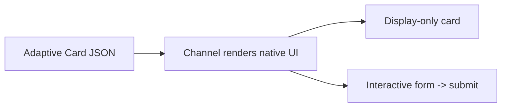

Plain text and quick replies are great, but sometimes you need **rich, structured UI** — a styled card
with an image and buttons, or a **form** that collects several fields at once. That's what **Adaptive
Cards** are for. This section explains the two ways to use them and when to pick each.

> Quick recap from [04-nodes-message-and-question.md](04-nodes-message-and-question.md): the
> **Message** node *shows* cards (display-only); the **Ask with Adaptive Card** node *collects* input.

---

## 1. What is an Adaptive Card?

An **Adaptive Card** is a piece of UI described as **JSON** that renders natively inside the channel
(Teams, Web Chat, etc.). It can contain text, images, columns, input fields, date pickers, dropdowns,
and action buttons — all in one tidy block.



- **Schema-based:** Copilot Studio supports Adaptive Cards **1.6 and earlier**.
- **Channel matters:** **Web Chat** supports **1.6** (no `Action.Execute`); **Teams** and the live
  chat widget are limited to **1.5**.
- Authored in a **visual designer** *or* by editing the **JSON payload** directly.

---

## 2. Two ways to use cards

| | **Message node → Adaptive Card** | **Ask with Adaptive Card node** |
| --- | --- | --- |
| Purpose | **Display** rich content | **Collect** input (a form) |
| Input | None | **Several fields at once** |
| Stores | Nothing | **One variable per input field** |
| Use when | Show a product, receipt, summary | Gather multiple values in one step |

---

## 3. Display-only cards (Message node)

Use a card to present information attractively — a product, an order summary, a confirmation.

**How to add**
1. In a **Send a message** node, open **Add** → **Adaptive Card**.
2. Use the designer or paste JSON.
3. Insert variables with `{x}` / Power Fx to make it dynamic.

**Example — order summary card (JSON)**

```json
{
  "type": "AdaptiveCard",
  "$schema": "http://adaptivecards.io/schemas/adaptive-card.json",
  "version": "1.5",
  "body": [
    { "type": "TextBlock", "text": "Order Confirmation", "weight": "Bolder", "size": "Medium" },
    { "type": "TextBlock", "text": "Thanks, {Topic.CustomerName}!", "wrap": true },
    { "type": "FactSet", "facts": [
      { "title": "Item:", "value": "{Topic.Coffee}" },
      { "title": "Size:", "value": "{Topic.Size}" },
      { "title": "Pickup:", "value": "{Topic.PickupTime}" }
    ]}
  ],
  "actions": [
    { "type": "Action.OpenUrl", "title": "Track order", "url": "https://contoso.com/track" }
  ]
}
```

> Display cards don't capture input — for that, use the form node below.

---

## 4. Forms — collecting input (Ask with Adaptive Card)

When you need **several fields in one step** (name + email + date + dropdown + a Submit button), use
the **Ask with Adaptive Card** node. Each input maps to its **own variable** on submit.

**How to add**
1. **+ → Ask with adaptive card**.
2. **Edit adaptive card** → add **Input** elements (text, number, date, choice/toggle) and a
   **Submit** action.
3. Map each input's **id** to a **variable**; the user's submission fills them.

**Example — contact form (JSON)**

```json
{
  "type": "AdaptiveCard",
  "$schema": "http://adaptivecards.io/schemas/adaptive-card.json",
  "version": "1.5",
  "body": [
    { "type": "TextBlock", "text": "Tell us about you", "weight": "Bolder" },
    { "type": "Input.Text", "id": "fullName", "label": "Full name", "isRequired": true },
    { "type": "Input.Text", "id": "email", "label": "Email", "style": "Email" },
    { "type": "Input.Date", "id": "callbackDate", "label": "Preferred callback date" },
    { "type": "Input.ChoiceSet", "id": "topic", "label": "Topic", "choices": [
      { "title": "Sales", "value": "sales" },
      { "title": "Support", "value": "support" }
    ]}
  ],
  "actions": [
    { "type": "Action.Submit", "title": "Submit" }
  ]
}
```

On submit, `fullName`, `email`, `callbackDate`, and `topic` flow into the variables you mapped.

**Form input element types**

| Element | Collects |
| --- | --- |
| `Input.Text` | Free text (styles: text, email, tel, url) |
| `Input.Number` | A number |
| `Input.Date` | A date |
| `Input.Time` | A time |
| `Input.Toggle` | Yes/No (boolean) |
| `Input.ChoiceSet` | Dropdown or radio/checkboxes |

---

## 5. Card actions (buttons)

| Action | Does | Note |
| --- | --- | --- |
| `Action.Submit` | Sends form inputs back to the agent | Use in **forms** |
| `Action.OpenUrl` | Opens a link | Must be `https://` |
| `Action.ShowCard` | Reveals a nested card | Inline expand |
| `Action.Execute` | Server-driven action | **Web Chat 1.6+ only; not Teams** |

---

## 6. Properties of the form node

Similar to a Question node:
- **How many reprompts** — the card is **resent** on each retry (default up to 2).
- **Retry prompt** — message shown with the resent card.
- **Allow switching to another topic** — if the user **types text** instead of submitting, it counts
  as **invalid** unless it triggers an interruption.

---

## 7. When to use what

| You want to… | Use |
| --- | --- |
| Show a styled summary/receipt | **Message node → Adaptive Card** (display) |
| Offer a few tappable options inline | **Quick replies** or **Multiple choice** question |
| Collect **one** value | **Question node** (entity) |
| Collect **several** values at once | **Ask with Adaptive Card** (form) |
| Force a structured submission | **Form** with `isRequired` inputs |

---

## 8. Limitations & gotchas

- **Schema cap:** 1.6 and earlier; **Teams/live chat = 1.5**, so avoid `Action.Execute` there.
- **Channel rendering differs** — always test on the **target channel**, not just the Test pane.
- A **typed reply** while a form waits counts as **invalid** unless interruptions are on.
- **No client-side logic** beyond what the schema offers (no custom JavaScript).
- Keep cards **short** — very large/complex cards render slowly or get clipped on some channels.
- Inputs return **strings** — convert with `Value(...)` for numbers/dates if you do math.

---

### Key takeaways

- **Adaptive Cards** = JSON-described native UI; **Message node** displays, **Ask with Adaptive Card**
  collects.
- **Forms** gather **multiple fields in one step**, each mapped to a variable on **Submit**.
- Mind the **schema cap** (Teams 1.5 / Web Chat 1.6) and **always test on the real channel**.

---

## Official Microsoft documentation (references)

- [Add rich content with the Message node](https://learn.microsoft.com/microsoft-copilot-studio/authoring-send-message)
- [Ask with an adaptive card](https://learn.microsoft.com/microsoft-copilot-studio/authoring-adaptive-cards)
- [Adaptive Cards overview & schema](https://learn.microsoft.com/adaptive-cards/)
- [Adaptive Cards designer](https://adaptivecards.io/designer/)

Next: [14-ai-prompts.md](14-ai-prompts.md) — add custom AI prompts as reusable building blocks.
