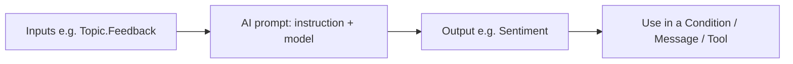

An **AI prompt** is a reusable, purpose-built instruction to an AI model that you can call from your
agent to do **one focused generative task** — summarize text, classify a message, extract fields,
draft a reply, translate, and more. Think of it as a **mini AI function** you create once and reuse.

> Different from the agent's **Instructions** (which steer the *whole* agent). An **AI prompt** is a
> small, single-job model call you invoke at a specific step.

---

## 1. What is an AI prompt?

A prompt takes **inputs**, sends them to a model with your **instruction text**, and returns an
**output** you can store in a variable and use downstream.



- Built with **AI Builder / Prompt builder** and surfaced in Copilot Studio as a **Prompt tool**.
- Has **typed inputs** (text, etc.) and a defined **output**.
- Reusable across topics and even across agents.

---

## 2. Why use AI prompts?

| Without a prompt | With an AI prompt |
| --- | --- |
| Re-write the same instruction inline everywhere | Define **once**, reuse everywhere |
| Whole-agent instructions get bloated | Keep a focused task **isolated** |
| Inconsistent results | Consistent, testable behavior |
| Hard to maintain | Update in one place |

Great for **deterministic-ish, single-purpose** generative steps you want to control tightly.

---

## 3. Common use cases (with examples)

| Task | Input → Output |
| --- | --- |
| **Summarize** | Long ticket text → 2-line summary |
| **Classify / route** | User message → category (`Billing` / `Tech` / `Sales`) |
| **Sentiment** | Feedback → `Positive` / `Neutral` / `Negative` |
| **Extract fields** | Free text → JSON (`{ name, date, amount }`) |
| **Draft a reply** | Bullet points → polished email |
| **Translate** | Text + target language → translated text |
| **Rewrite/tone** | Draft → friendlier/shorter version |

**Example — sentiment prompt**

```
Instruction:
  Classify the sentiment of the customer message as exactly one of:
  Positive, Neutral, Negative. Return only that single word.

Input:   {Topic.Feedback}
Output:  Topic.Sentiment   (e.g., "Negative")
```

Then branch on it with a **Condition** node:

```
If  Topic.Sentiment = "Negative"  → escalate to a human
Else                              → thank the user
```

---

## 4. How to create and use an AI prompt

**Create the prompt**
1. In **Copilot Studio → Tools** (or AI Builder **Prompts**), select **+ New prompt** /
   **Create a prompt**.
2. Write the **instruction** and insert **input** placeholders (e.g., the user's text).
3. Pick the **model** and **test** with sample inputs in the prompt builder.
4. **Save / publish** the prompt.

**Use it in an agent**
1. Add it as a **Tool** (Prompt) to your agent.
2. **Call it** from a topic with **Call an action → (your prompt)**, mapping a variable to its input.
3. Save the **output** to a variable.
4. Use that variable in a **Message**, **Condition**, or another **Tool**.

```mermaid
flowchart TD
    A[Ask: "What's your feedback?"] --> S[Save Topic.Feedback]
    S --> C[Call AI prompt: Sentiment]
    C --> V[Save Topic.Sentiment]
    V --> B{Condition}
    B -->|Negative| E[Escalate]
    B -->|else| T[Thank you]
```

---

## 5. AI prompt vs other generative features

| Feature | What it's for |
| --- | --- |
| **Agent Instructions** | Steer the **whole** agent's behavior every turn |
| **Generative answers / knowledge** | Answer from **your data** (RAG) |
| **AI prompt (Prompt tool)** | One **focused** generative task you call on demand |
| **Generative orchestration** | Decide **which** topics/tools to run |

Use an **AI prompt** when you need a *specific, repeatable transformation* of text — not a full
conversation and not a knowledge lookup.

---

## 6. Best practices

- **One job per prompt.** Narrow prompts are accurate and testable.
- **Constrain the output.** "Return only one word from this list" → easy to branch on.
- **Name inputs clearly** and pass clean values (trim/normalize first).
- **Test with edge cases** in the prompt builder before wiring it in.
- **Handle failure** — if the output is unexpected/blank, branch to a safe default or escalate.
- **Mind cost/latency** — each prompt is a model call; avoid calling it in tight loops.

---

## 7. Limitations & gotchas

- **Non-deterministic.** Same input can vary slightly; constrain outputs and validate.
- **Model/region/license** availability applies (AI Builder capacity may be required).
- **Latency & cost** per call — it's a real model invocation.
- **Output is text** — parse/convert (`Value(...)`, JSON parsing) before using as Number/record.
- **Not a knowledge lookup** — a prompt doesn't search your documents; pair with knowledge for that.
- **Content filters** (Responsible AI) may block some inputs/outputs.

---

### Key takeaways

- An **AI prompt** is a **reusable, single-purpose** generative step (summarize, classify, extract,
  draft, translate).
- Create it in **AI Builder / Prompt builder**, add it as a **Prompt tool**, **call** it, and store
  the **output** in a variable.
- **Constrain outputs**, **test edge cases**, and **handle failures** — and remember it's a model
  call (cost, latency, non-determinism).

---

## Official Microsoft documentation (references)

- [Add a prompt (AI Builder) to an agent](https://learn.microsoft.com/microsoft-copilot-studio/advanced-prompt-actions)
- [Create a custom prompt (AI Builder)](https://learn.microsoft.com/ai-builder/create-a-custom-prompt)
- [Prompt builder overview](https://learn.microsoft.com/ai-builder/prompts-overview)
- [Use tools in agents](https://learn.microsoft.com/microsoft-copilot-studio/advanced-plugin-actions)

Next: revisit [09-models-and-instructions.md](09-models-and-instructions.md) to see how prompts pair with the right model.
