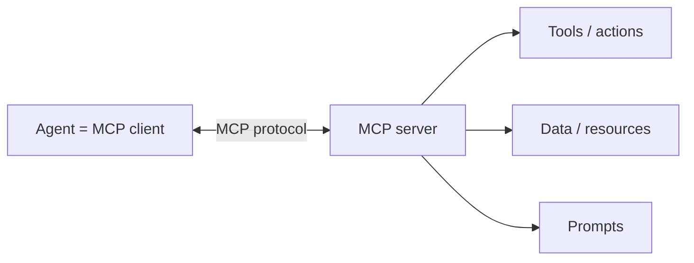
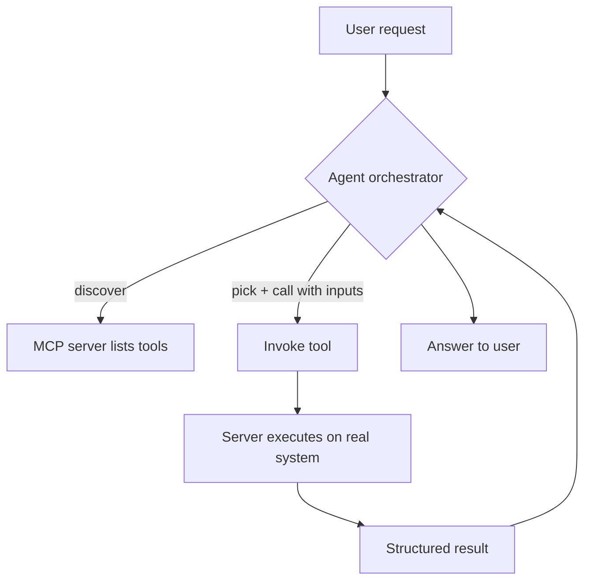

**MCP** lets your agent connect to external **tools, data, and capabilities** through a single,
standardized protocol — instead of hand-building a custom integration for each system. In Copilot
Studio you can add an **MCP server** as a **tool**, and the agent can then call whatever that server
exposes.

> Think of MCP as a **universal adapter** (like USB-C) between AI agents and the systems they need to
> use. Build/expose once, and any MCP-aware agent can plug in.

---

## MCP for beginners (plain English)

Imagine your agent is a **new employee**. They're smart and can chat, but they can't actually *do*
much until you give them access to the company's tools — the ticket system, the order database, the
shared drive. **MCP is the standard "access badge + instructions"** that lets your agent use those
outside tools safely.

**An everyday analogy**

- Your phone charger uses **USB-C** — one plug fits many devices. You don't need a different cable for
  every gadget.
- **MCP is USB-C for AI agents.** One standard way to plug an agent into many different systems.

**Two simple roles**

| Role | Plain meaning | Who |
| --- | --- | --- |
| **MCP client** | The thing that *wants* to use a tool | Your **agent** |
| **MCP server** | The thing that *offers* the tool | The external **system** (or a wrapper around it) |

> The **server** says *"here's what I can do"*; the **client (your agent)** says *"great, please do
> this one."*

**What an MCP server can give your agent**

- **Do something** — e.g., *create a support ticket*, *look up an order* (called **tools/actions**).
- **Read something** — e.g., *fetch a document or record* (called **resources/data**).
- **Reuse a prompt** — a ready-made instruction the server provides (**prompts**).

**A 10-second example**

> A customer says *"Where's my order #123?"* Your agent doesn't know — but an **MCP server** for the
> order system offers a `getOrderStatus` tool. The agent calls it, gets *"Shipped, arriving Tuesday,"*
> and tells the customer. You never had to build that lookup from scratch.

**Why a beginner should care**

- You **don't write integration code** — you connect an existing MCP server as a **tool**.
- The same server can be reused by **other agents**, so work isn't repeated.
- It's **safe by design** — admins control access, and security/DLP rules still apply.

> You'll go deeper below, but that's the whole idea: **MCP is a standard way for your agent to borrow
> tools and data from other systems.**

---

## 1. What is MCP?

**MCP (Model Context Protocol)** is an **open standard** for connecting AI applications (like agents)
to external systems. It defines a common "language" so an agent (the **client**) and a system (the
**server**) can talk without bespoke glue code.

- **Open & standardized** — one protocol many tools/vendors implement.
- **Capability-based** — a server advertises what it can do; the agent discovers and uses it.
- **Two-way** — the agent can call actions and read data; the server returns structured results.



> **Why it exists:** without a standard, every system needs a custom connector. MCP replaces "N×M
> custom integrations" with "one protocol both sides speak."

---

## 2. The building blocks of MCP

An MCP server can expose three kinds of capabilities:

| Capability | What it is | Example |
| --- | --- | --- |
| **Tools** | Actions the agent can **call** (functions) | `createTicket`, `getOrderStatus` |
| **Resources** | **Data** the agent can read | A document, a record, a file listing |
| **Prompts** | Reusable **prompt templates** the server offers | "Summarize this ticket" |

The two sides:

| Role | Who plays it | Job |
| --- | --- | --- |
| **MCP client** | Your **agent** (Copilot Studio) | Discovers and calls capabilities |
| **MCP server** | The external system/wrapper | Exposes tools/resources/prompts |

---

## 3. How MCP works (step by step)

1. **Connect** — the agent (client) connects to an MCP server endpoint.
2. **Discover** — the server advertises its **tools, resources, and prompts** (names + schemas).
3. **Decide** — the agent's orchestrator reads those descriptions and decides what to call for the
   user's request.
4. **Call** — the agent invokes a tool with structured **inputs** (matching the schema).
5. **Execute** — the server runs the action against the real system.
6. **Return** — the server sends back a structured **result**.
7. **Respond** — the agent uses the result in its reply (or chains another tool/topic).



> Because capabilities are **self-described**, generative orchestration can pick the right MCP tool
> the same way it picks topics — by **name + description**. Good descriptions matter.

---

## 4. MCP in Copilot Studio

- Add an **MCP server** under **Tools → Add a tool** (where supported in your environment).
- Once added, its tools appear alongside connectors, flows, and prompts — the agent can call them.
- Reference them by name with **`/`** in **Instructions** to steer when they're used.
- Authentication, governance, and **DLP** still apply — admins control what's allowed.

**Example — IT support agent**

```
User: "My laptop won't connect to VPN and I need a ticket."
→ Agent calls MCP tool  getKnowledge("VPN connect")   (resource)
→ Walks the user through the fix
→ Still broken? Agent calls MCP tool  createTicket({ issue, user })  (action)
→ Returns the ticket number to the user
```

---

## 5. Why MCP matters

| Without MCP | With MCP |
| --- | --- |
| Custom connector per system | **One standard** many systems implement |
| Tight coupling, lots of glue code | **Loose coupling** via a shared protocol |
| Hard to reuse across agents | **Reusable** by any MCP-aware client |
| Each integration re-invents auth/schema | **Consistent** discovery, schema, results |

**Benefits:** faster integration, reuse across agents/vendors, consistent security, and access to a
growing ecosystem of ready-made MCP servers.

---

## 6. Limitations & considerations

- **Server availability/feature support** in Copilot Studio depends on your **license, region, and
  cloud** — check what's enabled in your environment.
- **You trust the server.** It runs real actions — vet the source, scope permissions, and respect
  **DLP** policies.
- **Auth & secrets** must be configured correctly; expired tokens break calls.
- **Latency & reliability** depend on the server and the systems behind it (throttling, timeouts).
- **Good descriptions required** — vague tool/resource descriptions → the orchestrator won't pick them.
- **Schema must match** — inputs the agent sends must fit the tool's expected schema.
- **Not a knowledge index** — MCP *resources* return data on demand; for document Q&A, also use
  **knowledge sources** (see [12-knowledge-integration.md](12-knowledge-integration.md)).

---

### Key takeaways

- **MCP = open standard** that connects agents (clients) to external systems (servers) — a "USB-C for AI."
- A server exposes **tools** (actions), **resources** (data), and **prompts** (templates).
- Flow: **connect → discover → decide → call → execute → return → respond.**
- In Copilot Studio, add an **MCP server as a tool**; **names + descriptions** drive when it's used.
- Mind **trust, auth, DLP, latency**, and **region/license** support.

---

## Official Microsoft documentation (references)

- [Extend your agent with Model Context Protocol (MCP)](https://learn.microsoft.com/microsoft-copilot-studio/agent-extend-action-mcp)
- [Add tools to a custom agent](https://learn.microsoft.com/microsoft-copilot-studio/advanced-plugin-actions)
- [Model Context Protocol — official spec](https://modelcontextprotocol.io/)
- [Data Loss Prevention (DLP) for agents](https://learn.microsoft.com/microsoft-copilot-studio/admin-data-loss-prevention)

Next: revisit [02-core-concepts.md](02-core-concepts.md#02-core-concepts__5-orchestration-classic-vs-generative) — MCP tools are chosen by the same orchestration logic.
