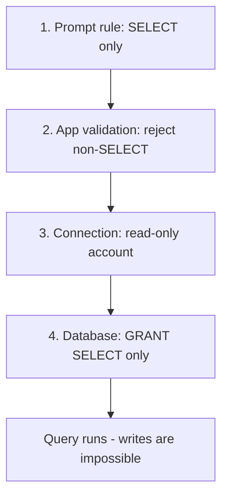

This section is a **practical pattern library** for *grounding* your prompts and instructions —
giving the model the right context, in the right shape, so it answers reliably. It also includes
**reusable query/prompt formats** for common tasks and **SQL templates** (including **Databricks**)
you can call from a tool and feed back into the conversation.

> Recap: grounding = answering from **trusted context** instead of the model's general memory. See
> [11-grounding.md](11-grounding.md) for the mechanisms and [12-knowledge-integration.md](12-knowledge-integration.md)
> for connecting sources.

---

## 1. Ways to ground a prompt or instruction

| Technique | What it does | Use when |
| --- | --- | --- |
| **Knowledge grounding (RAG)** | Retrieve relevant chunks from your sources | Answers live in documents/sites |
| **Variable injection** | Insert known facts into the prompt (`{Topic.X}`) | You already hold the value |
| **Tool/data grounding** | Call a flow/HTTP/SQL and feed results in | Live or structured data |
| **Schema/format constraint** | Tell the model the **exact output shape** | You need parseable output |
| **Role + scope framing** | Define who the model is and its boundaries | Every prompt |
| **Few-shot examples** | Show 1–3 input→output examples | Tricky/ambiguous tasks |
| **Guardrails** | "Only use provided context; else say you don't know" | Reduce hallucination |

**The grounding sandwich** — a reliable prompt structure:

```
[ROLE]      You are <role>. Answer ONLY from the CONTEXT below.
[CONTEXT]   <retrieved text / variable values / tool results>
[TASK]      <the user's question or the transformation to perform>
[FORMAT]    Respond as <exact format>. If the answer isn't in CONTEXT, say "I don't know."
```

---

## 2. Reusable prompt formats by query type

### a) Question answering (grounded)

```
You are a support assistant. Use ONLY the CONTEXT to answer.
CONTEXT:
{Topic.RetrievedText}
QUESTION:
{Topic.UserQuestion}
Rules: Cite the source line. If not in CONTEXT, reply exactly: "I don't have that information."
```

### b) Summarization

```
Summarize the TEXT in <=3 bullet points for a busy manager.
Keep numbers exact. No new facts.
TEXT:
{Topic.Document}
```

### c) Classification / routing (constrained output)

```
Classify the MESSAGE into exactly one: Billing | Technical | Sales | Other.
Return ONLY the single word.
MESSAGE: {Topic.UserText}
```

### d) Extraction to JSON (parseable)

```
Extract fields from TEXT. Return STRICT JSON with keys:
{ "name": string, "date": "YYYY-MM-DD"|null, "amount": number|null }
No extra text. If a field is missing, use null.
TEXT: {Topic.UserText}
```

### e) Rewrite / tone

```
Rewrite the DRAFT to be friendly, concise, and under 80 words.
Do not change facts.
DRAFT: {Topic.Draft}
```

### f) Translation

```
Translate TEXT into {Topic.TargetLanguage}.
Preserve names and numbers. Return only the translation.
TEXT: {Topic.Text}
```

> **Tip:** For anything you'll branch on (classification, extraction), **constrain the output** to a
> fixed list or strict JSON — it makes downstream **Condition** nodes and parsing reliable.

---

## 3. Grounding with structured data (SQL)

When the answer lives in a **database/warehouse**, don't paste data into the prompt by hand — call a
**tool** (Power Automate, a connector, or HTTP) that runs a query, then **inject the result** into the
prompt or message. Pattern:


> **Security:** always use **parameterized queries** — never concatenate raw user text into SQL
> (prevents SQL injection). Bind values like `:orderId` instead of string-building.

### Databricks SQL templates

Databricks uses **Spark SQL** (ANSI-style) over catalogs/schemas/tables (`catalog.schema.table`).

**Look up one record (parameterized)**

```sql
SELECT order_id, status, eta, total_amount
FROM   sales.orders.orders
WHERE  order_id = :order_id
LIMIT  1;
```

**Filter + aggregate**

```sql
SELECT status, COUNT(*) AS cnt, SUM(total_amount) AS revenue
FROM   sales.orders.orders
WHERE  order_date >= :start_date
GROUP  BY status
ORDER  BY revenue DESC;
```

**Recent rows for a customer**

```sql
SELECT order_id, order_date, status
FROM   sales.orders.orders
WHERE  customer_id = :customer_id
ORDER  BY order_date DESC
LIMIT  10;
```

**Date window (last 30 days)**

```sql
SELECT *
FROM   sales.orders.orders
WHERE  order_date >= date_sub(current_date(), 30);
```

> Databricks specifics: three-part names `catalog.schema.table`; functions like `current_date()`,
> `date_sub()`, `to_date()`; use `LIMIT` to cap rows the agent has to read.

### Generic ANSI SQL (SQL Server / Postgres / MySQL)

```sql
-- Parameterized lookup
SELECT order_id, status, eta
FROM   dbo.orders
WHERE  order_id = @orderId;     -- @orderId (SQL Server) / $1 (Postgres) / ? (MySQL)
```

```sql
-- Top N (dialect differs)
-- SQL Server:  SELECT TOP 10 ...
-- Postgres/MySQL/Databricks:  ... LIMIT 10
SELECT customer_id, SUM(total_amount) AS spend
FROM   orders
GROUP  BY customer_id
ORDER  BY spend DESC
LIMIT  10;
```

### Turning rows into a grounded answer

After the tool returns rows (often JSON), inject them and constrain the reply:

```
You are an orders assistant. Use ONLY the DATA to answer. Do not invent rows.
DATA (JSON rows):
{Topic.SqlResultJson}
QUESTION: {Topic.UserQuestion}
FORMAT: One short sentence. If DATA is empty, say "No matching orders were found."
```

---

## 4. Text-to-SQL (let the model draft the query) — safely

You can ask the model to **generate** SQL from a natural-language question, but do it carefully:

```
You write READ-ONLY Spark SQL for Databricks.
SCHEMA:
  sales.orders.orders(order_id STRING, customer_id STRING, order_date DATE,
                      status STRING, total_amount DOUBLE)
RULES:
- SELECT statements only. Never INSERT/UPDATE/DELETE/DROP.
- Always add LIMIT 100.
- Use only columns in SCHEMA.
QUESTION: {Topic.UserQuestion}
Return ONLY the SQL.
```

**Guardrails for generated SQL**
- **Allow read-only** — reject anything that isn't a `SELECT`.
- **Validate** against the known schema before running.
- **Enforce `LIMIT`** to cap rows.
- Run with a **least-privilege, read-only** account.
- Never run generated SQL **unreviewed** against production without these checks.

---

## 4a. Enforcing read-only (no updates, deletes, or other writes)

**Never trust the prompt alone.** A model *can* be talked into writing an `UPDATE` or `DELETE`. Real
safety comes from **layers** — if the prompt fails, the database still refuses the write. Use **all**
of these together (defense in depth):



### Layer 1 — Database permissions (the real lock)

The **strongest** control is at the database: give the agent's account permission to **read and
nothing else**. Even a perfect injection can't delete what it has no rights to touch.

```sql
-- Databricks (Unity Catalog): grant read-only, nothing else
GRANT USE CATALOG ON CATALOG sales TO `agent_readonly`;
GRANT USE SCHEMA  ON SCHEMA  sales.orders TO `agent_readonly`;
GRANT SELECT      ON SCHEMA  sales.orders TO `agent_readonly`;
-- Do NOT grant MODIFY, INSERT, UPDATE, DELETE, CREATE, DROP.
```

```sql
-- SQL Server: add the login to the read-only role only
ALTER ROLE db_datareader ADD MEMBER agent_readonly;
-- Never add db_datawriter / db_owner.
```

```sql
-- PostgreSQL: grant SELECT only, and prevent future-table writes
GRANT CONNECT ON DATABASE sales TO agent_readonly;
GRANT USAGE  ON SCHEMA public TO agent_readonly;
GRANT SELECT ON ALL TABLES IN SCHEMA public TO agent_readonly;
ALTER DEFAULT PRIVILEGES IN SCHEMA public GRANT SELECT ON TABLES TO agent_readonly;
-- No INSERT/UPDATE/DELETE/TRUNCATE granted.
```

> **Bonus:** where supported, connect to a **read replica** so writes are physically impossible.

### Layer 2 — A read-only connection

- Use a connection/credential that maps to the **read-only account** above (not an admin/service
  owner).
- If your driver/connector supports it, set the session/connection to **read-only mode**.
- Set a **query timeout** and **row cap** so a heavy read can't hurt the system.

### Layer 3 — Validate the SQL before running

If the model (or a user) supplies SQL, **check it in your flow** (Power Automate/HTTP/code) before
executing. Reject anything that isn't a single read.

```
Allow ONLY if ALL are true:
- Statement starts with SELECT (or WITH ... SELECT).
- Contains exactly ONE statement (no ";" that starts a second statement).
- Does NOT match (case-insensitive) any of these words as a keyword:
  INSERT, UPDATE, DELETE, MERGE, UPSERT, DROP, ALTER, CREATE, TRUNCATE,
  REPLACE, GRANT, REVOKE, COPY, INTO, CALL, EXEC, EXECUTE.
Otherwise: reject and return "Only read queries are allowed."
```

A simple regex gate (reject if it matches a write keyword):

```regex
(?i)\b(insert|update|delete|merge|upsert|drop|alter|create|truncate|replace|grant|revoke|exec|execute|call|copy|into)\b
```

> Combine with: **trim** the input, **block multiple statements** (split on `;` → must be one), and
> **block comments** (`--`, `/* */`) that try to smuggle a second command.

### Layer 4 — Prompt rule (last line, not the only line)

Keep the instruction explicit so the model produces clean SELECTs:

```
You generate READ-ONLY SQL. SELECT statements only.
Never write INSERT, UPDATE, DELETE, MERGE, DROP, ALTER, CREATE, TRUNCATE,
GRANT, REVOKE, or call procedures. Always add LIMIT 100.
If the request would change data, refuse and say:
"I can only run read-only queries."
```

### Read-only enforcement checklist

- [ ] **DB account** has `SELECT` only — no write/DDL grants (the real lock).
- [ ] Connect via that **read-only** credential (or a **read replica**).
- [ ] **Validate** SQL: SELECT-only, single statement, no write keywords/comments.
- [ ] **Parameterized** values; **LIMIT** + **timeout** enforced.
- [ ] Prompt instructs **read-only** and refuses data changes.
- [ ] Tested with attempts like `DROP TABLE`, `; DELETE …`, and `UPDATE …` → all rejected.

> **Key point:** prompt rules are **layer 4 of 4**. The database `GRANT SELECT`-only account is what
> actually makes updates/deletes impossible — the other layers just stop bad queries earlier.

---

## 5. Quality checklist for grounded prompts

- ✅ State the **ROLE** and **"use only the provided context."**
- ✅ Put **CONTEXT/DATA** right above the **TASK**.
- ✅ Constrain the **FORMAT** (list, single word, strict JSON).
- ✅ Give an **"I don't know"** fallback.
- ✅ For data: **parameterized** queries, `LIMIT`, read-only access.
- ✅ For generated SQL: **SELECT-only**, schema-validated, capped.
- ✅ Test with **edge cases** and empty results.

---

### Key takeaways

- Ground prompts with the **sandwich**: ROLE → CONTEXT → TASK → FORMAT (+ "I don't know").
- Keep a **format per query type** (QA, summarize, classify, extract-JSON, rewrite, translate).
- For structured data, **call a tool with parameterized SQL** and inject results — don't free-type
  data into prompts.
- **Databricks** uses Spark SQL with `catalog.schema.table` and `LIMIT`; constrain and validate any
  **generated** SQL to **read-only**.

---

## Official Microsoft documentation (references)

- [Boost conversations with generative answers](https://learn.microsoft.com/microsoft-copilot-studio/nlu-boost-conversations)
- [Write agent instructions](https://learn.microsoft.com/microsoft-copilot-studio/authoring-instructions)
- [Add tools (Power Automate, connectors, HTTP)](https://learn.microsoft.com/microsoft-copilot-studio/advanced-plugin-actions)
- [Add a prompt (AI Builder) to an agent](https://learn.microsoft.com/microsoft-copilot-studio/advanced-prompt-actions)
- [Databricks SQL language reference](https://learn.microsoft.com/azure/databricks/sql/language-manual/)

Next: pair these formats with [14-ai-prompts.md](14-ai-prompts.md) and secure them via [16-security-guidelines.md](16-security-guidelines.md).
